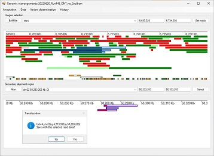

# AgileStructure

#### Contents
- [Introduction](#Introduction)
- [Guide](guide)
    * [Running on Linux, BSD or macOS](#running-on-linux-bsd-or-macos)
- [Download](program)

## Introduction

Next generation sequencing has revolutionised the detection of pathogenic variants in people with rare genetic conditions. However, the underlying pathogenic variant in approximately 50% of patients are not resolved with short read sequencing data. It has been suggested that many of these cases are due to large scale structural rearrangements which are more difficult to detect than compared to SNVs or small indel with using short read data. To overcome this problem, long read sequencing data generated by PacBio or ONT sequencers is been increasingly used in the hope of identifying these large scale rearrangements.  
Once generated, the data is typically aligned to the appropriate genome using a long read specific aligned such as minimap2 ([github](https://github.com/lh3/minimap2), [paper](https://academic.oup.com/bioinformatics/article/34/18/3094/4994778)) or lra ([github](https://github.com/ChaissonLab/LRA), [paper](https://journals.plos.org/ploscompbiol/article?id=10.1371/journal.pcbi.1009078)). Once aligned the data is typically visualised with an applications such as IGV Genome Browser (https://www.igv.org/) to identify break points, unfortunately these programs are limited in their ability to allow the rapid detection and annotation of structural rearrangements, consequently, we have developed AgileStructure specifically for this purpose. 

## Guide

The AgileStructure guide is [here:](guide/README.md)

### Running on Linux, BSD or macOS
AgileStructure can be run on most POSIX like systems via WINE whose installation is covered [here](https://github.com/msjimc/RunningWindowsProgramsOnLinux)

## Download

The compiled program can be downloaded from [here:](program/README.md)
