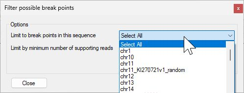
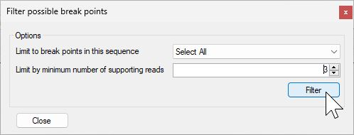

# AgileStructure user guide

## Data requirements

### Prior knowledge of the likely location of the break point

AgileStructure is designed to identify break points with user input rather than scan the whole file for possible break points, consequently its expected that you have some prior knowledge as to where the break point is such has a cytogenetics and/or karyotyping report, a list of known disease genes or a single pathogenic variant in a patient with a recessive disease for whom a second pathogenic variant can not be found. 

### Aligned data format
AgileStructure is designed to visualise aligned long read data formatted as `*.bam` files with their related index file. To aid the importing of data, it is expected that the index file will have the same name as the bam file with the `*.bam.bai` extension appended to the bam files name, for instance the bam file:  
```CNTNAP2.srt.mm2.bam```  
while have a index file named:  
```CNTNAP2.srt.mm2.bam.bai```  

### Preferred long read sequence aligners

Long reads that span a break point will appear to consist of two regions of homology, mapping to different locations in the genome. How these chimeric alignments are reported are aligner specific. Some aligners such as minimap2 ([github](https://github.com/lh3/minimap2), [paper](https://academic.oup.com/bioinformatics/article/34/18/3094/4994778)), treat the two regions as different alignments, but will report the secondary alignment as a CIGAR string in the alignments tag section, while those like lra ([github](https://github.com/ChaissonLab/LRA), [paper](https://journals.plos.org/ploscompbiol/article?id=10.1371/journal.pcbi.1009078)), may report a single alignment with an insertion or deletion reported in the alignments CIGAR string.  
AgileStructure is able to analyse both annotations, but the first method is the most flexible and will allow more complex break points to be processed than those that hard clip the sequence and don't include the location of secondary alignment. Consequently, it is recommended to align data using an aligner like minimap2. 

### Optional data

To aid the analysis, it is possible to view the putative break points with reference to the  location of repeat and genes sequences. This data can be obtain from the USCS genome browser as described [here](downloadingOptionalFiles.md).

### Importing alignment data

Data is imported as a pair of files, the pre-aligned bam files and its index file, by either pressing the ```BAM file``` button (Figure 1a) or by selecting the ```Analysis``` > ```Open BAM file``` option (Figure 1b)  and selecting the required file.


Figure 1a


Figure 1b

AgileStructure will read the header section of the bam file and populate the dropdown list box with the name of the reference sequences in the bam file (Figure 2).


Figure 2

If AgileStructure appears to do nothing, it may because it is unable to find the bamreaderdll.dll file: this must be in the same folder as AgileStructure.exe.

### Selecting the region to view

Select the likely chromosome (reference sequence) from the dropdown list boz and enter the regions co-ordinates in the two text boxes to the right of the drop down list box and press the ```Get reads``` button (Figure 3).    


Figure 3

The position of reads mapping to the region are shown as green (aligned to the forward strand) and red (aligned to the reverse strand) rectangles scaled to the length of the read. Soft clipped sequences are identified as pale green or red extensions to the darker green/red rectangles. The size of the pale rectangles is proportionate to their length and their location only indicates whether they are on the 5' or 3' of the aligned sequence.  
AgileStructure does not have an upper limit on the size of the region or number of reads it will process and will attempt to read the requested data until the computer runs out of memory. WHile there is no upper limit, you should try to limit the amount of data reads as reading the underlying bam file can be a slow process due to its size.

### Looking for putative break points in the selected region.

It may be possible to simply identify the the break point  at this point, especially for large homozygous deletions, but in many situation particularly for heterozygous break points they may not standout. Consequently, AgileStructure scans the reads, looking for 250 bp regions in which multiple read alignments prematurely terminate and the remaining soft clipped sequence all maps to the same location. These regions are then recorded and entered in to the lower drop down list box (Figure 4).


Figure 4

For extended regions and/or alignments with a high read depth, this list may contain a large number of entries. To filter them press the ```Filter``` button to the left of the lower drop down list box. This will open the ```Filter possible break points``` form (Figure 5 a nd b). The upper drop down list box allow the break point to be filtered by the chromosome that the soft clip regions are mapped too (Figure 5a), while the lower number select box will filter the results by the number of reads linked to each putative break point. 



Figure 5a



Figure 5b

Pressing the ```Filter``` button will repopulate the drop down list box (Figure 6).


Figure 6