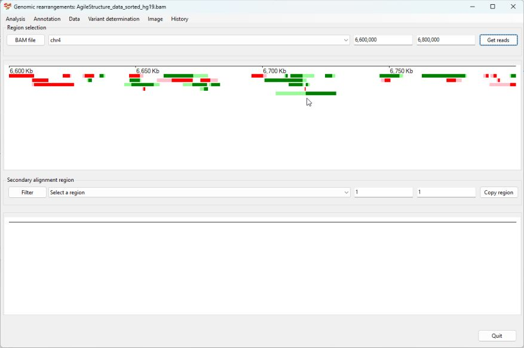
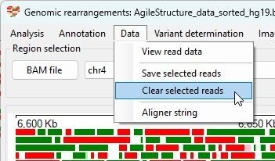
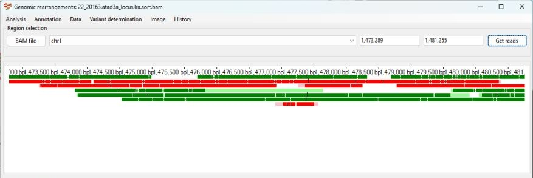
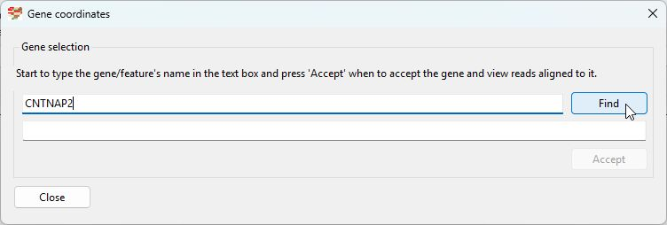
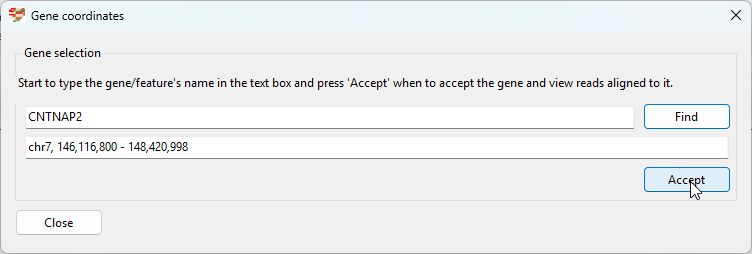
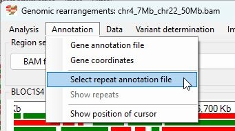

# AgileStructure user guide

- [AgileStructure user guide](#agilestructure-user-guide)
  * [Data requirements](#data-requirements)
    + [Prior knowledge of the likely location of the break point](#prior-knowledge-of-the-likely-location-of-the-break-point)
    + [Aligned data format](#aligned-data-format)
    + [Preferred long read sequence aligners](#preferred-long-read-sequence-aligners)
    + [Optional data](#optional-data)
  * [Importing alignment data](#importing-alignment-data)
  * [Selecting the region to view](#selecting-the-region-to-view)
  * [Hiding reads without a soft clipped segment](#hiding-reads-without-a-soft-clipped-segment)
  * [Looking for putative break points in the selected region.](#looking-for-putative-break-points-in-the-selected-region)
  * [Viewing read alignment information](#viewing-read-alignment-information)
  * [Selecting reads linked to a break point](#selecting-reads-linked-to-a-break-point)
  * [Saving alignment information for selected reads](#saving-alignment-information-for-selected-reads)
  * [Annotating break points using soft clipped data](#annotating-break-points-using-soft-clipped-data)
    + [Translocation](#translocation)
    + [Deletion](#deletion)
    + [Insertion](#insertion)
    + [Inversion](#inversion)
    + [Duplication](#duplication)
  * [Identifying Indels using the primary alignments CIGAR string](#identifying-indels-using-the-primary-alignments-cigar-string)
    + [Important note](#important-note)
    + [Identifying insertions using the primary alignments CIGAR string](#identifying-insertions-using-the-primary-alignments-cigar-string)
    + [Identifying deletions using the primary alignments CIGAR string](#identifying-deletions-using-the-primary-alignments-cigar-string)
  * [Navigating the read data](#navigating-the-read-data)
    + [Changing the regions by typing in the co-ordinates](#changing-the-regions-by-typing-in-the-co-ordinates)
    + [Moving the region to the left and right arrow keys](#moving-the-region-to-the-left-and-right-arrow-keys)
    + [Changing the regions by selecting a region with the mouse](#changing-the-regions-by-selecting-a-region-with-the-mouse)
    + [Changing the regions using the History functions](#changing-the-regions-using-the-history-functions)
  * [Selecting an area that contains a specific gene](#selecting-an-area-that-contains-a-specific-gene)
  * [Viewing data with reference to genomic features](#viewing-data-with-reference-to-genomic-features)
    + [Displaying gene positions](#displaying-gene-positions)
    + [Displaying repeats positions](#displaying-repeats-positions)
  * [Miscellaneous functions](#miscellaneous-functions)
    + [Cursor location](#cursor-location)
    + [Aligner string](#aligner-string)

<small><i><a href='http://ecotrust-canada.github.io/markdown-toc/'>Table of contents generated with markdown-toc</a></i></small>


AgileStructure is composed of two components:  AgileStructure.exe which runs the user interface and analyses the data and bamreaderdll.dll which reads the bam file, extracts the relevant information which its sends to the AgileStructure.exe. To work, both files need to be in the same folder, when AgileStructure starts, it will look for the bamreaderdll.dll file and give an error message if it doesn't find it, the will start without the bamreaderdll.dll, but will do nothing. 

## Data requirements

### Prior knowledge of the likely location of the break point

AgileStructure is designed to identify break points with user assistance rather than scan the whole file for possible break points, consequently its expected that the user will have some prior knowledge as to where the break point is such has a cytogenetics and/or karyotyping report, a list of known disease genes for the patients condition or a single pathogenic variant in a patient with a recessive disease for whom a second pathogenic variant can not be found. 

### Aligned data format
AgileStructure is designed to visualise aligned long read data formatted as indexed ```*.bam``` files. It is expected that the index file will have the same name as the bam file with the `*.bam.bai` extension appended to the bam files name, for instance the bam file:  
```CNTNAP2.srt.mm2.bam```  
while have a index file named:  
```CNTNAP2.srt.mm2.bam.bai```    
which will be in the same directory as the bam file.

### Preferred long read sequence aligners

Long reads that span a break point will appear to consist of two regions of homology, mapping to different locations in the genome. How these chimeric alignments are reported are aligner specific. Some aligners such as minimap2 ([github](https://github.com/lh3/minimap2), [paper](https://academic.oup.com/bioinformatics/article/34/18/3094/4994778)), treat the two regions as different alignments, but will report the secondary alignment as a condensed CIGAR string in the primary alignments tag section, while others, report the read as two separate alignments, but not directly reference the other alignment's position and CIGAR string. However, for shorter indels both aligns will report them in the CIGAR string [see section](#identifying-indels-using-the-primary-alignments-cigar-string). 
AgileStructure is able to analyse both annotations, but the first method is the most flexible and will allow more complex break points to be processed than those that hard clip the sequence and don't include the location of secondary alignment. Consequently, it is recommended to align data using an aligner like minimap2. 

### Optional data

To aid the analysis, it is possible to view the putative break points with reference to the  location of repeat and genes sequences. This data can be obtain from the USCS genome browser as described [here](downloadingOptionalFiles.md).

## Importing alignment data

Data is imported as a pair of files, the pre-aligned bam file and its index file, by either pressing the ```BAM file``` button (Figure 1a) or by selecting the ```Analysis``` > ```Open BAM file``` menu option (Figure 1b) and selecting the required ```bam``` file.


Figure 1a


Figure 1b

AgileStructure will read the header section of the bam file and populate the dropdown list box with the name of the reference sequences in the bam file (Figure 2).


Figure 2

If AgileStructure appears to do nothing, it may because it is unable to find the bamreaderdll.dll file: this must be in the same folder as AgileStructure.exe.

## Selecting the region to view

Select the required chromosome (reference sequence) from the dropdown list box and enter the region's co-ordinates in the two text boxes to the right of the drop down list box and press the ```Get reads``` button (Figure 3). The co-ordinates are checked to make sure they are not greater than the chromosomes length as reported in the ```bam``` file. If no chromosome has been selected these values will be limited to '1'.    


Figure 3

The position of reads mapping to the region are shown as green (aligned to the forward strand) and red (aligned to the reverse strand) rectangles scaled to the length of the read. Soft clipped sequences are identified as pale green or pale red extensions to the darker green/red aligned data. The size of the pale rectangles is proportionate to the length of the unaligned sequence and their location only indicates whether they are on the 5' or 3' of the aligned sequence.  
It is important to note that in the default view, reads are drawn as a solid box spanning the length of the alignment, if a read as a large deletion this will not be shown, however they can be visualised by selecting the ```Analysis``` > ```Look for indels within a read``` option (see section [Identifying Indels using the primary alignments CIGAR string](#identifying-indels-using-the-primary-alignments-cigar-string)).  
AgileStructure does not have an upper limit on the size of the region or number of reads it will process and will attempt to read the requested data until the computer runs out of memory. While there is no upper limit, you should try to limit the amount of data it reads as reading the underlying bam file can be a slow process due to its size.

## Hiding reads without a soft clipped segment

When adding reads to the image, they are stacked so as little space as possible is used, however for alignments with a high read depth, the stacks may be to too tall to fit in the image. Since, reads that have a soft clipped region are more important in break point detection it is possible to hide those with out an unaligned fragment by selecting the ```Analysis``` > ```Only show reads with secondary alignments ``` option (Figure 4).


Figure 4

The filtered image will contain fewer reads, making those at the break point more apparent.



Figure 5

## Looking for putative break points in the selected region.

It may be possible to simply identify the the break point  at this point, especially for large homozygous deletions, but in many situation particularly for heterozygous break points they may not standout. Consequently, AgileStructure scans the reads, looking for 250 bp regions in which multiple read alignments prematurely terminate and the remaining soft clipped sequence all maps to the same location. These regions are then recorded and entered in to the lower drop down list box (Figure 6).


Figure 6

For extended regions and/or alignments with a high read depth, this list may contain a large number of entries. To filter them press the ```Filter``` button to the left of the lower drop down list box. This will open the ```Filter possible break points``` form (Figure 7a and 7b). The upper drop down list box allows the break points to be filtered by the chromosome that the soft clip regions are mapped too (Figure 7a), while the lower number select box will filter the results by the number of reads linked to each putative break point. 


Figure 7a


Figure 7b

Pressing the ```Accept``` button will remove all break points that do not match the criteria (Figure 8), while pressing the ```Cancel``` will remove all filtering.


Figure 8

Selecting a break point from this list will cause the reads with soft clipped sequences mapped to the break points flanking regions to be displayed in the lower panel (Figure 9). As before, reads are drawn in green or red for those mapping to the forward or reverse strands, with aligned sequences darker than the unaligned soft clipped sequences. It is important to note that only reads that are present in the upper image shown in the lower image and that sequences that were aligned to the reference sequence in the upper image will be unaligned, soft clipped sequences in the lower image. 


Figure 9

## Viewing read alignment information

Selecting the ```Data``` > ```View read data``` will cause a resizable window to appear that consist solely of a text area. If the mouse cursor is held over a read, its underlying data will be written to the text area. For a sequence to be selected, the cursor has to hover over the read for a little while. This makes it possible to select a read and then quickly move the cursor to the new window and copy the data to paste in a document etc.


Figure 10a


Figure 10b

Since the read, quality score string and CIGAR string can be several thousand characters lond, the text area doesn't word wrap text and so if you want to read the end of a CIGAR string you must use the horizontal scroll bar.   
As well as the sequence and quality string, this information contains the primary and secondary alignments' location etc as well all the tag added by the aligner.

## Selecting reads linked to a break point

When the upper image contains a large number of reads it may not be possible identify the reads associated with the selected break point, however clicking on a read in either image will cause it to be selected and drawn with a blue boarder. By clicking on all the reads linked to a break point in the lower image will help to identify the break point in the upper image (Figure 11) 


Figure 11

If you click on a selected read it will be deselected, while selecting the ```Data``` > ```Clear selected reads``` option will deselect all selected reads (Figure 12). Finally, iIf read data is imported from the bam file (the ```Get reads``` is pressed) the selection will be cleared.



Figure 12

## Saving alignment information for selected reads

Rather than manually saving the data for a series of read alignments, its possible to save all the data to a text file using the ```Data``` > ```Save selected reads``` (Figure 13).


Figure 13

## Annotating break points using soft clipped data

Once the reads spanning a break point have been selected, is is possible to get AgileStructure to attempt to annotate the mutation. To see what type of mutation the break point represents select ```Variant determination``` > ```Use soft clip data``` > ```Variant type``` (Figure 14a). AgileStructure will scan the reads primary and secondary alignment data and the orientation of the soft clipped data with respect to the aligned sequences to determine what type of mutation it is. This is reported in a message box with the possible answers of "Deletion", "Insertion", "Inversion", "Duplication" or "Translocation" as well as messages indicating an error processing the data or user data selection issues (Figure 14b). 


Figure 14a


Figure 14b

Once the variant type is determined it is then possible to get AgileStructure to annotate it by selecting the appropriate option (Figure 15a and 15b)

### Deletion 
A worked example is [here](deletion.md).
### Duplication
A worked example is [here](duplication.md).

### Insertion

### Inversion
A worked example is [here](inversion.md).


### Translocation
 A worked example is [here](translocation.md).

## Identifying Indels using the primary alignments CIGAR string  

AgileStructure was primarily designed to identify chromosomal break points by looking for sets reads whose alignment is broken in two, such that part of the read aligns at one location and the the other fragment is located some distance away or on a different chromosome. However, it is also able to identify insertion and deletions that do not cause the alignment to be fragmented, but whose presence is noted in the CIGAR string.  
Selecting the ```Analysis``` > ```Look for indels within a read``` option (Figure A) causes the reads to be redrawn with deletions shown as a horizontal black line linking to blocks of aligned sequences while an insertion is shown as a vertical line projecting above and below the aligned sequence. Since ONT data contains numerous short indels, only insertions longer than 10 bp are shown/processed.


Figure A

When redrawn using the the CIGAR string to identify insertions and deletions their presence becomes apparent. For example in Figure B the large deletion spanning 1,495,000 bp to 1,534,000 bp and the insert at 1,586,000 bp (above the cursor) are easily identified.


Figure B

### Important note

Since ONT data is very noisy the exact point of the break point may appear to vary by a number of base pairs between different reads, while artefactual indels may also be present in the reads. Consequently AgileStructure scans the beginning and ends of the indels, sorts them by position and then reports the median values in the reported variant. Using the median value rather than the average reduces the chance an artifactual indel unduly influences the annotation, but it is important that the individual indels are checked to make sure a 2nd indel is not somehow disrupting the annotation.

### Identifying insertions using the primary alignments CIGAR string

To annotate an insert, select the reads the containing variant of interest and select ```Variant determination``` > ```Use primary alignment's CIGAR string``` > ```Insertion``` (Figure Ca). This will display a message box, listing any insertions over 10 bps followed by the read's name and the annotation of the variant.   


Figure C


Figure Cb

### Identifying deletions using the primary alignments CIGAR string  

To annotate a deletion, select the reads containing variant of interest and select ```Variant determination``` > ```Use primary alignment's CIGAR string``` > ```Deletion``` (Figure Da). This will open a message box, listing the deletions over 10 bps followed by the reads and finally the annotation of the variant.   


Figure D


Figure Db

## Navigating the read data

### Changing the regions by typing in the co-ordinates

As previously mentioned, AgileStructure displays the primary and secondary alignments in two panels, above each are to text area where the start and end points of the displayed data can be changed. Since the primary read data is retrieved from the bam file which can be slow, changes to the primary alignment image are only made when the ```Get reads``` button is pressed. However, changes to the co-ordinates of secondary alignment image are displayed instantly.  

### Moving the region to the left and right arrow keys

Rather than typing in new locations in to the text areas, its possible to move the region to the left or right by clicking on one of the text areas so that the text area becomes active (you could change the value by typing) and then pressing the CRTL + 'left arrow' or CRTL + 'right arrow' keys. 

### Changing the regions by selecting a region with the mouse

The mouse can be used to select a sub-region of the current display in either image by moving the cursor to the desired start point and then moving the mouse to the end point while holding the right mouse button down (Figure Ea). When the mouse button is released the display is redrawn (Figure Eb). [In figure Eb an insert can be seen in four reads, while its position appears variable, all the reads had a 134 to 135 bp insertion suggesting its position is inaccurately placed possibly due to sequencing errors in the flanking sequences (Figure Ec).]


Figure E



Figure Eb


Figure Ec

### Changing the regions using the History functions

As each change in the either primary and secondary display co-ordinates is made, the old positions are saved, allowing the views to be recreated by selecting the appropriate co-ordinates from the lists in ```History``` > ```Primary alignments``` or ```History``` > ```Secondary alignments``` (Figure F). 


Figure F

## Selecting an area that contains a specific gene

The @Displaying gene positions@ section explains how to import gene locations, once this has been done it is then possible to navigate to a region that contains a specific gene by selecting the ```Annotation``` > ```Gene coordinates``` option (Figure la). 


Figure La

This will open the ```Gene co-ordinates``` which consists of two text areas, type the gene symbol for the gene you which to view in the upper text area (Figure Lb).  



Figure Lb


Press the ```Find``` button and if the gene is present in the gene co-ordinate data, it's co-ordinates will be displayed in the lower text area (Figure Lc).



Figure Lc


Pressing ```Accept``` will reset the the co-ordinates in AgileStructure, pressing the ```Get reads``` button will then update the Primary alignment window (Figure Ld). 


Figure Ld

## Viewing data with reference to genomic features

It is possible to view the read data with reference to the genes and repeats around the break point. The chromosomal locations of the genes and repeats can be downloaded from the UCSC Genome Browser as described [here](downloadingOptionalFiles.md). 

### Displaying gene positions

Gene co-ordinate data can be imported by selecting the ```Annotation``` > ```Gene annotation file``` option (Figure G).


Figure G

Genes are displayed as black rectangles with their exons drawn as either green (gene on forward strand) or yellow (gene on reverse strand) at the bottom of the displays. 


Figure H

Clicking on a gene will cause is name to be displayed to the top left of the appropriate display, for instance in Figure I the genes near the break point (Primary alignment display: LOC105378240 and secondary alignment display: PLXNB2) have been selected.


Figure I

### Displaying repeats positions

Repeat co-ordinates are imported by selecting the ```Annotation``` > ```Select repeat annotation file``` option (Figure J). Unlike the gene positions, repeats are only drawn when the ```Annotation``` > ```Show repeats``` option is selected (Figure J). This is due to the large number of repeats requiring an excessive amount of memory to store and then slow to draw across large regions. Consequently, AgileStructure will only retain the repeat file's filename and reads the file each time it is required to draw them.  



Figure J

The repeats are drawn as black rectangles filled in pale blue (forward strand) or pale yellow (reverse strand) across a single row at the very bottom of the displays. As with the genes, clicking on a repeat will cause it's name, class and family to be displayed at the top left of the display. For example in Figure K, the repeats close to the break point (Primary alignment: AluSz, SINE, Alu and (CCCACC)n, Simple repeat, Secondary alignment Simple repeat) have been selected.


Figure K

## Miscellaneous functions

### Cursor location

The ```Annotation``` > ```Show position of cursor``` option displays the genomic co-ordinates of cursor's position (Figure Mb). It should be remembered that this in too accurate as a region 1 Mb wide may drawn on an image 860 pixels wide will have 1,162.8 bps mapped to each pixel.


Figure Ma


Figure Mb

### Aligner string

Typically, the aligner used to map the reads on the reference genome will include the command line arguments used in the alignment. This can be viewed by selecting the ```Data``` > ```Aligner string``` (Figure Na and Nb). This can prove useful when you need to be certain which reference genome was used in the alignment.


Figure Na


Figure Nb