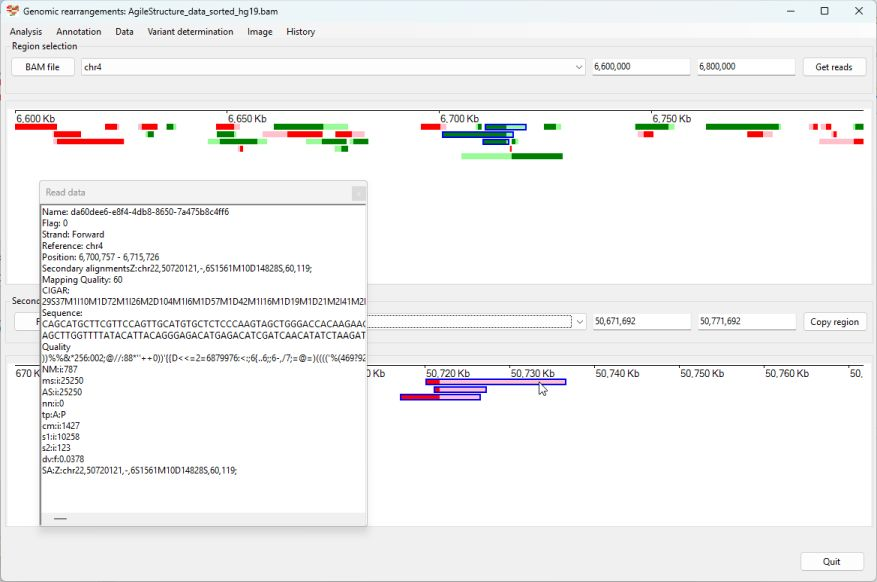
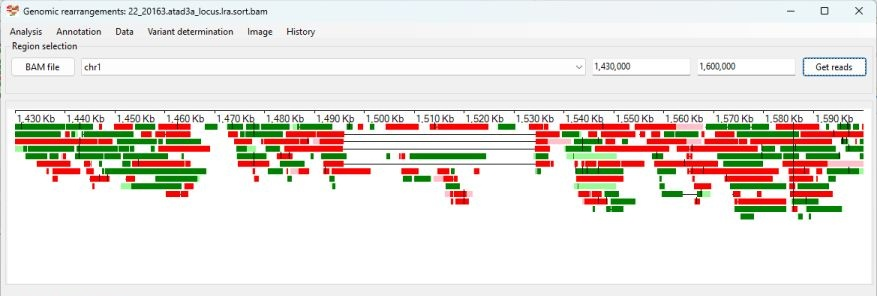
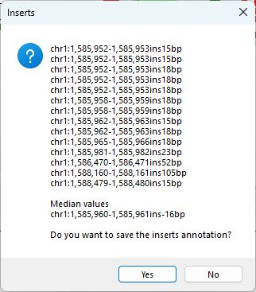
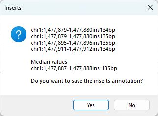
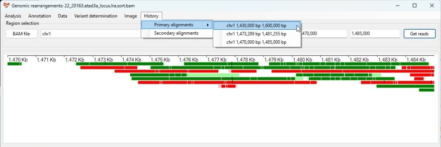
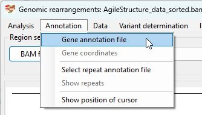

# AgileStructure user guide

- [Installation](#installation)
  * [Windows](#windows-computers)
  * [Linux, BSD and macOS](#linux-macos-and-bsd)
- [Data requirements](#data-requirements)
  * [Prior knowledge of the likely location of the breakpoint](#prior-knowledge-of-the-likely-location-of-the-break-point)
  * [Aligned data format](#aligned-data-format)
  * [Preferred long read sequence aligners](#preferred-long-read-sequence-aligners)
  * [Optional data](#optional-data)
- [Importing alignment data](#importing-alignment-data)
  * [How indexed BAM files are processed](#how-indexed-bam-files-are-processed)
- [Selecting the region to view](#selecting-the-region-to-view)
- [Hiding reads without a soft-clipped segment](#hiding-reads-without-a-soft-clipped-segment)
- [Looking for putative breakpoints in the selected region.](#looking-for-putative-break-points-in-the-selected-region)
- [Viewing read alignment information](#viewing-read-alignment-information)
- [Selecting reads linked to a breakpoint](#selecting-reads-linked-to-a-break-point)
- [Saving alignment information for selected reads](#saving-alignment-information-for-selected-reads)
- [Annotating breakpoints using soft-clipped data](#annotating-break-points-using-soft-clipped-data)
  * [Deletion](#deletion)
  * [Duplication](#duplication)
  * [Insertion](#insertion)
  * [Inversion](#inversion)
  * [Translocation](#translocation)
- [Identifying Indels using the primary alignments CIGAR string](#identifying-indels-using-the-primary-alignments-cigar-string)
  * [Important note](#important-note)
  * [Identifying insertions using the primary alignments CIGAR string](#identifying-insertions-using-the-primary-alignments-cigar-string)
  * [Identifying deletions using the primary alignments CIGAR string](#identifying-deletions-using-the-primary-alignments-cigar-string)
- [Navigating the read data](#navigating-the-read-data)
  * [Changing the region by typing the coordinates](#changing-the-region-by-typing-the-coordinates)
  * [Moving the region to the left and right with the left and right arrow keys](#moving-the-region-to-the-left-and-right-with-the-left-and-right-arrow-keys)
  * [Changing the width of the region with the Up and Down arrow keys](#changing-the-width-of-the-region-with-the-up-and-down-arrow-keys)
  * [Changing the region by selecting a region with the mouse](#changing-the-region-by-selecting-a-region-with-the-mouse)
  * [Changing the regions using the History menu options](#changing-the-regions-using-the-history-menu-options)
- [Selecting an area that contains a specific gene](#selecting-an-area-that-contains-a-specific-gene)
- [Viewing data with reference to genomic features](#viewing-data-with-reference-to-genomic-features)
  * [Displaying gene positions](#displaying-gene-positions)
  * [Displaying repeat positions](#displaying-repeat-positions)
- [Miscellaneous functions](#miscellaneous-functions)
  * [Cursor location](#cursor-location)
  * [Aligner string](#aligner-string)

<small><i><a href='http://ecotrust-canada.github.io/markdown-toc/'>Table of contents generated with markdown-toc</a></i></small>

## Installation

### WIndows computers
```AgileStructure``` can be run simply by downloading [AgileStructure.exe](../program/AgileStructure.exe), [AgileStructure.dll](../program/AgileStructure.dll) and [AgileStructure.runtimeconfig.json](../program/AgileStructure.runtimeconfig.json) files to the same folder and then double clicking on the agileAgileStructure.exe file. The program requires the .NET 6.0 (or later) framework to be install which can be obtained from here: [version 6.0](https://dotnet.microsoft.com/en-us/download/dotnet/6.0) or [version 8.0](https://dotnet.microsoft.com/en-us/download/dotnet/8.0) and selecting the appropriate ***.NET Desktop Runtime \*.\*.\****  

### Linux, macOS and BSD

Like Windows computers, AgileStructure doesn't require installation (just download the [3 files](../program/) to the same folder), but does require ___Wine___ to be installed on the computer. A number of short guides covering the installation of ___Wine___ on appropriatlye 20 versions of Linux, BSD and macOS can be found [here](https://github.com/msjimc/RunningWindowsProgramsOnLinux).  ```AgileStructure``` also requires the installation of the .NET frameworks usually achieved via ___Winetricks___.

## Data requirements

### Prior knowledge of the likely location of the breakpoint

 ```AgileStructure``` is designed to identify breakpoints with user assistance rather than scan the whole alignment for possible breakpoints, consequently it is expected that the user will have some prior knowledge as to where the breakpoint is such as a cytogenetics and/or karyotyping report, a list of known disease genes for the patient's condition or a single pathogenic variant in a patient with a recessive disease for whom a second pathogenic variant cannot be found. 

### Aligned data format

```AgileStructure``` is designed to visualise aligned long read data formatted as indexed ```BAM``` files. It's expected that the index file will have the same name as the ```BAM``` file with the ```*.bai``` extension appended to the BAM file's name. For instance, the BAM file:  
```CNTNAP2.srt.mm2.bam```  
will have an index file named:  
```CNTNAP2.srt.mm2.bam.bai```  
which will be in the same directory as the ```BAM``` file.  
The ```BAM``` file must contain the header section, which lists the name and size of each reference sequence in the reference genome.

### Preferred long read sequence aligners

Long reads that span a breakpoint will appear to consist of two regions of homology, mapping to different locations in the genome. How these chimeric alignments are reported is aligner-specific. Some aligners, such as Minimap2 ([github](https://github.com/lh3/minimap2), [paper](https://academic.oup.com/bioinformatics/article/34/18/3094/4994778)), treat the two regions as different alignments but will report the secondary alignment as a condensed CIGAR string in the primary alignments tag section, while others report the read as two separate alignments but not directly reference the other alignment's position and CIGAR string. However, for shorter indels, both types of aligners may report them in the CIGAR string ([see this section](#identifying-indels-using-the-primary-alignments-cigar-string)).  
```AgileStructure``` is only able to analyse reads in which the indel is reported in the primary alignment's CIGAR string or the secondary alignment is reported in the tag section: The reporting of the secondary alignment in the tag section is the most flexible method and will allow more complex breakpoints to be processed. Consequently, it is recommended to align data using an aligner such as minimap2. 

### Optional data

To aid the analysis, it is possible to view the putative breakpoints with reference to the  location of genes and repetitive sequences. This data can be obtained from the USCS genome browser as described [here](downloadingOptionalFiles.md).

## Importing alignment data

Data is imported as a pair of files, the pre-aligned BAM file and its index file, by either pressing the ```BAM file``` button (Figure 1a) or by selecting the ```Analysis``` > ```Open BAM file``` menu option (Figure 1b) and selecting the required ```BAM``` file.


Figure 1a


Figure 1b

```AgileStructure``` will read the header section of the BAM file and populate the dropdown list box next to the ```BAM file``` button, with the name of the reference sequences in the BAM file (Figure 2).


Figure 2

### How indexed BAM files are processed

Before indexing a BAM file, reads are ordered with reference to the read's genomic coordinates with the data then compressed with the qzip algorithm to form discrete chunks of compressed data containing reads that start in a small region. For example the first chunk in a file may contain reads with alignments starting on chr 1 between 1 bp and 16,000 bp with the next chunk containing reads whose alignment starts on chr 1 between 16,000 bp and 32,000 bp. The indexing of a file creates a 2nd file (.bam.bai) that lists the start point of each chunk in the BAM file and the start position of the first read in that chunk.   
When a program has to find reads mapping to a certain region, it looks in the bam.bai files to find the chunks that contain the start positions of the reads mapped to the region. Once it's found the chunks mapping to the data, it looks up in the index file where that data starts in the BAM file and then reads the data at that point in the BAM file until it comes to the end of the compressed chunk. It repeats the process until it has read all the data for the region of interest. This works fine for short read data since all the reads in a chunk start between two well defined points (the genomic start site of the chunk and the end of the chunk plus the length of the read i.e. 16,000 bp to 32,000 bp plus 150 bp). However, with long read data, a read may be longer than the size of a chunk's region, so a read 20 kb long may start in  one chunk while its end may be in the next or the next but one chunk. This causes an issue when you select a small region, as reads that over lap the region may be listed in a chunk much further upstream and so may not be found when reading the BAM file.  Consequently, ```AgileStructure``` reads the chunk that ends just before the start of the region of interest, but if a read is particularly long it may be missed as it starts even further upstream. Therefore when selecting regions, initially select a slightly larger (16 kb added to each side) region than required and note if a long read spanning the breakpoint disappears when you shrink the region.      

## Selecting the region to view

Select the required chromosome (reference sequence) from the upper dropdown list box and enter the region's coordinates in the two text boxes to the right of this drop down list box and press the ```Get reads``` button (Figure 3). The coordinates are checked to make sure they are not greater than the chromosomes length as reported in the ```BAM``` file. If no chromosome has been selected these values will be limited to '1'.    


Figure 3

The positions of reads mapping to the region are depicted as green rectangles (aligned to the forward strand) and red rectangles (aligned to the reverse strand), scaled according to the length of the read. Soft-clipped sequences are represented as pale green or pale red extensions adjacent to the darker green/red aligned data. The size of these pale rectangles is proportional to the length of the unaligned sequence, and their placement merely indicates whether they are on the 5’ or 3’ end of the aligned sequence.  
It is important to note that in the default view, reads are represented as a solid box spanning the length of the alignment, if a read has a large deletion this will not be shown, however they can be visualised by selecting the ```Analysis``` > ```Look for indels within a read``` menu option (see section [Identifying Indels using the primary alignments CIGAR string](#identifying-indels-using-the-primary-alignments-cigar-string)).  
```AgileStructure``` does not have an upper limit on the size of the region or number of reads it will process and will attempt to read the requested data until it has processed the region or the computer runs out of memory. While there is no upper limit, you should try to limit the amount of data it reads because reading the underlying BAM file can be a slow process due to its size.

## Hiding reads without a soft-clipped segment

When adding reads to the display, they are stacked to use as little space as possible. However, for alignments with a high read depth, the stacks may be too tall to fit in the image. Since reads that have a soft-clipped region are more important in breakpoint detection, it is possible to hide those without an unaligned fragment by selecting the ```Analysis``` > ```Only show reads with secondary alignments ``` menu option (Figure 4).


Figure 4

The filtered image will contain fewer reads, making those at the breakpoint more apparent.


Figure 5: When reads with no secondary alignment are removed the breakpoint is more apparent: see mouse cursor in Figure 5 and compare to same region in Figure 3

## Looking for putative breakpoints in the selected region.

It may be possible to simply identify the breakpoint at this point, especially for large homozygous deletions, but in many situations, particularly for heterozygous breakpoints, they may not stand out. Consequently, ```AgileStructure``` scans the displayed reads, looking for 250 bp regions in which multiple read alignments prematurely terminate and the remaining soft clipped sequences all map to the same secondary location. These regions are then noted and entered into the lower drop-down list box (Figure 6).


Figure 6

For extended regions and/or alignments with a high read depth, this list may contain a large number of entries. To filter these regions, press the ```Filter``` button to the left of the lower drop-down list box. This will open the ```Filter possible breakpoints``` window (Figure 7a and 7b). The upper drop-down list box allows the breakpoints to be filtered by the chromosome that the secondary alignments are mapped to (Figure 7a), while the lower number select box will filter the results by the number of reads linked to each putative breakpoint. 


Figure 7a


Figure 7b

Pressing the ```Accept``` button will remove all breakpoints that do not match the criteria (Figure 8), while pressing the ```Cancel``` will remove all filtering.


Figure 8

Selecting a breakpoint from this list will cause the reads with soft-clipped sequences mapped to the second breakpoint’s flanking regions to be displayed in the lower panel (Figure 9). As before, reads are represented in green or red for those mapping to the forward and reverse strands, with aligned sequences darker than the unaligned soft-clipped sequences. It is important to note that only reads that are present in the upper image are shown in the lower image, and that sequences that were aligned to the reference sequence in the upper image will be unaligned, soft-clipped sequences in the lower image


Figure 9

## Viewing read alignment information

Selecting the ```Data``` > ```View read data``` (Figure 10a) will cause a resizable window to appear that consists solely of a text area. If the mouse cursor is held over a read, its underlying data will be written to the text area (Figure 10b). For a sequence to be shown, the cursor has to hover over the read for a little while. This makes it possible to select a read, then quickly move the cursor to the new window, and copy the data to paste into a document.


Figure 10a



Figure 10b

Since the read, quality score string, and CIGAR string can be several thousand characters long, the text area doesn’t word wrap text (unless it’s very long), and so if you want to read the end of a CIGAR string, you must use the horizontal scroll bar.
In addition to the sequence and quality string, this information contains the primary and secondary alignment locations, as well as all the tags added by the aligner. The format of the tag data can be aligner-specific, with the aligner’s documentation providing a full description of each tag’s meaning.

## Selecting reads linked to a breakpoint

When the upper image contains a large number of reads, it may not be possible to identify the reads associated with the selected breakpoint. However, clicking on a read in either image will cause it to be selected and outlined with a blue border. Clicking on all the reads linked to a breakpoint in the lower image will help to identify the location of the breakpoint in the upper image (Figure 11).


Figure 11

If you click on a selected read, it will be deselected, while selecting the ```Data``` > ```Clear selected reads``` option will deselect all selected reads (Figure 12). Finally, if new data is imported from the BAM file (i.e. the ```Get reads``` button is pressed) the selection will be cleared.


Figure 12

## Saving alignment information for selected reads

Rather than manually saving the data for a series of read alignments, it's possible to save the data of selected reads to a text file using the ```Data``` > ```Save selected reads``` (Figure 13).


Figure 13

## Annotating breakpoints using soft-clipped data

Once the reads spanning a breakpoint have been selected, it is possible to get ```AgileStructure``` to attempt to identify the type of variant: deletion, duplication, insertion, inversion or translocation. To identify what type of mutation the breakpoint represents, select the ```Variant determination``` > ```Use soft-clip data``` > ```Variant type``` menu option (Figure 14a). ```AgileStructure``` will then scan the orientation of the primary and secondary alignments of the selected reads to determine what type of mutation it is. This is reported in a message box with the possible answers of “Deletion”, “Insertion”, “Inversion”, “Duplication” or “Translocation” as well as messages indicating any error processing the data or user data selection issues (Figure 14b).  
***For this feature to work a region must be selected in the lower panel***.


Figure 14a


Figure 14b

Once the variant type is determined, it is then possible to annotate the breakpoint by selecting the appropriate option. The links below show examples of analysing each type of mutation.

### Deletion

A worked example is [here](deletion.md).

### Duplication

A worked example is [here](duplication.md).

### Insertion

A worked example is [here](insertion.md).

### Inversion

A worked example is [here](inversion.md).


### Translocation

 A worked example is [here](translocation.md).

## Identifying Indels using the primary alignments CIGAR string  

```AgileStructure``` is primarily designed to identify chromosomal breakpoints by looking for sets of reads whose alignment is broken in two, such that their primary alignment aligns at one location and their secondary alignments are all located to a more distant common region possibly on a different chromosome. However, it is also able to identify insertions and deletions that do not cause the alignment to be fragmented, but whose presence is noted in the primary alignment's CIGAR string.  
Selecting the ```Analysis``` > ```Look for indels within a read``` menu option (Figure 15) causes the reads to be redrawn with deletions shown as a horizontal black line linking two blocks of aligned sequences while an insertion is shown as a vertical line projecting above and below the aligned sequence. Since ONT data contains numerous short indels, only insertions/deletions longer than 10 bp are shown.


Figure 15

When redrawn using the CIGAR string to identify insertions and deletions, their presence becomes apparent. For example in Figure 16 the large deletion spanning 1,495,000 bp to 1,534,000 bp of chromosome 1 and the insertion at 1,586,000 bp (above the cursor) are easily identified.



Figure 16

### Important note

Since ONT data is very noisy the exact point of the breakpoint may appear to vary by a number of base pairs between different reads, while artefactual indels may also be present in the reads. Consequently ```AgileStructure``` scans the beginning and ends of the indels, sorts them by position and then reports the median values in the reported variant. Using the median value rather than the average reduces the chance an artifactual indel unduly influencing the annotation, but it is important to ensure that the individual indels are checked to make sure a 2nd, possibly artifactual, indel is not somehow disrupting the annotation.

### Identifying insertions using the primary alignments CIGAR string

To annotate an insertion, select the reads containing the variant of interest, then navigate to ```Variant determination``` > ```Use primary alignment's CIGAR string``` > ```Insertion``` menu option (see Figure 17a). A message box will appear, listing any insertions larger than 10 bp along with the corresponding read names and variant annotations. 
***Note:*** Reads with multiple insertions may need to be deselected for accurate analysis. 


Figure 17



Figure 17b: The order of the reads in the message box is determined by chromosomal position, which may differ from the display order of the reads.

### Identifying deletions using the primary alignments CIGAR string  

To annotate a deletion, select the reads containing the variant of interest and then select the  ```Variant determination``` > ```Use primary alignment's CIGAR string``` > ```Deletion``` menu option (Figure 18a). This will open a message box, listing the deletions over 10 bps followed by the reads and finally the variant's annotation (Figure 18b).


Figure 18


Figure 18b: The reads in the message box are ordered by chromosomal position, which may differ from their display order.

## Navigating the read data

### Changing the region by typing the coordinates

As noted earlier, ```AgileStructure``` presents the primary and secondary alignments in separate panels. At the top of each panel, there are text fields for adjusting the start and end points of the data displayed. Retrieval of primary read data from the BAM file can be time-consuming, so updates to the primary alignment region occur only upon clicking the ```Get reads```.  In contrast, modifications to the secondary alignment coordinates are reflected immediately.  

### Moving the region to the left and right with the left and right arrow keys

Instead of manually entering new locations into the text areas, you can easily shift the region to the left or right. Simply click on one of the text areas to activate it (i.e., you could edit the value by typing), and then press the ```Ctrl``` + ```left arrow``` or ```Ctrl``` + ```right arrow``` keys. This will move the region in the desired direction to an adjacent, non-overlapping region of the same length as the original.

### Changing the width of the region with the Up and Down arrow keys

In a similar manner to moving the region to the left or right, you can double or half the width of the region. Simply activate a text area and then press the ```Ctrl``` + ```Up arrow``` or ```Ctrl``` + ```Down arrow``` keys. Even though the size of the region changes, it remains centered on the same point in the reference sequence.

### Changing the region by selecting a region with the mouse

Using the mouse, a sub-region can be selected within either panel by clicking at the desired start point and dragging the cursor to the end point with the right mouse button held down (refer to Figure 19a). Upon releasing the button, the display updates to show the selected area (see Figure 19b). This feature enables detailed examination of specific regions. For example, Figure 19a shows four reads with a seemingly common insertion. However, closer inspection in Figure 19b reveals discrepancies in their locations, indicating they may not be authentic. To further investigate, selectinge ```Variant determination``` > ```Use primary alignment's CIGAR string``` > ```Insertion``` menu option, reveals that all reads share a 134 to 135 bp insertion. This uniformity suggests that the insertion’s position might be inaccurately represented, potentially due to sequencing errors or alignment issues with low complexity sequences (illustrated in Figure 19c).. 


Figure 19a: 


Figure 19b



Figure 19c

### Changing the regions using the History menu options

Whenever adjustments are made to the primary or secondary display coordinates, the previous positions are automatically stored. This feature enables users to revisit earlier views by choosing the saved coordinates from the ```History``` dropdown menu, under ```Primary alignments``` or ```Secondary alignments``` (as shown in Figure 20).



Figure 20

## Selecting an area that contains a specific gene

The [Displaying gene positions](#displaying-gene-positions) section explains how to import gene locations, once imported, it is possible to navigate to a region that contains a specific gene by selecting the ```Annotation``` > ```Gene coordinates``` menu option (Figure 21a).


Figure 21a

Activating this option will launch the ```Gene coordinates``` window, which features two text fields. Enter the gene symbol of interest into the top text field (refer to Figure 21b).  


Figure 21b

Click the ```Find``` button and if the gene symbol is present in the imported gene coordinate data, its coordinates will be displayed in the lower text field (Figure 21c).


Figure 21c

Pressing ```Accept``` will reset the coordinates in ```AgileStructure``` main window. Pressing the ```Get reads``` button will update the Primary alignment window (Figure 21d).


Figure 21d

## Viewing data with reference to genomic features

It is possible to visualise the read data in relation to the genes and repeats around the breakpoint. The chromosomal coordinates of the genes and repeats can be downloaded from the UCSC Genome Browser as outlined in this [guide](downloadingOptionalFiles.md). 

### Displaying gene positions

Gene coordinate data can be imported by selecting the ```Annotation``` > ```Gene annotation file``` menu option (Figure 22).



Figure 22

Genes are displayed as black rectangles, with their exons depicted by green (gene on forward strand) or yellow (gene on reverse strand) positioned at the bottom of the displays (Figure 23). 


Figure 23

Clicking on a gene will cause is name to be displayed to the top left of the appropriate display. For instance, in Figure 24, the genes near the breakpoint (Primary alignment display: LOC105378240 and secondary alignment display: PLXNB2) have been selected.


Figure 24

### Displaying repeat positions

Repeat coordinates are imported by selecting the ```Annotation``` > ```Select repeat annotation file``` option (Figure 25). Unlike the gene positions, repeats are only drawn when the ```Annotation``` > ```Show repeats``` option is selected (Figure 25). This is due to the large number of repeats,  which require substantial memory to store and can be slow to render across extensive regions. Consequently, ```AgileStructure``` will only retain the repeat file's filename and reloading the required data from the file each time the repeats need to be drawn..  


Figure 25

The repeats are drawn as black rectangles filled in pale blue (forward strand) or pale yellow (reverse strand) across a single row at the very bottom of the displays. As with genes, clicking on a repeat will cause its name, class, and family to be displayed at the top left of the display. For example in Figure 26, the repeats close to the breakpoint (Primary alignment: AluSz, SINE, Alu and Secondary alignment: (CCCACC)n, Simple repeat, Simple repeat) have been selected.


Figure 26

## Miscellaneous functions

### Cursor location

The ```Annotation``` > ```Show position of cursor``` menu option reveals the genomic coordinates of cursor's position (Figure 27b).It’s important to note that this representation is approximate. For instance, a 1 Mb region depicted on an 860-pixel-wide image results in approximately 1,162.8 bps per pixel. Therefore, this feature should be used as a general guide to understand the region rather than a precise tool.


Figure 27a


Figure 27b

### Aligner string

Typically, the aligner used to map reads to the reference genome includes the command line arguments in the BAM file’s header section. This information can be accessed by selecting the ```Data``` > ```Aligner string``` menu option (see Figures 28a and 28b). This feature is particularly useful when, for instance, you need to verify which reference genome was used for the alignment.


Figure 28a


Figure 28b: The command string identifies the data in the '20220620_Run148.fastq.gz' file was aligned to the 'hg38.fa.mmi' minimap2 index (human genome : hg38).
