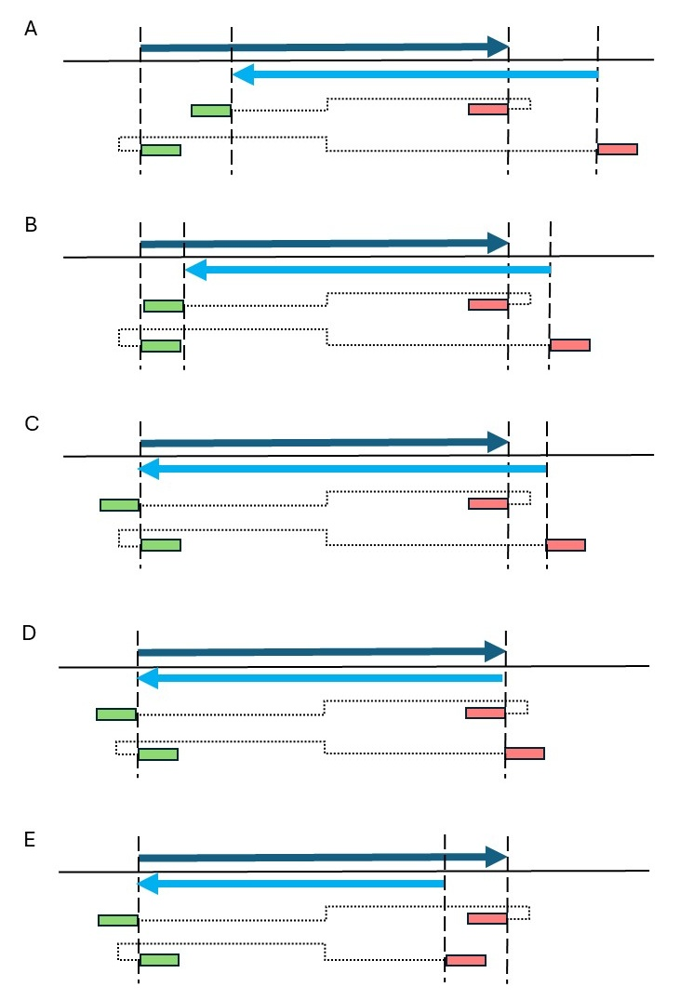
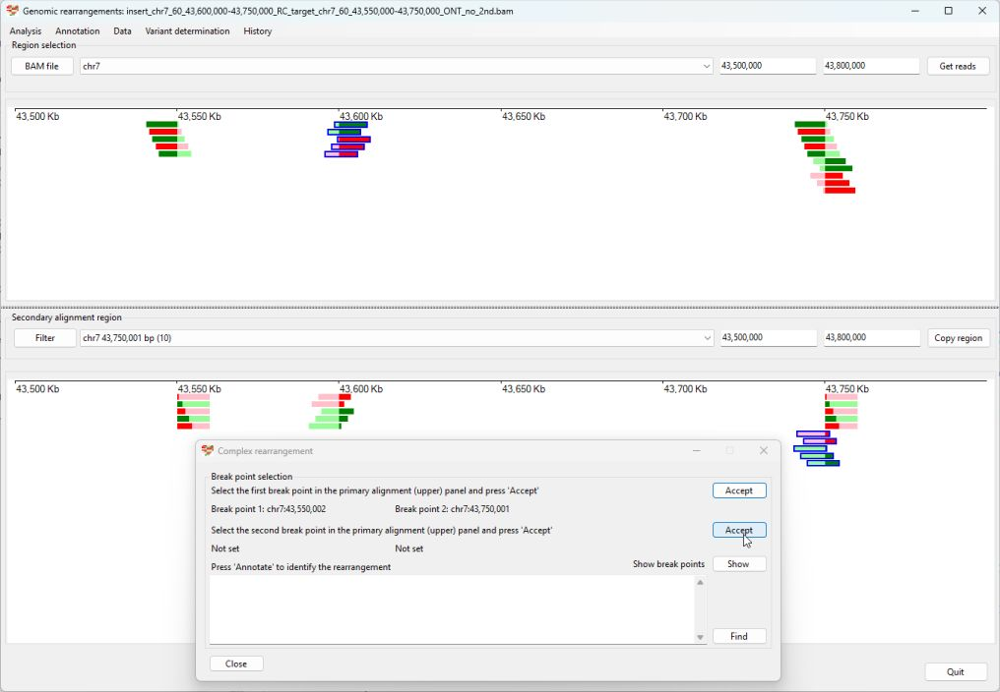
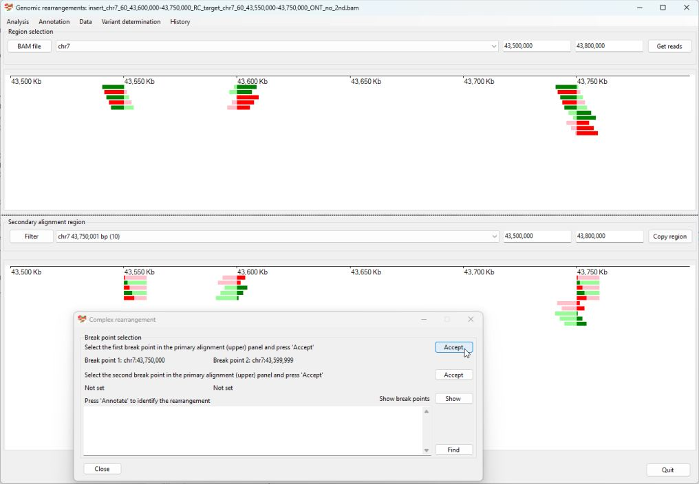
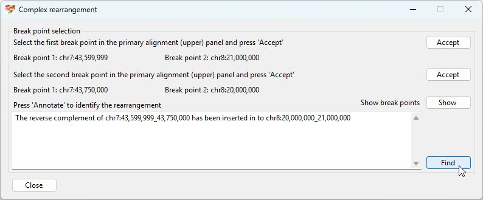

# Identifying a complex rearrangement

Typically, most rearrangements are simple, in that no sequence is lost at the point of insertion, but a significant number of structural variants do lose data at the point of insertion. Consequently, the ***Complex rearrangement*** function (___Variant determination___ > ___Use soft clip data___ > ___Complex rearrangement___ ) was created to aid their annotation.

When analysing rearrangements, its apparent that they fall in three main groups, which have 2, 3 or 4 distinct columns of split reads. Rearrangements with 2 columns (or insertions with 3 columns) are classed as simple and can be annotated by AgileStructure, using one of its specific functions. Those with 3 or 4 columns should be annotated with the ***Complex rearrangement*** window. 

Why a rearrangement as 2, 3 or 4 columns of split reads depends on whether sequence is lost or duplicated at the break points. Figures 7a and 7b show an offset inversion with the size of the offset in Figures 7a greater than Figures 7b. It can be seen that as the size of the duplicated/deleted sequences decreases the distances between the two columns of split reads decreases. In Figures 7c no sequence was deleted/duplicated at 5’ side of the arrangement, consequently, the first two columns of split reads have merged to form a single column. It should be noted that the pattern of the read’s alignments has not changed.  In Figures 7d, no sequence is duplicated or deleted at either side of the rearrangement and so only two columns of split reads are present. Again, should be noted that the pattern of the read’s alignments has not changed. Finally. In Figure 7e the deleted sequence is shorter than the inserted sequences resulting in a duplication of sequences at the 3’ end of the inversion. This results in the end of the rearrangement been delimited by two columns of split reads, but unlike Figures 7a and 7b, the alignments lay between the columns. Yet again, should be noted that the pattern of each read’s alignments has not changed.
  

Figure: Affect of deletions and sequence duplication at breakpoints on the arrangement of the split reads. The dark blue arrow marks the extent of the rearranged sequence, while the pale blue arrow marks the extent of the sequence replaced by the copied sequence. The green and red rectangles indicate the location of a read’s alignments, with the different colours only indicating the orientation of the alignment differs. The dotted line indicates how a read’s alignments are arranged within the read. The vertical bashed line marks the apparent breakpoint at each column of split reads.

When describing a structural variant ***AgileStructure*** only needs data on two sets of split reads which are either the first or last two pairs of split read columns. While the break points in the examples below are close enough to be able to show them in the same window, it is possible to select on column of split reads and then move to another region on the same chromosome to select the second column. The selection of these columns is described below.

## Annotating a duplication or inversion in which sequence is deleted

The synthetic read datasets contains a number of duplications and insertions in which part of the insertion site is deleted resulting in the formation of three columns of split reads. In this guide the analysis of a chromosome 7 sequence in which the reverse complement of the chr 7, 43,600,000 to 43,750,000 is inserted into the region chr7, 43,550,000 to 43, 750,000 creating an inversion with a 50 kb deletion on its 5 prime flank ([see synthetic data set file ](../synthetic/RC_of_chr7_43,600,000-43,750,000_inserted_into_chr7_43,550,000-43,750,000.md)).

### Selecting the region

The indexed bam file was imported by pressing the **Bam file** button and selecting the region Chr7, 43,500,000 to 43,800,000. A location on chr7 was selected in the lower panels dropdown list and the ***Copy region*** button was pressed to select the same region in the upper and lower panels (Figure 1)

Figure 1

### Selecting the break points at the two distinct sites

Break points are first selected by selecting the __Variant determination___ > ___Use soft clip data___ > ___Complex rearrangement___ menu option which opens the ***Complex rearrangement*** window (Figure 2)

Figure 2

In this example the split reads appear has three columns, the first two columns delimit the region deleted in the rearrangement and consist of reads who's arrangement primary/secondary alignment is the same as other split reads at that location. the third column contains reads that represent two types of primary/secondary alignment pattern. In Figure 2 the upper 5 reads at 43,750,000 have secondary alignments at 43,550,000, while the lower 5 have secondary alignments at 43,600,000. To annotated the variant select the reads in the first column and press the upper ***Accept*** button on the ***Complex rearrangement*** window (Figure 3a and 3b).

Figure 3a

Figure 3b

Pressing the upper ***Accept*** button on the ***Complex rearrangement*** window deselects the reads and displays the breakpoint coordinates in the window (figure 3b). If there is an issue the word 'error' will be displayed.

Next select the reads in the second column and press the lower ***Accept*** button in the ***Complex rearrangement*** window (Figure 4a and 4b)

Figure 4a

Figure 4b

As before, the reads will be deselected and the break point data will be displayed in the window. In this case the break point at 43,750,000 is found twice while those at 43,550,000 and 43,600,000 appear once. 

### Checking the break points have been detected

Pressing the ***Show*** button highlights the break points in the main window (Figure 5)

Figure 5

### Describing the variant

Finally, pressing the ***Find*** button on the ***Complex rearrangement*** window displays a description of the variant in the lower text area. This text can then be copied and pasted or used to create a variant annotation of your preferred format. 

Figure 6

### Selecting split reads at a single break point with two distinct patterns

Occasionally, the annotation step produces two are more possible descriptions, in which case it you will have to use the other set of split reads, in this case they over lap.

First, select the all split reads in the column that display the same pattern of primary and secondary alignments and the linked secondary alignments are 3 prime to the other set of secondary alignments (in this case at 43,600,000) and press the upper ***Accept*** button (Figure 6a and 6b)   

Figure 7a

Figure 7b

Next, select split reads showing the other primary/secondary alignment pattern (secondary alignments at 43,550,000) and press the lower ***Accept*** button (Figure 8a and 8b).

Figure 8a

Figure 8b

### Checking the break points have been detected

Pressing the ***Show*** button highlights the break points in the main window (Figure 5)

Figure 9

### Describing the variant

Finally, pressing the ***Find*** button on the ***Complex rearrangement*** window displays a description of the variant in the lower text area. This text can then be copied and pasted or used to create a variant annotation of your preferred format. 

Figure 10

## Annotating a insertion in which sequence is deleted

The synthetic read datasets contains a number of duplications and insertions in which part of the insertion site is deleted resulting in the formation of three columns of split reads. In this guide the analysis of a chromosome 7 sequence in which the reverse complement of the chr 7, 43,600,000 to 43,750,000 is inserted into the region chr8, 20,000,000 to 21,000,000 creating an insertion with a 1 Mb deletion on its insetion site ([see synthetic data set file ](../synthetic/chr7_43,600,000-43,750,000_inserted_into_chr8_20000000-21,000,000.md).

### Selecting the region

The indexed bam file was imported by pressing the **Bam file** button and selecting the region Chr7, 43,500,000 to 43,800,000. A location on chr8 was selected in the lower panels dropdown list and the region expanded to include the two split read columns at 20,000,000 and 21,000,000 (Figure 11)

Figure 11

### Selecting the break points at the four distinct sites

In this example two sets of split read columns occur on chromosome 7 and a second pair on chromosome 8. The first analysis will use the reads on chromosome 7 and the second on chromosome 8. However, if the insertion was on the same chromosome as the original sequence, the 5 prime most pair of reads would be analysed together or the 3 prime most pair would be analysed together.

### Selecting split reads on chromosome 7

After selecting the  __Variant determination___ > ___Use soft clip data___ > ___Complex rearrangement___ menu option and opening the ***Complex rearrangement*** window. Select the split reads in the first column and press the upper ***Accept*** button (Figure 12a and 12b)

Figure 12a

Figure 12b

Next select split reads in the second column on chromosome 7 and press the lower ***Accept*** button (Figure 13a and 13b)

Figure 13a

Figure 13b

 

### Checking the detection of the break points

Pressing the ***Show*** on the ***Complex rearrangement*** window displays the detected break points in the main window (Figure 14).

Figure 14

 

### Describing the structural rearrangement

Pressing the ***Find*** on the ***Complex rearrangement*** window prompts ***Agile Structure*** to describe the rearrangement (Figure 15). The description appears in the text area in the ***Complex rearrangement*** window.

Figure 15

 

### Selecting split reads on chromosome 8

The interval on chromosome 8 is select in the upper panel (chr8, 20,050,000 to 21,050,000) along with chr7, 43,550,000 to 43,800,000 in the lower panel and the ***Complex rearrangement*** window displayed by selecting the  __Variant determination___ > ___Use soft clip data___ > ___Complex rearrangement___ menu option. Select the split reads in the first column and press the upper ***Accept*** button (Figure 16a and 16b)

Figure 16a

Figure 16b

Next select split reads in the second column on chromosome 8 and press the lower ***Accept*** button (Figure 17a and 17b)

Figure 17a

Figure 17b

 

### Checking the detection of the break points

Pressing the ***Show*** on the ***Complex rearrangement*** window displays the detected break points in the main window (Figure 18).

Figure 18

 

### Describing the structural rearrangement

Pressing the ***Find*** on the ***Complex rearrangement*** window prompts ***Agile Structure*** to describe the rearrangement (Figure 19). The description appears in the text area in the ***Complex rearrangement*** window.

Figure 19

 