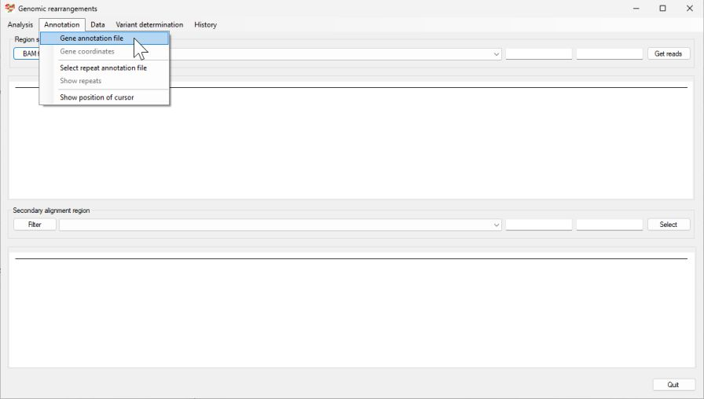
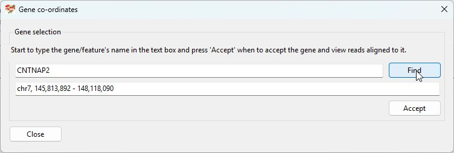
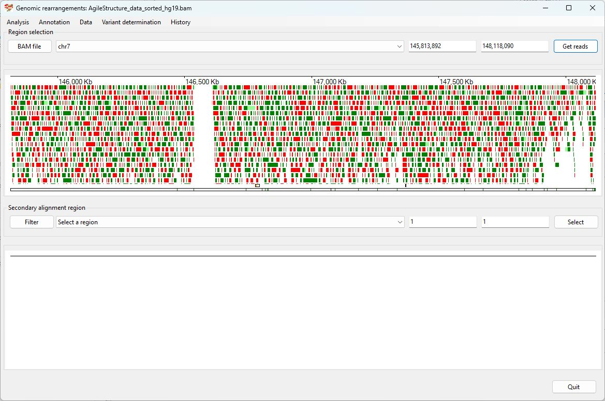
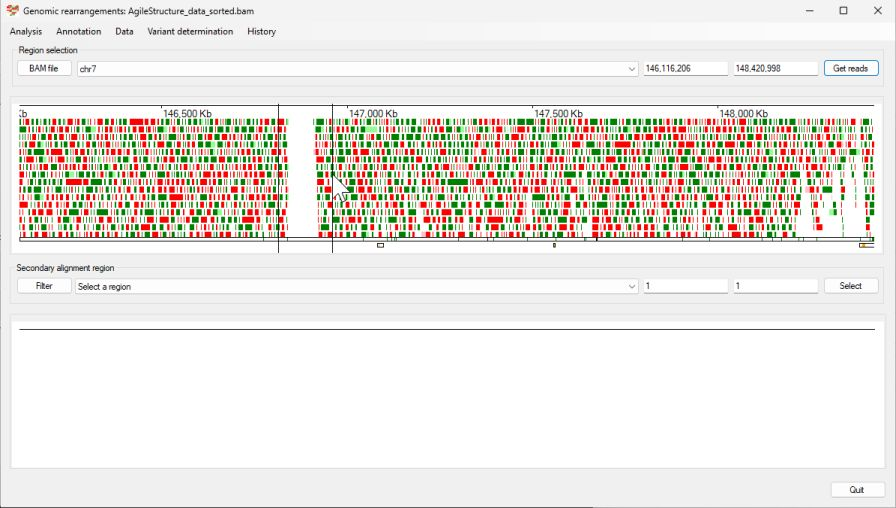
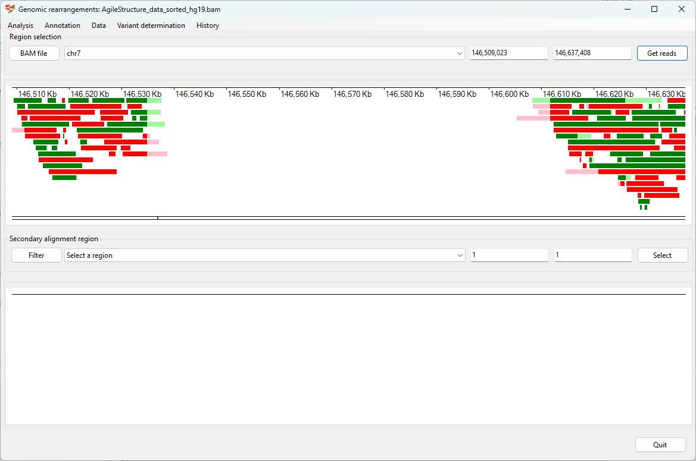
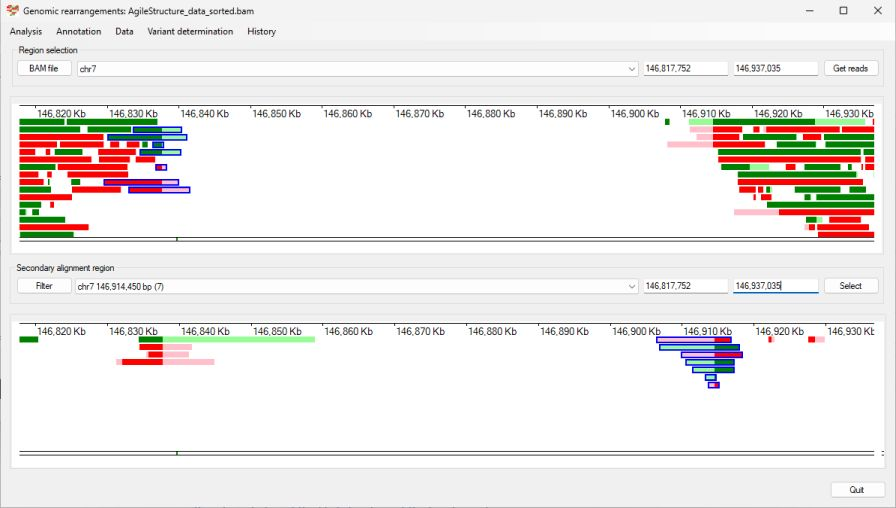
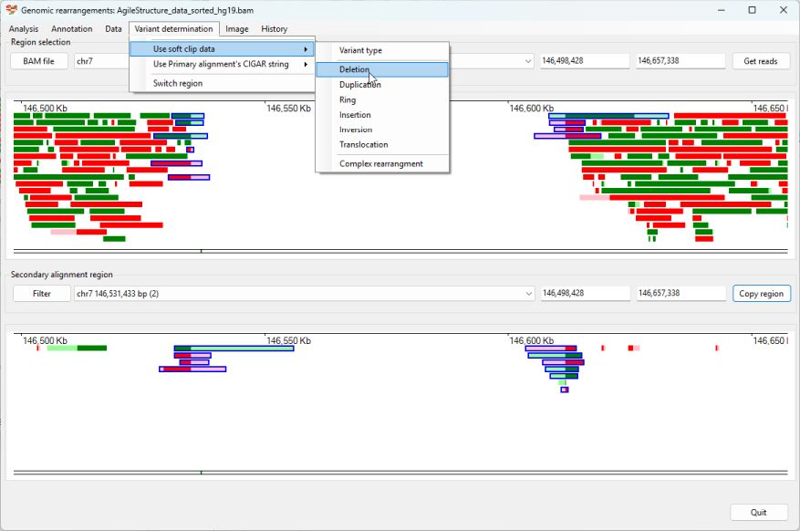

# Identifying a Deletion

The patient was first described in: 
> Watson CM, Crinnion LA, Tzika A, Mills A, Coates A, Pendlebury M, Hewitt S, Harrison SM, Daly C, Roberts P, Carr IM, Sheridan EG, Bonthron DT. (2014) Diagnostic whole genome sequencing and split-read mapping for nucleotide resolution breakpoint identification in CNTNAP2 deficiency syndrome. Am J Med Genet A. 164A:2649-55. doi: 10.1002/ajmg.a.36679.

Sanger sequencing of the individual identified the variant to be: __chr7:146,534,699_146,611,541del__  for the hg19 reference sequence 


__Prior information__  
Using clinical phenotype data an individual was believed to have a mutation in the CNTNAP2 gene.  
(The read data in in the AgileStructure_dta_sorted.bam file.)

Import the alignment data by pressing ```BAM file``` button. While it's possible to determine the location of the CNTNAP2 gene from a number of sources, in this example we'll get AgileStructure to identify the region using the RefSeq gene data set. To do this first download the data set as described [here](downloadingOptionalFiles.md), then select the ```Annotation``` > ```Gene annotation file```menu option and select the files (Figure 1). The annotation file most be for the same reference build as the read data was aligned too. The file will take a couple of seconds to load



Figure 1

The file will take a couple of seconds to load before you can select the ```Annotation``` > ```Gene coordinates``` menu option, which will display the ```Gene co-ordinates``` window (if no bam file was selected this window will not appear). Enter CNTNAP2 in to the upper text area and press the ```Find``` button. The co-ordinates for CNTNAP2 will then appear in the lower text area. (Figure 2)



Figure 2

Pressing the ```Accept``` button will then cause the gene's co-ordinates to appear in the upper panel's dropdown list and text areas, while pressing the ```Get reads``` while display reads mapping to CNTNAP2. Since a RefSeq annotation file was entered, the CNTNAP's exons will be displayed (Figure 3). Since the individual is homozygous for the mutation, it's location is easily seen as an area with no reads. 



Figure 3

Consequently, it is possible to select the deletion without looking for the location of unaligned sequences in the lower panel (Figure 4 and 5).



Figure 4



Figure 5

However, for AgileStructure to annotate a break point it requires a region to be selected in the lower dropdown list. Selecting the ```chr7 146,914,450 bp (7)``` option will only display one side of the deletion, to view both sides copy and paste the locations in the upper text areas to the lower text areas (Figure 6). This aligns the mapping of the primary alignments to the mapping of the secondary alignments. Selecting primary alignments mapping to one side of the deletion will highlight their secondary alignments at the other side of the deletion.



Figure 6

After selecting all the reads spanning the deletions selecting the ```Variant determination``` > ```Use soft clip data``` > ```Deletion``` menu option prompts AgileStructure to analyse the selected reads and annotate the break point: chr7.146,837,611_146,914,450del (Figure 7).  



Figure 7

As stated at the start the variant had perviously been identified as chr7.146,837,607_146,914,449del when the original coordinates are mapped from hg19 to hg38

chr7.146,837,611_146,914,450del: AgileStructure
chr7.146,837,607_146,914,449del: original publication

[Return user guide](README.md#deletion) 