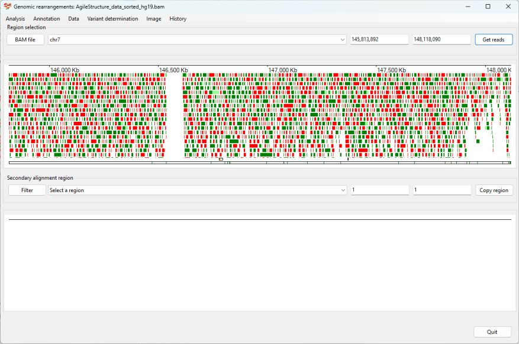
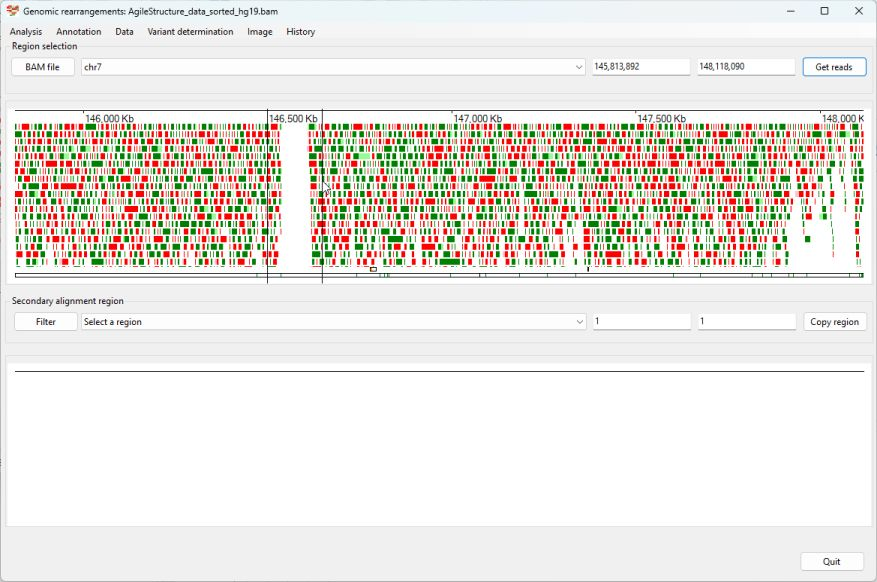
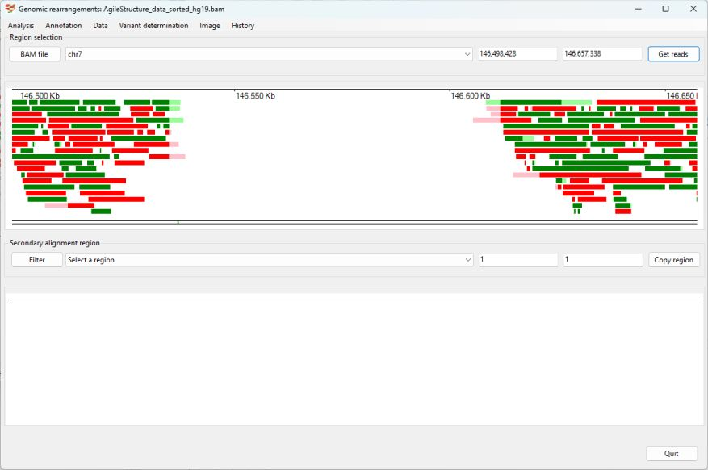

# Identifying a Deletion

The patient was first described in: 
> Watson CM, Crinnion LA, Tzika A, Mills A, Coates A, Pendlebury M, Hewitt S, Harrison SM, Daly C, Roberts P, Carr IM, Sheridan EG, Bonthron DT. (2014) Diagnostic whole genome sequencing and split-read mapping for nucleotide resolution breakpoint identification in CNTNAP2 deficiency syndrome. Am J Med Genet A. 164A:2649-55. doi: 10.1002/ajmg.a.36679.

Sanger sequencing of the individual identified the variant to be: __chr7:146,534,699_146,611,541del__  with reference to the hg19 human reference sequence 

__Data__  
The aligned data is in the ```AgileStructure```_dta_sorted.bam file.

__Prior information__  
Using clinical phenotype data an individual was believed to have a mutation in the CNTNAP2 gene.  

Import the alignment data by pressing ```BAM file``` button and selecting the ```bam``` file. While it's possible to determine the location of the CNTNAP2 gene from a number of sources, in this example we'll get ```AgileStructure``` to identify the region using the RefSeq gene data set. To do this first download the data set as described [here](downloadingOptionalFiles.md), then select the ```Annotation``` > ```Gene annotation file``` menu option and select the file (Figure 1).   

***Note***: the annotation file must be for the same reference genome build as the read data was aligned too.


Figure 1

The file will take a couple of seconds to load before you can select the ```Annotation``` > ```Gene coordinates``` menu option, which will display the ```Gene co-ordinates``` window (if no bam file was selected this window will not appear). Enter the gene's symbol (CNTNAP2) in to the upper text area and press the ```Find``` button. The coordinates for CNTNAP2 will then appear in the lower text area. (Figure 2)


Figure 2

Pressing the ```Accept``` button will then close the window and the gene's coordinates will appear in the upper panel's dropdown list and text areas, while pressing the ```Get reads``` will display reads mapping to CNTNAP2. Since a RefSeq annotation file was entered, the exons of any gene in the region will be displayed (Figure 3). 



Figure 3

Since the individual is homozygous for the mutation, it's location is easily seen as an area with no aligned read data. Consequently, it is possible to select the deletion without looking for the location of secondary alignments sequences in the lower panel (Figure 4 and 5).



Figure 4

To view the region in more detail, place the mouse cursor just before the start of the region, press the right mouse button and move the cursor to just after the end of the region (Figure 4) before releasing the mouse button to zoom in on the deletion (Figure 5).



Figure 5

However, while you don't need to use the lower panel to identify the deletion's break points, for ```AgileStructure``` to annotate a break point it does require a region to be selected in the lower dropdown list. Selecting the ```chr7 146,914,450 bp (7)``` option from the dropdown list above the secondary alignment display will only display one side of the deletion, to view both sides copy and paste the locations from the upper text areas to the lower text areas (Figure 6). This aligns the positions of the primary alignments to the mapping of the secondary alignments. Selecting primary alignments mapping to one side of the deletion will highlight their secondary alignments at the other side of the deletion (Figure 6).


Figure 6

After selecting all the reads spanning the deletion, pressing the ```Variant determination``` > ```Use soft clip data``` > ```Deletion``` menu option prompts ```AgileStructure``` to analyse the selected reads and annotate the break point has:  
__chr7.146,837,611_146,914,450del__ (Figure 7).  


Figure 7

As stated above, the variant had perviously been identified as:  
 __chr7:146,534,699_146,611,541del__   
 in the hg19 reference build, when the original coordinates are mapped from hg19 to hg38 using the [Lift Genome Annotations](https://genome.ucsc.edu/cgi-bin/hgLiftOver) webpage at the UCSC Genome Browser site, the regions can be seen to closely match:

|Origin|Variant|
|-|-|
|Publication|chr7.146,837,607_146,914,449del|
|This guide|chr7.146,837,611_146,914,450del|


[Return user guide](README.md#deletion) 