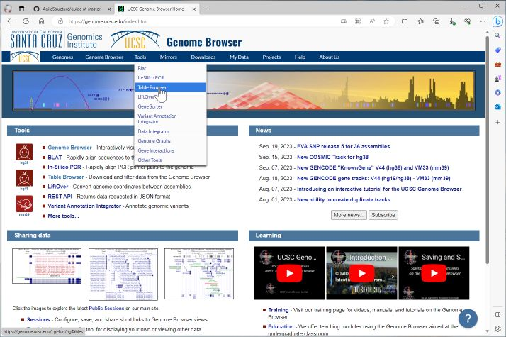

## Obtaining gene and reapet data
It is possible to view the location of genes and repeats with reference to the aligned data. This data can be obtained from the UCSC genome browser 'Table Browser'. The genome browser is located here: https://genome.ucsc.edu/index.html, with the Table Browser accessed via the Tools > Table Browser menu option (Figure 1). 

The web page contains of a number of options used to select the genome to which the long read data was aligned, the type of data you want and its format. Figure 2 shows the options used to select the genomic coordinates for the genes in NCBI refseq data set for the human hg38 reference sequence. Similarlay, Figure 3 conatians the setting for downlaoding the locations of the repeat sequences.

In both cases the genome option is selected to obtain data from the entire genome and whose format is set using the "selected fields from primary and related tables" and "tsv (tab-separated) text file" options. Finally, to aid downloading the data is compressed using the "gzip compressed" option. Pressing the "get output" directs the user to a 2nd page with which to selected what data fields are required (Figures 4 and 5). 