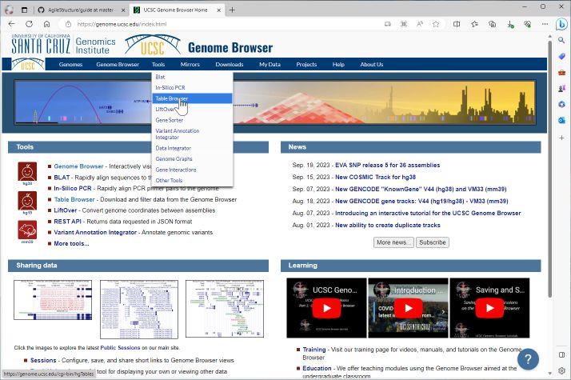
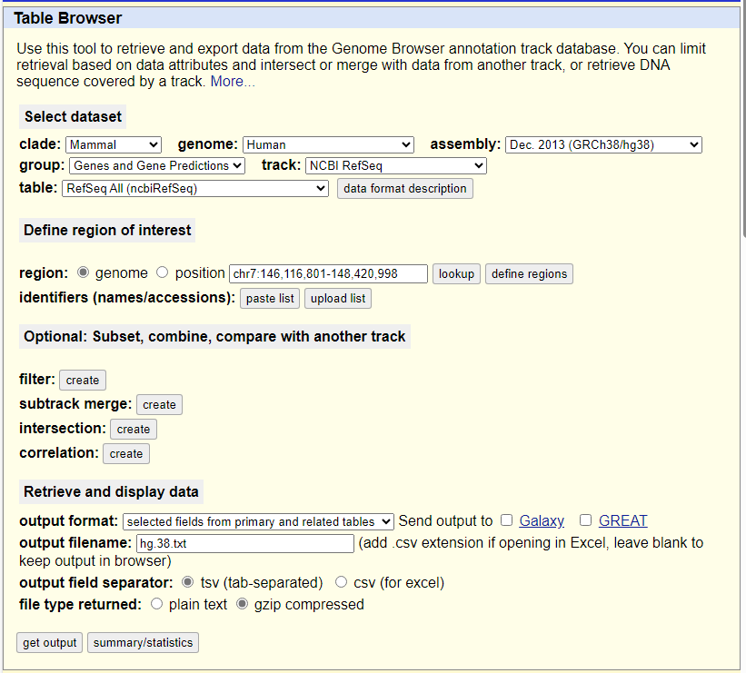
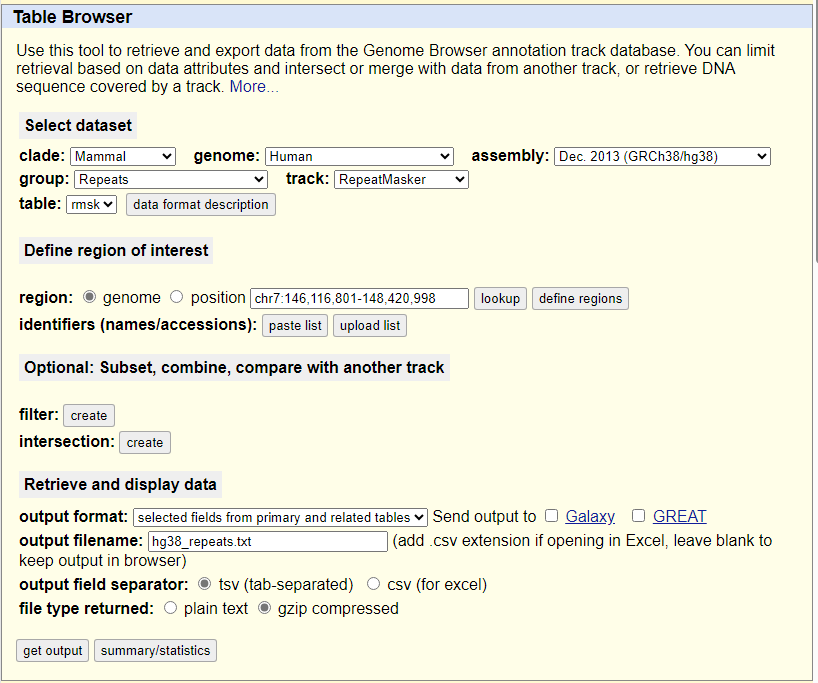
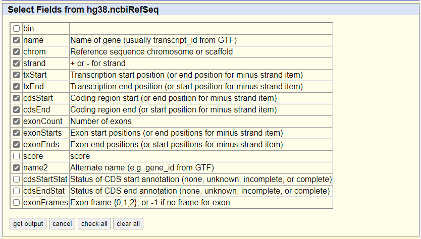
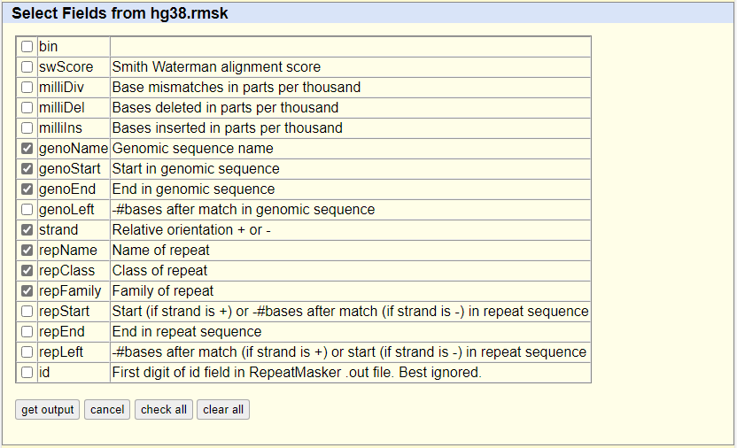

## Obtaining gene and repeat data
It is possible to view the location of genes and repeats with reference to the aligned data. The required data can be obtained from the UCSC genome browser 'Table Browser'. The genome browser is located here: https://genome.ucsc.edu/index.html, with the Table Browser accessed via the Tools > Table Browser menu option (Figure 1). 



Figure 1

The web page contains of a number of options used to select the genome to which the long read data was aligned, the type of data you want and its format. Figure 2a shows the options used to select the genomic coordinates for the genes in NCBI refseq data set for the human hg38 reference sequence. similarly , Figure 2b contains the settings for downloading the locations of the repeat sequences. The options for both datasets are very similar differing only by type of data to selected via the "group" and "track" options and the name of the file.



Figure 2a: Downloading gene coordinates

<hr />



Figure 2b: Downloading repeat coordinates.

<hr />

In both cases the genome option is selected to obtain data from the entire genome, while the format is set using the ```selected fields from primary and related tables``` and ```tsv (tab-separated) text file``` options. Finally, the data is compressed using the "gzip compressed" option. Pressing the ```get output``` directs the user to a 2nd page with which to selected what data fields are required (Figures 3a and 3b). Once the required fields have been set, pressing the ```get output``` button on this webpage will start the download.



Figure 3a: Selecting the options for gene coordinates file

<hr />



Figure 3b Selecting the options for repeat coordinates file

<hr />

Once downloaded, the files should be decompressed using a program such as 7zip (home page: https://www.7-zip.org/ and download page: https://www.7-zip.org/download.html)