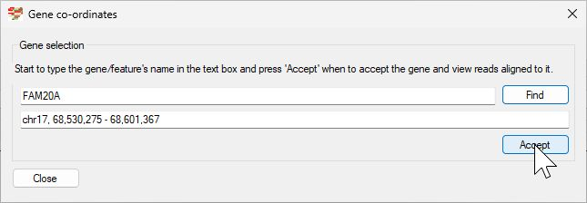
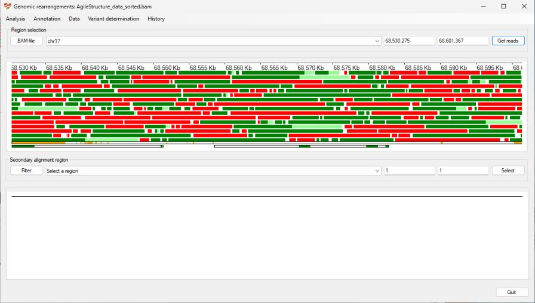
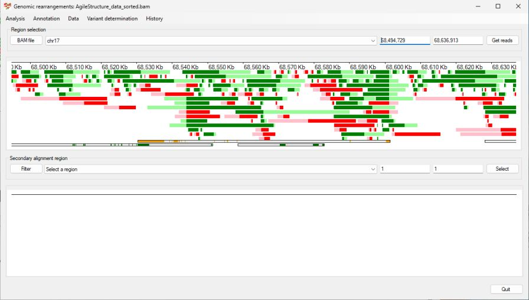
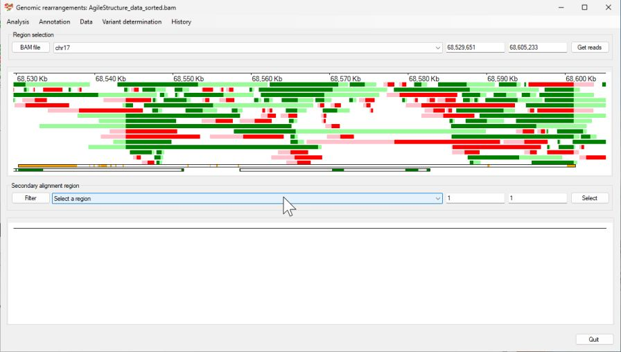
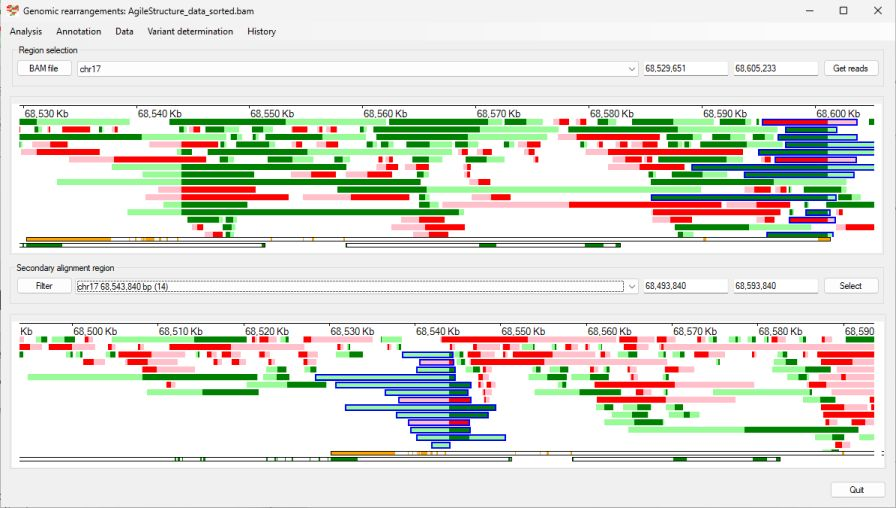
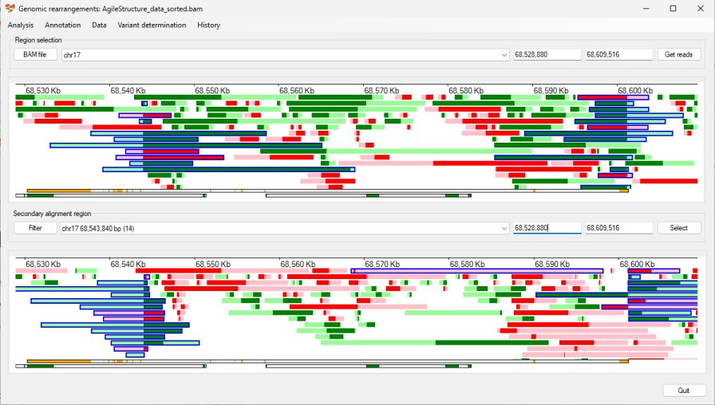
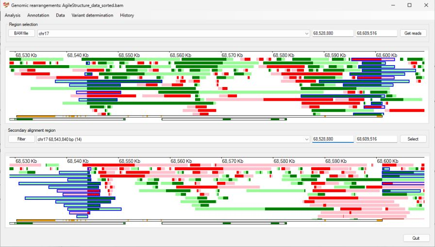
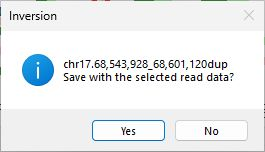

# Identifying a Duplication

__Prior information__  
Using clinical phenotype data an individual was believed to have a mutation in the FAM20A gene, however only a single pathogenic variant was found in what is normally a recessive condition. Consequently, the region was screened for structural rearrangement that could affect the gene.
(The aligned read data in in the AgileStructure_data_sorted.bam file.)

Import the aligned data by pressing ```BAM file``` button. While it's possible to determine the location of the FAM20A gene from a number of sources, in this example we'll get AgileStructure to identify the region using the RefSeq gene data set. To do this first download the data set as described [here](downloadingOptionalFiles.md), pick the ```Annotation``` > ```Gene annotation file``` menu option and select the file (Figure 1). The annotation file must be for the same reference build as the reference sequences the read data was aligned too.


Figure 1

The file will take a couple of seconds to load before you can select the ```Annotation``` > ```Gene coordinates``` menu option, which will display the ```Gene co-ordinates``` window (if no bam file has been selected this window will not appear). Enter FAM20A in to the upper text area and press the ```Find``` button. The coordinates for FAM20A will then appear in the lower text area. (Figure 2)



Figure 2

Pressing the ```Accept``` button will then cause the gene's coordinates to appear in the upper panel's dropdown list and text areas, while pressing the ```Get reads``` while display reads mapping to FAM20A. Since a RefSeq annotation file was entered, the FAM20A's exons will be displayed at the bottom of the display panel (Figure 3) (Unlike many genes, the opposite strand encodes two overlapping genes (PRKAR1A and LOC105371873) who's exons are coloured green compared to the yellow exons of FAM20A.). Since the individual is heterozygous for the mutation, it's location is not easily seen as the number of reads exceeds the ability of AgileStructure to display them.



Figure 3

While any rearrangement is presumed to affect FAM20A's expression, it may not directly impact on the gene's sequences, consequently the region was enlarged by placing the cursor in one of the upper text areas (such that you could type in the area) and the ```Ctrl``` + ```up arrow``` were pressed; this will double the size of the region. The number of reads displayed in the upper panel was reduced by selecting the ```Analysis``` > ```Only show reads with secondary alignments``` menu option (Figure 4)



Figure 4

Two columns of reads with secondary alignments can readily be seen at positions ~68,545,000 bp and ~68,602,000 bp. Use the mouse to select these putative break points and the FAM20A gene (put the mouse cursor at the start of the FAM20A gene, press the right hand mouse button and move the mouse past the 2nd break point and releasing the mouse button). Pressing the ```Get reads``` button displays reads with secondary alignments that mapping to this region. 



Figure 5

Searching the the lower dropdown list for a region within the FAM20A gene reveals two regions with a noticeable number of reads with secondary alignments: chr17 68,543,840 bp (14) and chr17 68,601,102 bp (10). Select the first region and then, in the lower panel, click on each read spanning the break point to select it and show its primary alignment at the second break point in the upper window (Figure 6)



Figure 6

Coping and pasting the coordinates from the upper panel's text areas to the lower panels text areas will display both break points, aligned to their positions in the upper window and allow reads who's primary alignment is at the first break point to be selected (Figure 7)



Figure 7

Looking at the reads with a secondary alignment at the second break point, reveals a read with two alternative alignments one at the break points and a very short second alignment at about 68, 570,000 bp.
Since AgileStructure identifies all the possible break points in a read and then aggregates the data to identify the most likely breakpoints, it is not necessary to remove reads from the analysis before annotating the breakpoint by selecting ```Variant determination``` > ```Use soft clip data``` > ```Duplication``` menu option (Figure 8). 


Figure 8

However, it would be sensible to remove any read that doesn't support the proposed mutation and annotate the site a 2nd time to check the result is consistent. 



Figure 9



Figure 10 

In this case the annotation changes by a base pair from chr17.68,543,927_68,601,120dup to chr17.68,543,928_68,601,120dup

[Return user guide](README.md#duplication) 