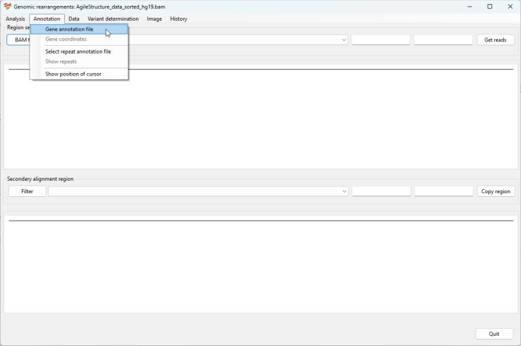
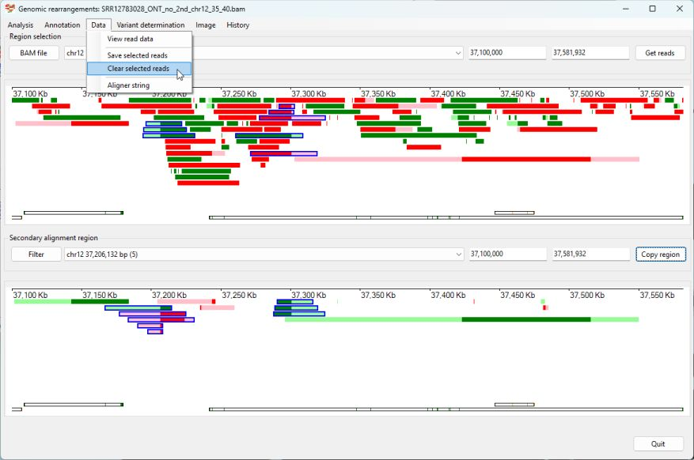
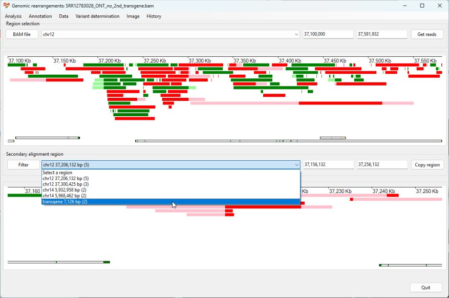

# Identifying a Duplication
## Case 1

This duplication is described here:
> Poulter JA, Smith CE, Murrillo G, Silva S, Feather S, Howell M, Crinnion L, Bonthron DT, Carr IM, Watson CM, Inglehearn CF, Mighell AJ. A distinctive oral phenotype points to FAM20A mutations not identified by Sanger sequencing. Mol Genet Genomic Med. 2015 Oct 4;3(6):543-9. doi: 10.1002/mgg3.164. PMID: 26740946; PMCID: PMC4694127.

__Prior information__  
Using clinical phenotype data an individual was believed to have a mutation in the FAM20A gene, however only a single pathogenic variant was found in what is normally a recessive condition. Consequently, the region was screened for a structural rearrangement that could affect the gene.  
(The aligned read data in in the AgileStructure_data_sorted.bam file.)

### Analysis

Import the aligned data by pressing ```BAM file``` button. While it's possible to determine the location of the FAM20A gene from a number of sources, in this example we'll get AgileStructure to identify the region using the RefSeq gene data set. To do this first download the data set as described [here](downloadingOptionalFiles.md), pick the ```Annotation``` > ```Gene annotation file``` menu option and select the file (Figure 1). The annotation file must be for the same reference build as the reference sequences the read data was aligned too.



Figure 1

The file will take a couple of seconds to load before you can select the ```Annotation``` > ```Gene coordinates``` menu option, which will display the ```Gene co-ordinates``` window (if no bam file has been selected this window will not appear). Enter FAM20A in to the upper text area and press the ```Find``` button. The coordinates for FAM20A will then appear in the lower text area. (Figure 2)


Figure 2

Pressing the ```Accept``` button will cause the gene's coordinates to appear in the upper panel's dropdown list and text areas, while pressing the ```Get reads``` will display reads mapping to FAM20A. Since a RefSeq annotation file was entered, the FAM20A's exons will be displayed at the bottom of the display panel (Figure 3) (Unlike many genes, the opposite strand encodes two overlapping genes [PRKAR1A and LOC105371873] who's exons are coloured green compared to the yellow exons of FAM20A.). Since the individual is heterozygous for the mutation, it's location is not easily seen as the number of reads exceeds the space available to display them.


Figure 3

While the putative rearrangement is presumed to affect FAM20A's expression, it may not directly impact on the gene's sequences, consequently the region was enlarged by placing the cursor in one of the upper text areas (such that you could type in the area) and the ```Ctrl``` + ```up arrow``` were pressed; this will double the size of the region. The number of reads displayed in the upper panel was then reduced by selecting the ```Analysis``` > ```Only show reads with secondary alignments``` menu option (Figure 4)


Figure 4

Two columns of reads with secondary alignments can readily be seen at positions ~68,545,000 bp and ~68,602,000 bp. Use the mouse to select the containing these putative break points and the FAM20A gene (put the mouse cursor at the start of the FAM20A gene, press the right hand mouse button and move the mouse past the 2nd break point and releasing the mouse button). Pressing the ```Get reads``` button will refresh the display to show reads within this region that also have secondary alignments. 


Figure 5

Searching the lower dropdown list for a region within the FAM20A gene reveals two regions containing a high number of reads with secondary alignments: chr17 68,543,840 bp (14) and chr17 68,601,102 bp (10). Select the first region and then, in the lower panel, click on each read spanning the break point to select it and show its primary alignment at the second break point in the upper window (Figure 6)


Figure 6

Coping and pasting the coordinates from the upper panel's text areas to the lower panels text areas will display both break points, aligned to their positions in the upper window and allow reads who's primary alignment is at the first break point to be selected (Figure 7)


Figure 7

Looking at the reads with a secondary alignment at the second break point, reveals a read with two alternative alignments one at the break points and a very short second alignment at about 68,570,000 bp.
Since AgileStructure identifies all the possible break points in a read and then aggregates the data to identify the most likely breakpoints, it is not necessary to remove reads from the analysis before annotating the breakpoint by selecting ```Variant determination``` > ```Use soft clip data``` > ```Duplication``` menu option (Figure 8). 


Figure 8

However, it would be sensible to remove any read that doesn't support the proposed mutation and annotate the site a 2nd time to check the result is consistent. 


Figure 9


Figure 10 

In this case the annotation changes by a base pair from ___chr17.68,543,927_68,601,120dup___ to ___chr17.68,543,928_68,601,120dup___.

[Return user guide](README.md#duplication) 

## Case 2

This transgenic mouse is described here:

> Sailer S, Coassin S, Lackner K, Fischer C, McNeill E, Streiter G, Kremser C, Maglione M, Green CM, Moralli D, Moschen AR, Keller MA, Golderer G, Werner-Felmayer G, Tegeder I, Channon KM, Davies B, Werner ER, Watschinger K. When the genome bluffs: a tandem duplication event during generation of a novel ___Agmo___ knockout mouse model fools routine genotyping. Cell Biosci. 2021 Mar 16;11(1):54. doi: 10.1186/s13578-021-00566-9. PMID: 33726865; PMCID: PMC7962373.

__Backgroud__

A transgenic ___Agmo___ knockout mouse was created by inserting a lacZ-neoR cassette close to exon 2 of the ___Agmo___ gene. However, difficulties genotyping ___Agmo___ deficient mice lead to the sequencing of the mouse and the identification of a 94 Kb tandem duplication of the 5' end of the ___Agmo___ gene.  

The data for this experiment is hosted on the NCBI SRA site as [SRR12783028](https://www.ncbi.nlm.nih.gov/sra/?term=SRR9982133).  

Reads which mapped to the start of the ___Agmo___ gene and contained extended unaligned data were used to search the NCBI blast database to obtain sequences homologous to the lacZ-NeoR cassette. This identified the sequence [JN960306.1](https://www.ncbi.nlm.nih.gov/nucleotide/JN960306.1?report=genbank&log$=nuclalign&blast_rank=3&RID=TWZMA063013) from which the sequence for the lacZ-NeoR cassette was extracted (15041 to 22164 bp) and added to mm10 mouse genome reference sequence as a separate reference sequence called transgene. The long read sequencing data aligned was then aligned to this combined reference and used in this guide.

While the detection of the cassette is separate from the detection of the duplication, it's identification is shown below and in the [insertion walk through](insertion.md).  

The RefSeq gene data for the mm10 genome reference was downloaded from the Genome Browser's Table Browser as describe [here](downloadingOptionalFiles.md).

### Analysis

Import the aligned data by pressing the ```BAM file``` button. While it's possible to determine the location of the ___Agmo___ gene from a number of sources, in this example we'll get AgileStructure to identify the region using the RefSeq gene data set. To do this first download the data set as described [here](downloadingOptionalFiles.md), use the ```Annotation``` > ```Gene annotation file``` menu option and select the file (Figure 11). The annotation file must be for the same reference build as the reference sequences the read data was aligned too.


Figure 11

The file will take a couple of seconds to load before you can select the ```Annotation``` > ```Gene coordinates``` menu option, which will open the ```Gene co-ordinates``` window (if no bam file has been selected this window will not appear). Enter ___Agmo___ in to the upper text area and press the ```Find``` button. The coordinates for AMGO will then appear in the lower text area. (Figure 12)


Figure 12

Pressing the ```Accept``` button will then cause the gene's coordinates to appear in the upper panel's dropdown list and text areas. Since the duplication affects the 5' end of the gene, change the start of the display region from 37,241,638 bp to 37,100,000 bp and press  the ```Get reads``` to display reads mapping to ___Agmo___ and 5' upstream sequences. Since a RefSeq annotation file was entered, the ___Agmo___'s exons will be displayed at the bottom of the display panel (Figure 13). 


Figure 13

To view the secondary alignments of the reads shown in the upper panel, select a region from the lower dropdown list that is on chromosome 12 and change the limits of the display to match those in the upper panel and then select the reads that span the breakpoints (Figure 14).


Figure 14

Selecting the ```Variant determination``` > ```Use soft clip data``` > ```Duplication``` menu option prompts AgileStructure to annotate the variant (Figure 15)


Figure 15

The variant __chr12.37,206,133_37,300,424dup__ closely matches the region published duplicated region: __chr12:37,206,133–37,300,425__.

### Identification of the lacZ-NeoR cassette

As stated above the transgenic mouse also included a lacZ-NeoR cassette whose sequence was added to the mouse mm10 reference sequence and called 'transgene'.

Following on from the detection of the duplication, all selected reads were deselected by using the ```Data``` > ```Clear selected reads``` menu option (Figure 16)



Figure 16

From the lower dropdown list, the region linked to the 'transgene' references sequence was selected and the two reads shown in the lower panel selected by clicking on them with the mouse (Figure 17)



Figure 17

The primary alingment for these reads can be seen at approximately  37,243,000 bp on chromosome 12 in intron 1 of the ___Agmo___ gene as expected (Figure 18). Selecting the ```Variant determination``` > ```Use soft clip data``` > ```Insertion``` menu option prompts AgileStructure to identify the insertion as chr12.37,243,310ins transgene.4,567,7126 (Figure 19). This is close to exon 2 the known location for the cassette.


Figure 18


Figure 19