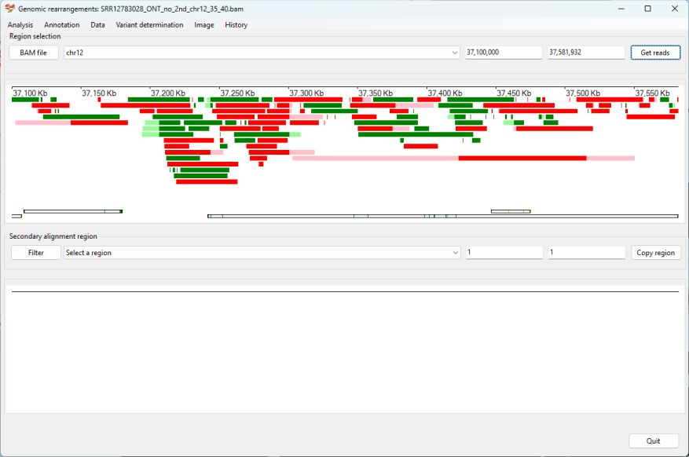

# Identifying a Duplication

This case study involves the ___Agmo___ knock out mouse that is lso discussed in Case 2 in the [Identification of insertions](insertion.md) read me file.

This transgenic mouse is described here:

> Sailer S, Coassin S, Lackner K, Fischer C, McNeill E, Streiter G, Kremser C, Maglione M, Green CM, Moralli D, Moschen AR, Keller MA, Golderer G, Werner-Felmayer G, Tegeder I, Channon KM, Davies B, Werner ER, Watschinger K. When the genome bluffs: a tandem duplication event during generation of a novel ___Agmo___ knockout mouse model fools routine genotyping. Cell Biosci. 2021 Mar 16;11(1):54. doi: 10.1186/s13578-021-00566-9. PMID: 33726865; PMCID: PMC7962373.

__Background__

A transgenic Agmo knockout mouse was engineered by inserting a lacZ-neoR cassette near exon 2 of the Agmo gene. However, challenges in genotyping these Agmo-deficient mice prompted further sequencing, revealing a 94 Kb tandem duplication at the 5' end of the Agmo gene.  

The data for this experiment is hosted on the NCBI SRA site as [SRR12783028](https://www.ncbi.nlm.nih.gov/sra/?term=SRR12783028).  

Reads that mapped to the start of the ___Agmo___ gene and contained extended unaligned sequence were used to search the NCBI blast database to obtain sequences homologous to the lacZ-NeoR cassette. This identified the sequence [JN960306.1](https://www.ncbi.nlm.nih.gov/nucleotide/JN960306.1?report=genbank&log$=nuclalign&blast_rank=3&RID=TWZMA063013) from which the sequence for the lacZ-NeoR cassette was extracted (15041 to 22164 bp) and added to the mm10 mouse genome reference sequence as a separate reference sequence called transgene. The long read sequencing data was then aligned to this extended reference sequence and used in this guide.

While the detection of the cassette is separate from the detection of the duplication, its identification is shown below and in the [insertion walk through](insertion.md).  

The RefSeq gene data for the mm10 genome reference was downloaded from the Genome Browser's Table Browser as describe [here](downloadingOptionalFiles.md).

### Analysis

Import the aligned data by pressing the ```BAM file``` button. While it's possible to determine the location of the ___Agmo___ gene from a number of sources, in this example we'll use ```AgileStructure``` to identify the region using the RefSeq gene data set. First, download the data set as described [here](downloadingOptionalFiles.md). Then, select the ```Annotation``` > ```Gene annotation file``` menu option and choose the downloades file (Figure 11). The annotation file must correspond to the reference build used to align the data.


Figure 11

The file will take a couple of seconds to load before you can select the ```Annotation``` > ```Gene coordinates``` menu option, which will open the ```Gene coordinates``` window (if no bam file has been selected, this window will not appear). Enter ___Agmo___ into the upper text area and press the ```Find``` button. The coordinates for ___AMGO___ will then appear in the lower text area. (Figure 12)


Figure 12

Pressing the ```Accept``` button will then cause the gene's coordinates to appear in the dropdown list and text areas of the upper panel. Since the duplication affects the 5' end of the gene, change the start of the display region from 37,241,638 bp to 37,100,000 bp and press  the ```Get reads``` button to display reads mapping to ___Agmo___ and 5' upstream sequences. Since a RefSeq annotation file was entered, the ___Agmo___'s exons will be displayed at the bottom of the display panel (Figure 13). 



Figure 13

To view the secondary alignments in the upper panel, select a region on chromosome 12 from the dropdown list in the lower panel and press the Copy region button to show the same region in the upper and lower panels and then choose the reads that span the breakpoints (Figure 14).


Figure 14

Selecting the ```Variant determination``` > ```Use soft clip data``` > ```Duplication``` menu option, prompts ```AgileStructure``` to annotate the variant (Figure 15)


Figure 15

The annotation __chr12.37,206,133_37,300,424dup__ closely matches the region published duplicated region: __chr12:37,206,133–37,300,425__.

