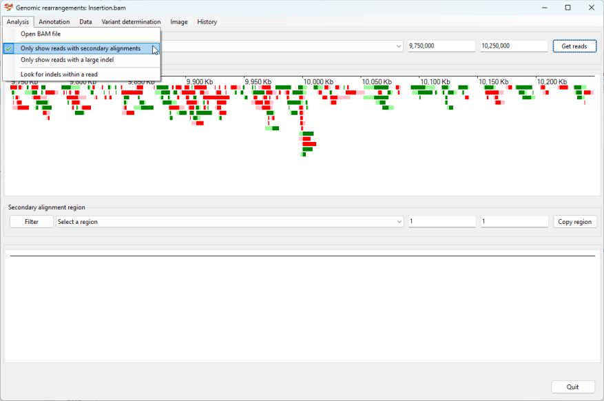

# Identifying a Insertion

## Case 1

__Prior information__  
Due to a lack of patient data with a large insertion, a reference sequence was created in which 0.5 Mb of sequence was removed from chromosome 1 at 10,000,000 bp and inserted at 200,000,000 bp of chromosome 1. When reads from a health individual are aligned to this data it would appear as if it has a 500 Kb insert at 10,000,000 bp on chromosome 1 which originated from 199,500,000 of chromosome 1. 

Import the data by pressing the ```Bam file``` button and selecting the file and then select chromosome 1 from the upper dropdown list box and enter the co-ordinates for the approximate position you want to start the search for the first break point in the  two text boxes to the right of the dropdown list and import the data by selecting the ```Analysis``` > ```Only show reads with secondary alignments``` menu option (Figure 1)



Figure 1

Pressing the ```get reads``` button displays data at the synthetic break point at 10,000,000 on chromosome 1, while the lower dropdown list box identifies possible break points at around 199,500,000 bp and 199,999,936 bp (Figure 2).   


Figure 2

While the site of the insertion is seen as a single point, the origin of the inserted sequence is shown as two break points flanking the inserted sequence. Consequently, the region containing the original site of inserted sequence should be expanded to contain both break points. This can be done, by first selecting the first region in the lower dropdown list and copying the beginning of location in the first lower text area (in this case 199,449,999) (Figure 3). 


Figure 3

Next, select the likely region of the 3' most break point and pasting the copied location back in the first lower text area and then selecting the reads aligning to this break point (Figure 4)


Figure 4

Once reads that map to all three break point sites have been selected, the variant can be annotated by selecting the ```Variant determination``` > ```Use soft clip data``` > ```Insertion``` menu option.


Figure 5

The annotated variant: chr1,10,00,000_10,000,001ins chr1.199,499,999_199,999,999 is very close to the expected annotation of chr1,10,00,000_10,000,001ins chr1.199,500,000_200_000,000. 

[Return user guide](README.md#insertion)

## Case 2: Identification of the lacZ-NeoR cassette

This transgenic mouse was first described here:

> Sailer S, Coassin S, Lackner K, Fischer C, McNeill E, Streiter G, Kremser C, Maglione M, Green CM, Moralli D, Moschen AR, Keller MA, Golderer G, Werner-Felmayer G, Tegeder I, Channon KM, Davies B, Werner ER, Watschinger K. When the genome bluffs: a tandem duplication event during generation of a novel ___Agmo___ knockout mouse model fools routine genotyping. Cell Biosci. 2021 Mar 16;11(1):54. doi: 10.1186/s13578-021-00566-9. PMID: 33726865; PMCID: PMC7962373.

__Backgroud__

A transgenic ___Agmo___ knockout mouse was created by inserting a lacZ-neoR cassette in to exon 2 of the ___Agmo___ gene. However, difficulties genotyping ___Agmo___ deficient mice lead to the sequencing of the mouse and the identification of a 94 Kb tandem duplication of the 5' end of the ___Agmo___ gene.  
The data for this experiment is hosted on the NCBI SRA site as [SRR12783028](https://www.ncbi.nlm.nih.gov/sra/?term=SRR9982133).  
Reads which mapped to the start of the ___Agmo___ gene and contained extended unaligned data were used to search the NCBI blast database to obtain sequences homologous to the lacZ-NeoR cassette. This identified the sequence [JN960306.1](https://www.ncbi.nlm.nih.gov/nucleotide/JN960306.1?report=genbank&log$=nuclalign&blast_rank=3&RID=TWZMA063013) from which the sequence for the lacZ-NeoR was (15041 to 22164 bp) was added to mm10 mouse genome reference sequence as a separate reference sequence called transgene and the long read data aligned this combined reference and used in this guide.  
The detection of the transgene is discussed in the [duplication walk through](duplication.md).

The RefSeq gene data for the mm10 genome reference was downloaded from the Genome Browser's Table Browser as describe [here](downloadingOptionalFiles.md).

Import the aligned data by pressing ```BAM file``` button. While it's possible to determine the location of the ___Agmo___ gene from a number of sources, in this example we'll get AgileStructure to identify the region using the RefSeq gene data set. To do this first download the data set as described [here](downloadingOptionalFiles.md), pick the ```Annotation``` > ```Gene annotation file``` menu option and select the file (Figure 6). The annotation file must be for the same reference build as the reference sequences the read data was aligned too.


Figure 6

The transgene cassette was designed to be inserted in to the 5' end of the ___Agmo___ gene that is located at 37,100,000 to 37,500,000 on chromosome 12. The gene annotation was imported using the ```Annotation``` > ```Gene annotation file``` menu option and select the file to import a gene coordinates file (this file was downloaded was described [here](downloadingOptionalFiles.md) for the mm10 mouse reference genome).

The region linked to the transgene's reference sequence was selected from the lower dropdown list (Figure 7) and the two sequences in the lower panel selected by clicking on them with the mouse. 


Figure 7

The location of the transgene was then determined by selecting the ```Variant determination``` > ```Use soft clip data``` > ```Insertion``` menu option (Figure 8), which was found to be close to exon 2 of the ___Agmo___ gene as expected (chr12.37,243,310ins transgene.4,567,7126).


Figure 8
