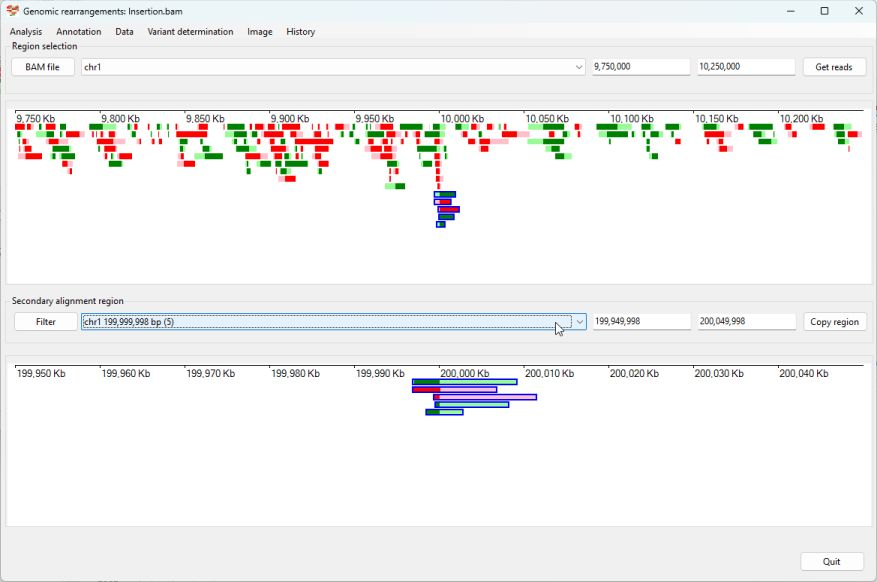

# Identifying a Insertion

__Prior information__  
Due to a lack of patient data with a large insertion, a reference sequence was created in which 0.5 Mb of sequence was removed from chromosome 1 at 10,000,000 bp and inserted at 200,000,000 bp of chromosome 1. When reads from a health individual are aligned to this data it would appear as if it has a 500 Kb insert at 10,000,000 bp on chromosome 1 which originated from 199,500,000 of chromosome 1. 

Import the data by pressing the ```Bam file``` button and then selected chromosome 1 from the upper dropdown list box and enter the co-ordinates for the approximate position you want to start the search for the first break point in the  two text boxes to the right of the dropdown list and import the data by selecting the ```Analysis``` > ```Only show reads with secondary alignments``` menu option (Figure 1)


Figure 1

Pressing the ```get reads``` button displays data at the synthetic break point at 10,000,000 on chromosome 1, while the lower dropdown list box identifies possible break points at around 199,500,000 bp and 199,999,936 bp (Figure 2).   


Figure 2

While the site of the insertion is seen as a single point, the origin of the inserted sequence is shown as two break points flanking the inserted sequence. Consequently, the region of the insert should be expanded to contain both break points. This can be done, by first selecting the first region in the lower dropdown list and copying the location in the first lower text area (in this case 199,449,999) (Figure 3). 


Figure 3

Next, select the likely region of the 3' most break point and pasted the copied location back in the first lower text area and then selecting the reads aligning to this break point (Figure 4)



Figure 4

Once reads that map to all three break point sites have been selected, the variant can be annotated by selecting the ```Variant determination``` > ```Use soft clip data``` > ```Insertion``` menu option.


Figure 5

The annotated variant is very close to the expected annotation. 

[Return user guide](README.md#insertion)