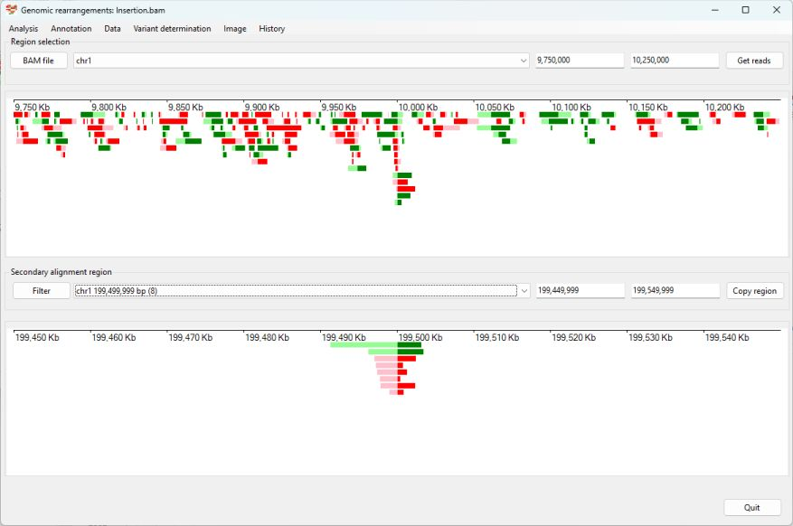
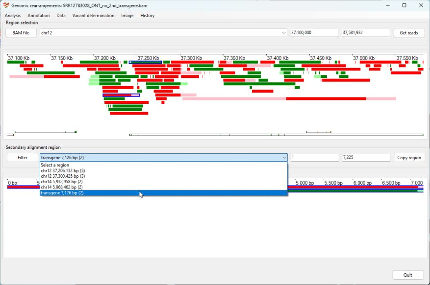
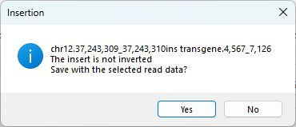

# Identifying a Insertion

## Case 1

__Prior information__  
Due to a lack of patient data with a large insertion, a reference sequence was created in which 0.5 Mb of sequence was removed from chromosome 1 at 10,000,000 bp and inserted at 200,000,000 bp on chromosome 1. When reads from a healthy individual are aligned to this data, it would appear as if 500 Kb of DNA has been inserted at 10,000,000 bp on chromosome 1, which originated from 199,500,000 bp on chromosome 1.  

### Analysis
Import the data by clicking the ```Bam file``` button, then select the BAM file. Next, choose chromosome 1 from the upper dropdown list box. Enter the coordinates for the approximate position where you want to start searching for the first breakpoint in the two text boxes to the right of the dropdown list (in this case, approximately 9,500,000 to 10,500,000). Complete the import by selecting ```Analysis``` > ```Only show reads with secondary alignments``` from the menu options. (Figure 1).


Figure 1

Pressing the ```Get reads``` button displays data at the synthetic breakpoint at 10,000,000 bp on chromosome 1. Meanwhile, the lower dropdown list box identifies two possible breakpoints at approximately 199,500,000 bp and 199,999,936 bp (Figure 2).   



Figure 2

While the site of the insertion is seen as a single point, the origin of the inserted sequence is shown as two breakpoints flanking the inserted sequence. Consequently, the region containing the origin of the inserted sequence should be expanded to include both breakpoints. This can be done by selecting the first region in the lower dropdown list and copying the start of the location into the first lower text area (in this case, 199,449,999) (Figure 3). 


Figure 3

Then, select the next region in the dropdown list and paste the copied location into in the first text field in the lower panel. Once the region has been selected,  select the reads aligning to the second breakpoint (Figure 4)


Figure 4

When reads mapping to all three breakpoint sites have been selected, the variant can be annotated by selecting the ```Variant determination``` > ```Use soft clip data``` > ```Insertion``` menu option.


Figure 5

The annotated variant: ___chr1,10,00,000_10,000,001ins chr1.199,499,999_199,999,999___ is very close to the expected annotation of ___chr1,10,00,000_10,000,001ins chr1.199,500,000_200,000,000___. 

[Return user guide](README.md#insertion)

## Case 2: Identification of the lacZ-NeoR cassette

The case study involves the Agmo knock out mouse discussed in Case 2 in the [Identification of duplications](duplication.md) read me file. 

This transgenic mouse was first described here:

> Sailer S, Coassin S, Lackner K, Fischer C, McNeill E, Streiter G, Kremser C, Maglione M, Green CM, Moralli D, Moschen AR, Keller MA, Golderer G, Werner-Felmayer G, Tegeder I, Channon KM, Davies B, Werner ER, Watschinger K. When the genome bluffs: a tandem duplication event during generation of a novel ___Agmo___ knockout mouse model fools routine genotyping. Cell Biosci. 2021 Mar 16;11(1):54. doi: 10.1186/s13578-021-00566-9. PMID: 33726865; PMCID: PMC7962373.

__Backgroud__

A transgenic ___Agmo___ knockout mouse was created by inserting a lacZ-neoR cassette near exon 2 of the ___Agmo___ gene. However, difficulties genotyping the ___Agmo___ deficient mice led to the sequencing of the mouse and the identification of a 94 Kb tandem duplication of the 5' end of the ___Agmo___ gene.  

The data for this experiment is hosted on the NCBI SRA site as [SRR12783028](https://www.ncbi.nlm.nih.gov/sra/?term=SRR12783028).  

Reads which mapped to the start of the ___Agmo___ gene and contained extended unaligned data were used to search the NCBI blast database to identify sequences homologous to the lacZ-NeoR cassette. This identified the [JN960306.1](https://www.ncbi.nlm.nih.gov/nucleotide/JN960306.1?report=genbank&log$=nuclalign&blast_rank=3&RID=TWZMA063013) sequence, from which the sequence for the lacZ-NeoR cassette (15041 to 22164 bp) was extracted and added to the mm10 mouse genome reference sequence as a separate reference sequence called transgene. The long read sequencing data was then aligned to this extended reference genome and used in this guide.  

The detection of the transgene is discussed in the [duplication walk through](duplication.md).

The RefSeq gene data for the mm10 reference genome  was downloaded from the Genome Browser's Table Browser as describe [here](downloadingOptionalFiles.md).

### Analysis

Import the aligned data by clicking ```BAM file``` button. While it's possible to determine the location of the ___Agmo___ gene from a number of sources, in this example we'll get ```AgileStructure``` to identify the region using the RefSeq gene data set. To do this first download the data set as described [here](downloadingOptionalFiles.md). Then select the ```Annotation``` > ```Gene annotation file``` menu option to import this file (Figure 6). The annotation file must correspond to the reference sequences used to align the read data too.


Figure 6

The transgene cassette was designed so that it would be inserted in to the 5' end of the ___Agmo___ gene. Since ___Agmo___ is on chromosome 12, at 37,100,000 to 37,500,000, this region was select. Clicking the ```Get reads``` button displayed the reads mapping to this area.

The region located on the transgene reference sequence was selected from the lower dropdown list (Figure 7) and the two reads in the lower panel selected using the mouse. 



Figure 7

The location of the transgene was then determined by selecting the ```Variant determination``` > ```Use soft clip data``` > ```Insertion``` menu option (Figure 8), which was found to be close to exon 2 (chr12:37,243,706-37,243,835) of the ___Agmo___ gene as expected (chr12.37,243,310ins transgene.4,567,7126).



Figure 8
