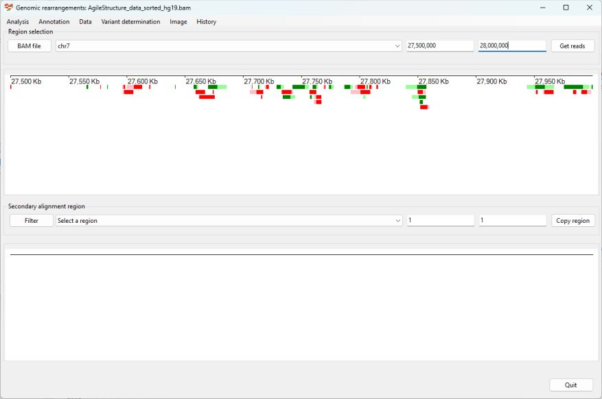

# Identifying an Inversion

The patient was first described in:   
> Watson CM, Crinnion LA, Harrison SM, Lascelles C, Antanaviciute A, Carr IM, Bonthron DT, Sheridan E. A Chromosome 7 Pericentric Inversion Defined at Single-Nucleotide Resolution Using Diagnostic Whole Genome Sequencing in a Patient with Hand-Foot-Genital Syndrome. PLoS One. 2016 Jun 7;11(6):e0157075. doi: 10.1371/journal.pone.0157075. PMID: 27272187; PMCID: PMC4896502.


__Prior information__  
Using standard cytogenetics tests an individual was found to have an inversion in chromosome 7 with the breakpoints around 26 to 28 MB and 91 to 95 MB.  
   

Import the data by pressing the ```BAM file``` button and then select chromosome 7 from the upper dropdown list box and enter the coordinates for the approximate position you want to start the search for the first breakpoint in the two text fields to the right of the dropdown list and import the data by selecting the ```Analysis``` > ```Only show reads with secondary alignments``` menu option (Figure 1)


Figure 1

Reads with secondary alignments are then displayed with sites of possible breakpoints listed in the lower dropdown list (Figure 2).


Figure 2

Since no obvious regions were identified, the cursor is placed in one of the upper text fields and the ```Ctrl``` + ```right arrow``` keys are pressed to move the region to the right (Figure 3)



Figure 3

Pressing the ```Get reads``` button will display the read data for the new region and populate the lower dropdown list box with possible sites for the second breakpoint. In this case a region on chr7 at 93 MB can be seen (Figure 4). 


Figure 4

Selecting this region identifies 4 reads with primary alignments at about 27,727,000 bp and secondary alignments at about 93,970,000 bp (Figure 5).


Figure 5

Selecting the four reads and then selecting the ```Variant determination``` > ```Use soft clip data``` > ```Inversion``` menu option annotates the inversion as chr7, 27,722,809_93,970,219inv (Figure 6).


Figure 6

This annotation depends solely on reads with primary alignments at the 27.7 MB site, to view reads with their primary alignments at the 93.97 MB site, select the ```Variant determination``` > ```Switch region``` menu option and press the ```Get reads``` button. The lower dropdown list now displays secondary alignments linked to these reads, with one region at the previously identified position (Figure 7).  


Figure 7

This set of reads is not as clear as those at the first site, with one secondary alignment flanked by long soft clipped sequences. However, selecting the three reads and then the ```Variant determination``` > ```Use soft clip data``` > ```Inversion``` menu option annotates the inversion as chr7:27,722,805_93,970,218inv (Figure 8), which is very close to the first annotation of chr7: 27,722,809_93,970,219inv (Figure 6).


Figure 8

The published breakpoint was identified as chr7:27,762,423_93,599,530inv when aligned to the hg19 human reference sequence. When these coordinates are mapped to hg38 using the [Lift Genome Annotations](https://genome.ucsc.edu/cgi-bin/hgLiftOver) the published mutation becomes: chr7:27,722,804_93,970,219inv which is very close to the results found here:  chr7:27,722,809_93,970,219inv and chr7:27,722,809_93,970,218inv

|Origin|Variant|
|-|-|
|Published variant (transferred to hg38)|chr7<:>27,722,804_93,970,219inv|
|Using primary alignments at 27 Mb|chr7:27,722,809_93,970,219inv|
|Using primary alignments at 93 Mb|chr7:27,722,805_93,970,218inv|

#### Table 1

[Return user guide](README.md#inversion) 
