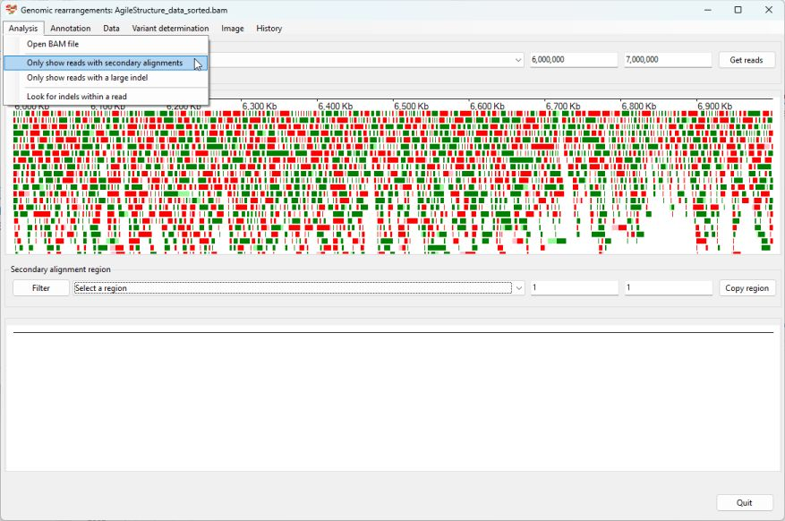
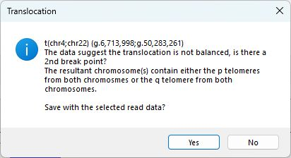
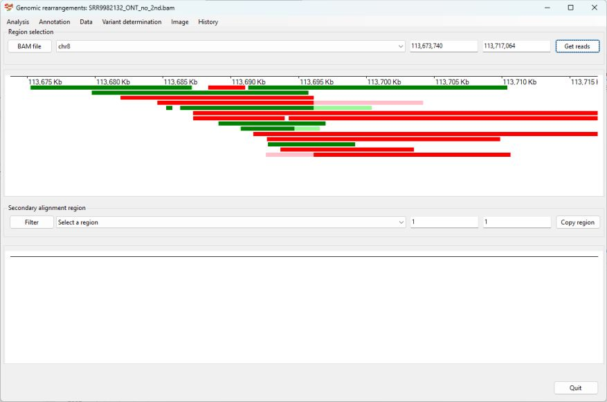
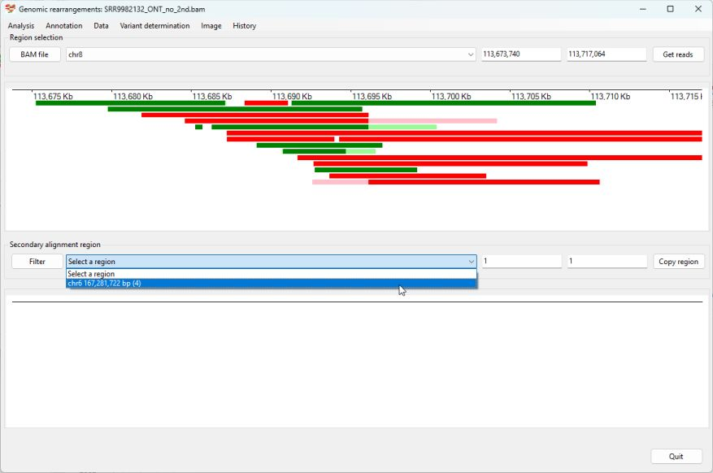
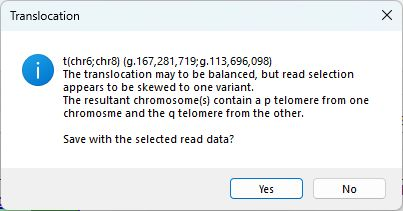

# Identifying a Translocation
## Case 1
__Prior information__  
Using standard cytogenetics tests an individual was found to have a translocation of the tip of chromosome 4 with the tip of chromosome 22. The breakpoint was narrowed down to around 6 to 7 Mb on chromosome 4 and 50 to 51 Mb on chromosome 22 using MLPA probe sets.  
(The read data in in the AgileStructure_dta_sorted.bam file.)

Import the data by pressing the ```Bam file``` button and then selecting chromosome 4 from the upper dropdown list box and enter the coordinates flanking the approximate position of the break point in the two text boxes to the right of the dropdown list and import the data by selecting the ```Analysis``` > ```Only show reads with secondary alignments``` menu option (Figure 1)



Figure 1

This will populate the upper panel with reads that have unaligned sequences that may span the break point. The lower dropdown list box will now contain a list of regions to which more than two unaligned sequences have been mapped. In the list there is a region at 50.28 Mb on chromosome 22 which is close to the suggested site of the second break point. Select this region to visualise the secondary alignments (Figure 2)


Figure 2

Once displayed, it's possible to select the reads by clicking on them in the lower panel with the mouse to see where they are located on chromosome 4. The three reads can be seen to map to approximately 6.7 Mb on chromosome 4. Select this region by moving the cursor to about 6.675 Mb, pressing the right mouse button and moving the mouse to about 6.725 Mb before releasing the right mouse button. This will expand the upper panel, showing the reads in greater detail. Since data has been re-read from the bam alignment file it is necessary to reselect the reads and the region in the lower dropdown list (Figure 3).  


Figure 3

While other reads with secondary alignments have mapped near the break point, it is now evident that they do not span the translocation break point. Selecting the ```Variant determination``` > ```Use soft clip data``` > ```Translocation``` menu option prompts ```AgileStructure``` to analyse the selected reads and annotate the break point which it states as:  
 __t(chr4;chr22)g.6,713,999:g.50,283,263__ (Figure 4).  
Pressing the ```Yes``` button will save the data to a text file.


Figure 4

To test the analysis, select the ```Variant determination``` > ```Switch region``` menu option (Figure 5).  


Figure 5

The coordinates used in the lower panel will be used to define the region viewed in the upper panel. Since data is re-read from the bam alignment file, it is necessary to select the region in the lower panel and any reads that span the translocation (Figure 6), before selecting the ```Variant determination``` > ```Use soft clip data``` > ```Translocation``` menu option (Figure 7). 


Figure 6



Figure 7

The break point identified in the 2nd analysis:  
__t(chr4;chr22)(g.6,713,998:g.50,283,262)__  
and is derived from a different set of reads and so could be considered an independent test. While the base pair position of the two break points are slightly different it should be close enough to design a diagnostic PCR test.

[Return user guide](README.md#translocation) 

## Case 2
This patient was first described in:
> Hu L, Liang F, Cheng D, Zhang Z, Yu G, Zha J, Wang Y, Xia Q, Yuan D, Tan Y, Wang D, Liang Y, Lin G. Location of Balanced Chromosome-Translocation Breakpoints by Long-Read Sequencing on the Oxford Nanopore Platform. Front Genet. 2020 Jan 14;10:1313. doi: 10.3389/fgene.2019.01313. PMID: 32010185; PMCID: PMC6972507.

__Prior information__  
Using standard cytogenetics tests an individual was found to have a translocation between chromosome 6 and chromosome 8. The breakpoint was narrowed down to around 113 to 114 Mb on chromosome 8 and 167 and 168 Mb on chromosome 6.  

(The read data is available from the NCBI SRA page as sample [SRR9982132](https://www.ncbi.nlm.nih.gov/sra/?term=SRR9982132). For this guide the data was aligned to the hg19 human reference sequence using minimap2)

Import the data by pressing the ```Bam file``` button and selecting the appropriate bam file. Then select chromosome 8 from the upper dropdown list box and enter the coordinates for the approximate position of the break point in the two text boxes to the right of the dropdown list and import the data by selecting the ```Get reads``` button (the data on the SRA web site only contains data for the region flanking the breakpoint on chromosome 8) (Figure 1)



Figure 1

This will populate the upper panel with reads that have unaligned sequences that may span the break point. The lower dropdown list box will now contain a region where more than two unaligned sequences have been mapped too. This region is at 167.28 Mb on chromosome 6 which is close to the suggested site of the second break point. Select the chromosmoe 6 region to visualise the secondary alignments of the reads on chromosome 8 (Figure 2)



Figure 2

Once displayed, it's possible to select the reads in the lower panel, by clicking on them with the mouse to see where they are located on chromosome 8. The four reads can be seen to be at approximately 113.7 Mb on chromosome 8 (Figure 3).  


Figure 3

Selecting the ```Variant determination``` > ```Use soft clip data``` > ```Translocation``` menu option prompts ```AgileStructure``` to analyse the selected reads and annotate the break point as: 
__t(chr6;chr8) (g.167,281,719;g.113,696,098)__ (Figure 4).  
Pressing the ```Yes``` button will save the data to a text file. 



Figure 4


To test the analysis, select the ```Variant determination``` > ```Switch region``` menu option (Figure 5).  


Figure 5

The coordinates used in the lower panel will be used to define the region viewed in the upper panel. Since data is re-read from the bam alignment file, it is necessary to select the region in the lower panel and any reads that span the translocation (Figure 6), before selecting the ```Variant determination``` > ```Use soft clip data``` > ```Translocation``` menu option (Figure 7). 


Figure 6


Figure 7

The break point identified in the 2nd analysis:  
__t(chr6;chr8) (g.167,281,716;g.113,696,100)__  
is derived from a different set of reads and so could be considered an independent test. While the base pair position of the two break points are slightly different from each other (Table 1) and the published position, it should be close enough to design a diagnostic PCR test.

|Origin|Variant|
|-|-|
|Published variant|t(chr6;chr8) (g.167,281,717:g.113,696,089)|
|Using primary alignments on chr8|t(chr6;chr8) (g.167,281,719;g.113,696,098)|
|Using primary alignments on chr6|t(chr6;chr8) (g.167,281,716;g.113,696,100)|

#### Table 1

[Return user guide](README.md#translocation) 
