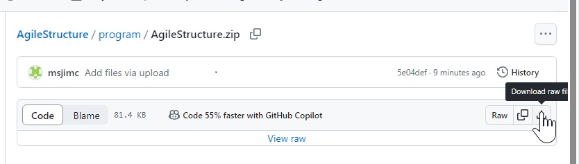
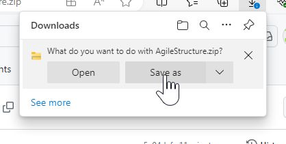
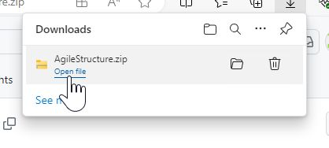
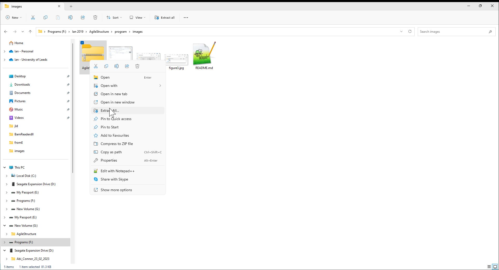
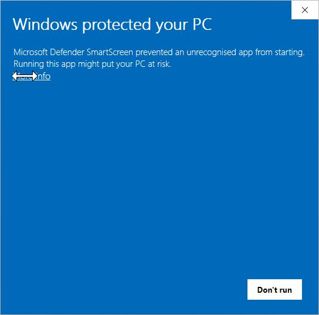
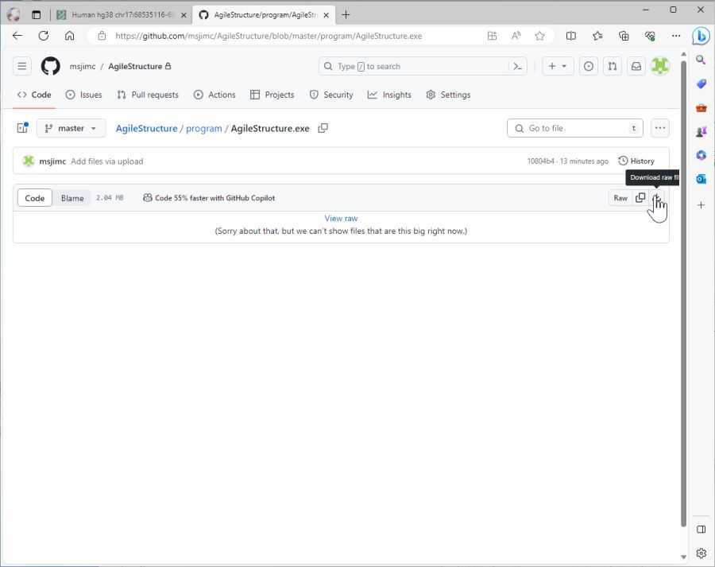

# Downloading binaries

It is possible to download the whole of this GitHub repository by selecting the green 'Code' button (Figure 1) and either selecting the 'Download ZIP' option or by copying the "https://github.com/msjimc/AgileROH.git" link and using a download manager such as wget on Linux. This will download the whole repository with the programs in the Programs > Windows or Programs > Linux folders. 

Figure 1

The process of downloading the prebuilt programs may be more involved on a Windows computer. First navigate to the Program/Window folder and click on the required program (Figure 2)

Figure 2

Then click on the 'Download' icon (Figure 3)

Figure 3

Select 'Save as' (Figure 4) 

Figure 4

This will create a warning message, click on the three ellipses (Figure 5)

Figure 5

and select 'Keep' (Figure 6)

Figure 6

On the next warning message select 'Show more' followed by the 'Keep anyway' link (Figure 7)

Figure 7

This should then allow you to save the program.