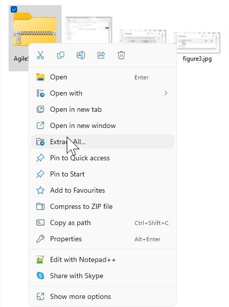
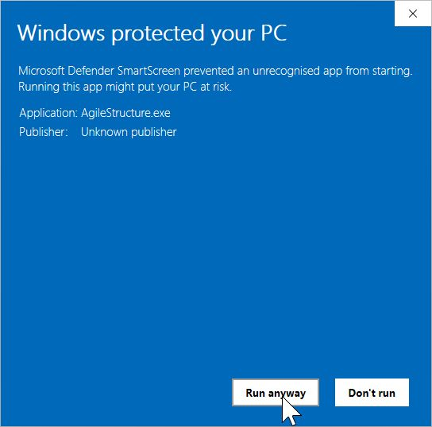

# Download
This folder contains the precompiled program and dll files as a single zip file which you can download. extract and then run. However, due to the current security measures in windows, you will have to ignore several warning designed to stop people downloading possibly dangerous programs. 

#### Important note  

Once downloaded it is important that the AgileStructure.zip and BamReaderdll.dll are located in the same folder. 

First click on the program file (AgileStructure.zip in the table above) which will take you to a new page, on the upper righthand corner click on the icon of a tray with an arrow pointing to it. This will then start the download which will ultimately prompt you to either save it or open the zip file (Figure 2).

Figure 1

Click on the "Save a"s button (Figure 2)

Figure 2

Once downloaded go to the zip file and extract it, saving the files to the desired location (Figure 3)

Figure 3

When you double click on the AgileStructure.exe file you'll get a warning message, click on the 'Run  anyway' option(Figure 4)

Figure 4

And finally, click on the 'Run  anyway' option and the program should start (Figure 5).

Figure 5

