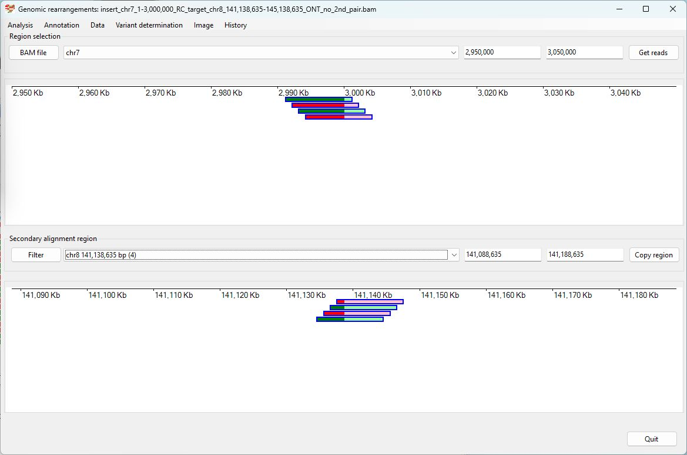
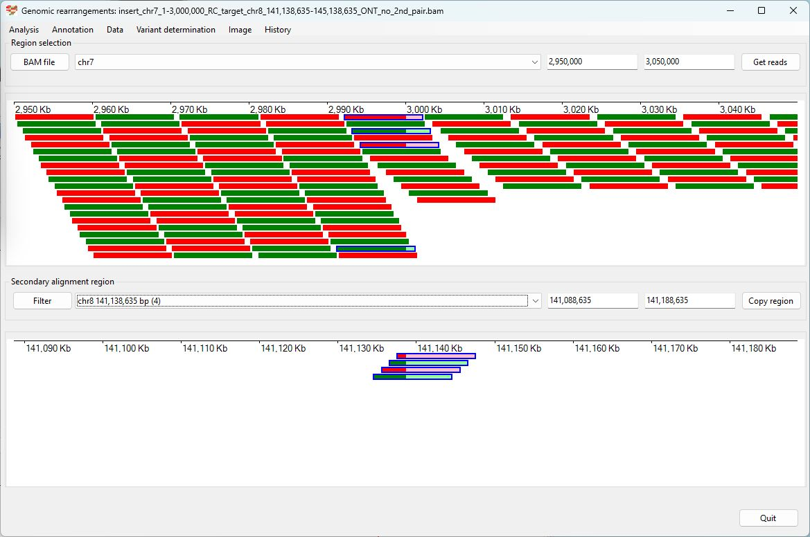
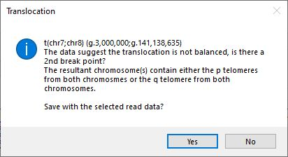
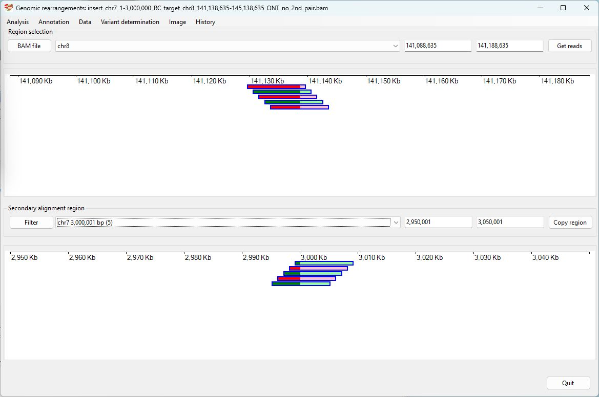
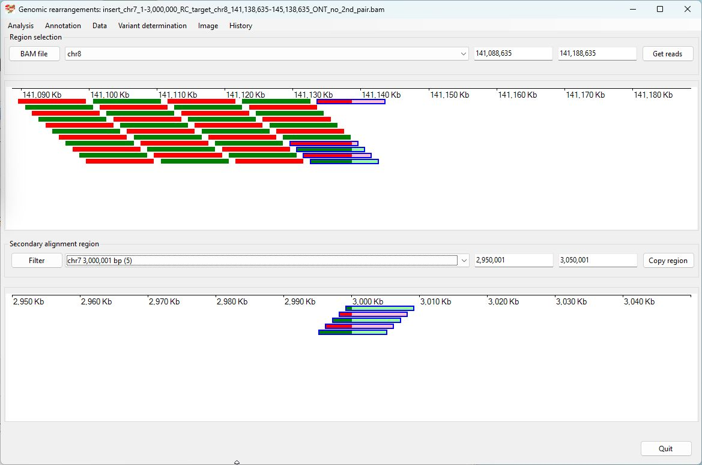
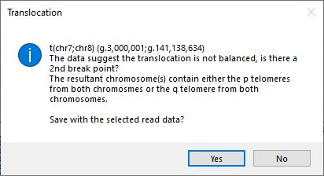

# Chr7 1-3,000,000  inserted into Chr8 141,138,635-145,138,635

### Analysis of the genome in which: 

The reverse complement of **chr7 1-3,000,000** is insert in the the region **chr8 141,138,635-145,138,635**

### Primary region spanning: chr7 1-3,000,000 

For this analysis the split reads at chr7 1-3,000,000 were selected and analysed using the ___Variant determination___ > ___Use soft clip data___ > ___Translocation___ menu option.

Figure 1

Figure 2

Figure 3

### Primary region spanning: chr8 141,138,635-145,138,635 

For this analysis the split reads at chr8 141,138,635 and 145,138,635were selected and analysed using the ___Variant determination___ > ___Use soft clip data___ > ___Translocation___ menu option.

Figure 4

Figure 5

Figure 6

