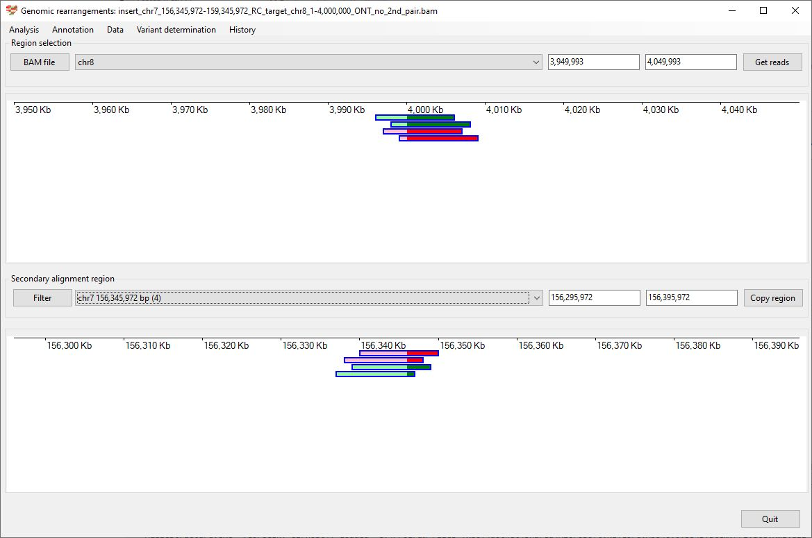

# Chr7 156,345,972 159,345,972  inserted into Chr8 1-4,000,000

Analysis of the genome in which: 

The reverse complement of **chr7 156,345,972-159,345,972** is insert in the the region **chr8 1-4,000,000**

### Primary region spanning: chr7 156,345,972-159,345,972 

For this analysis the reads at chr7 156,345,972-159,345,972were selected and analysed using the ___Variant determination___ > ___Use soft clip data___ > ___Complex rearrangement___ menu option.

Figure 1

Figure 2

Figure 3

### Primary region spanning: chr8 1-4,000,000 

For this analysis the reads at chr8 1 and 4,000,000were selected and analysed using the ___Variant determination___ > ___Use soft clip data___ > ___Complex rearrangement___ menu option.

Figure 4

Figure 5

Figure 6

