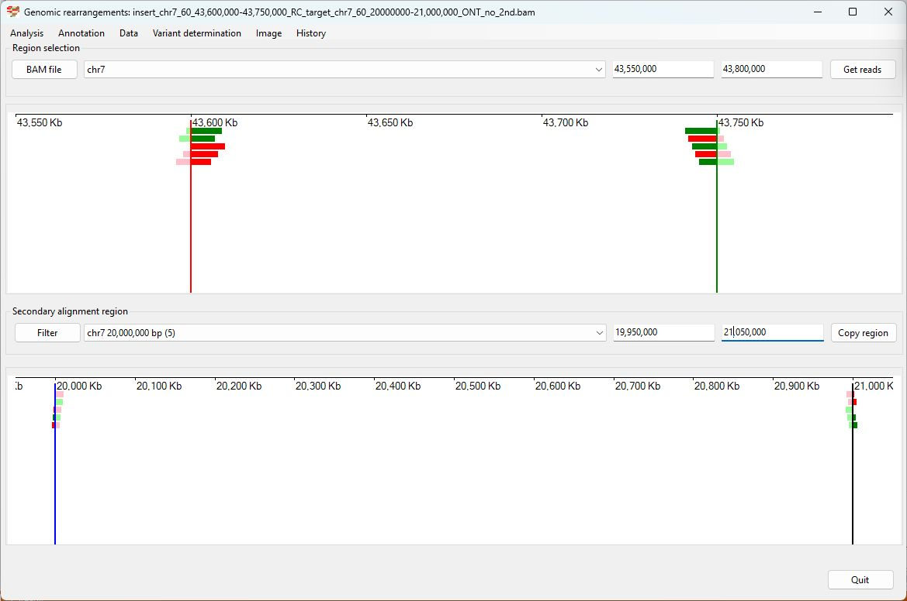
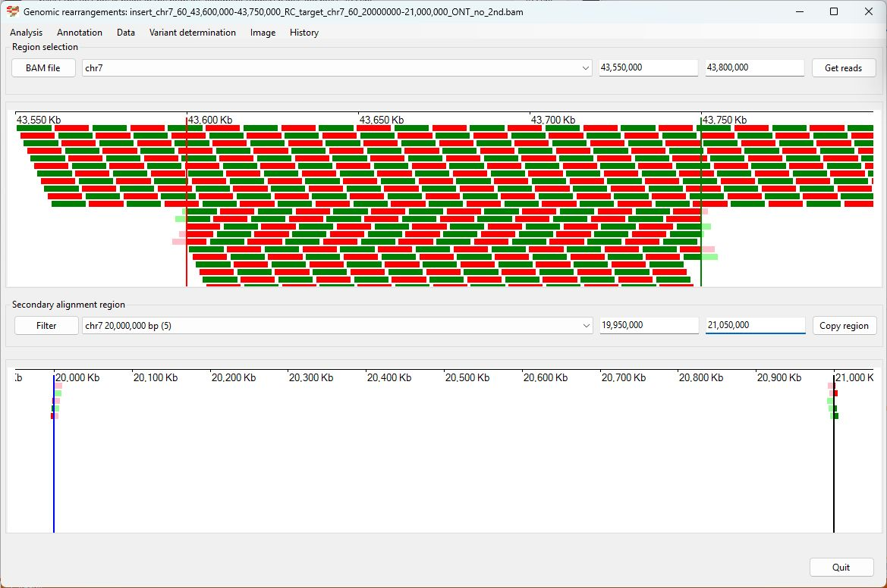
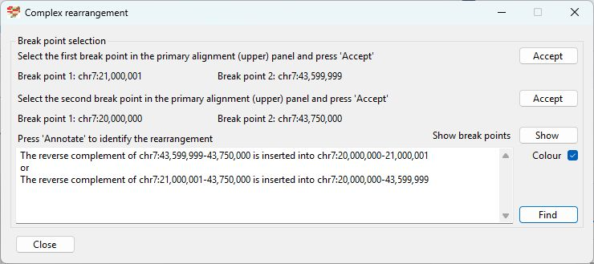
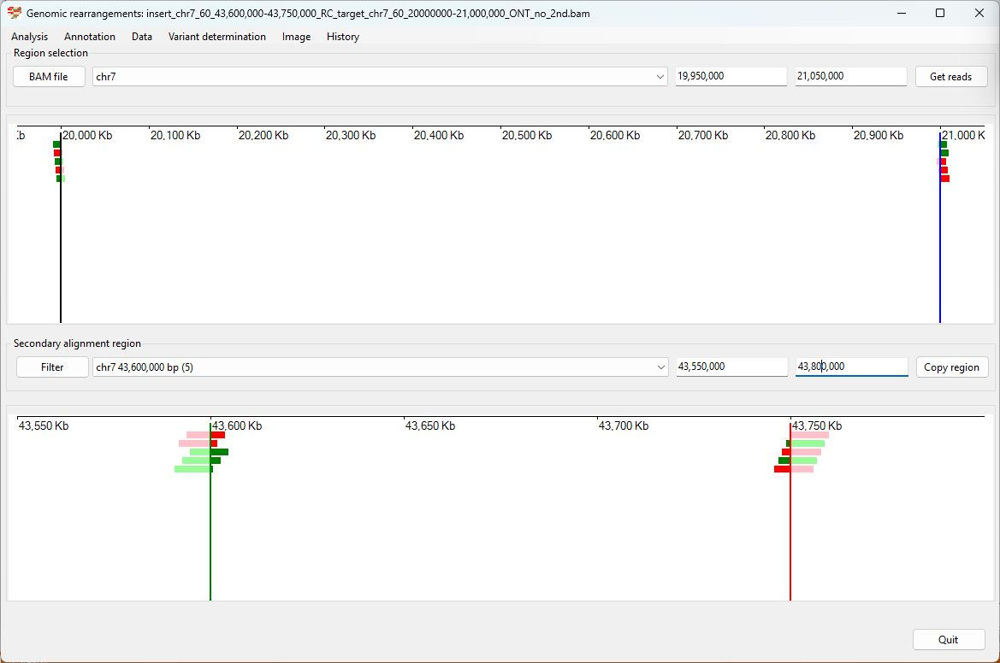
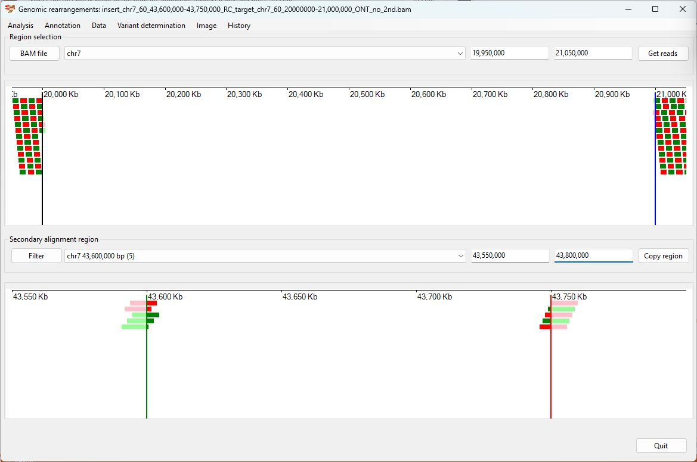
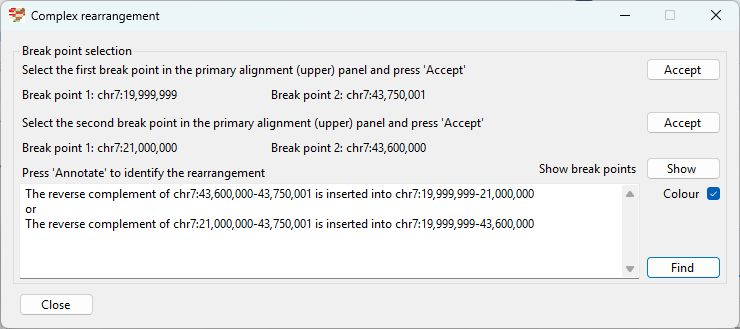

# The reverse complement of Chr7 43,600,000-43,750,000  inserted into Chr7 20000000

### Analysis of the genome in which: 

The reverse complement of **chr7 43,600,000-43,750,000** is insert in the the region **chr7 20000000-21,000,000**

### Primary region spanning: chr7 43,600,000-43,750,000 

For this analysis the split reads at chr7 43,600,000 and 43,750,000 were selected and analysed using the ___Variant determination___ > ___Use soft clip data___ > ___Complex rearrangement___ menu option.

Figure 1

Figure 2

Figure 3

### Primary region spanning: chr7 20,000,000-21,000,000 

For this analysis the split reads at chr7 20,000,000 and 21,000,000 were selected and analysed using the ___Variant determination___ > ___Use soft clip data___ > ___Complex rearrangement___ menu option.

Figure 4

Figure 5

Figure 6

## Schematic drawing of read alignments

The orientations of the alignments across the rearrangement is shown in Figure 7. Alignments shown in red indicate the orientation of the primary and secondary alignments differ.

Figure 7

