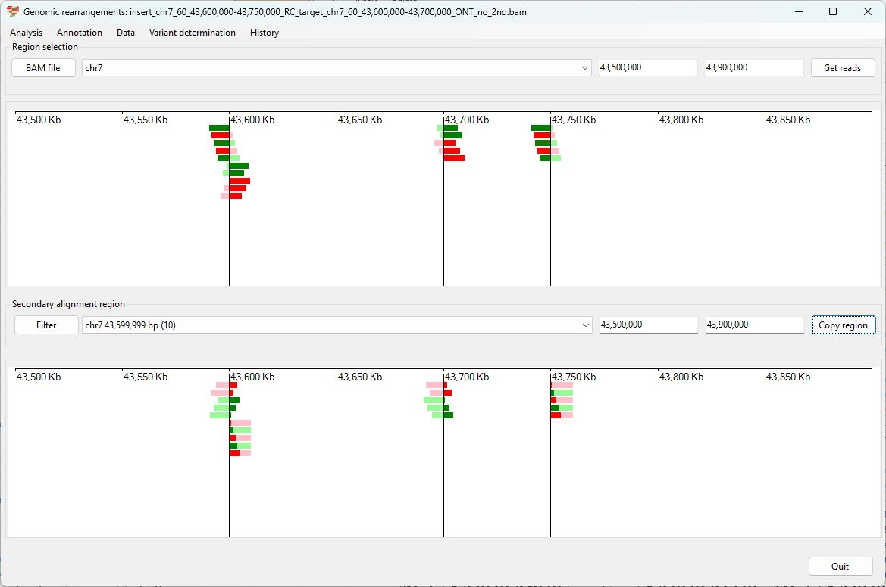
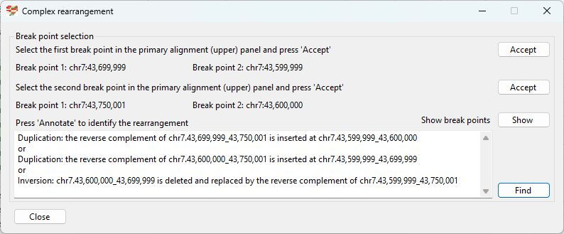
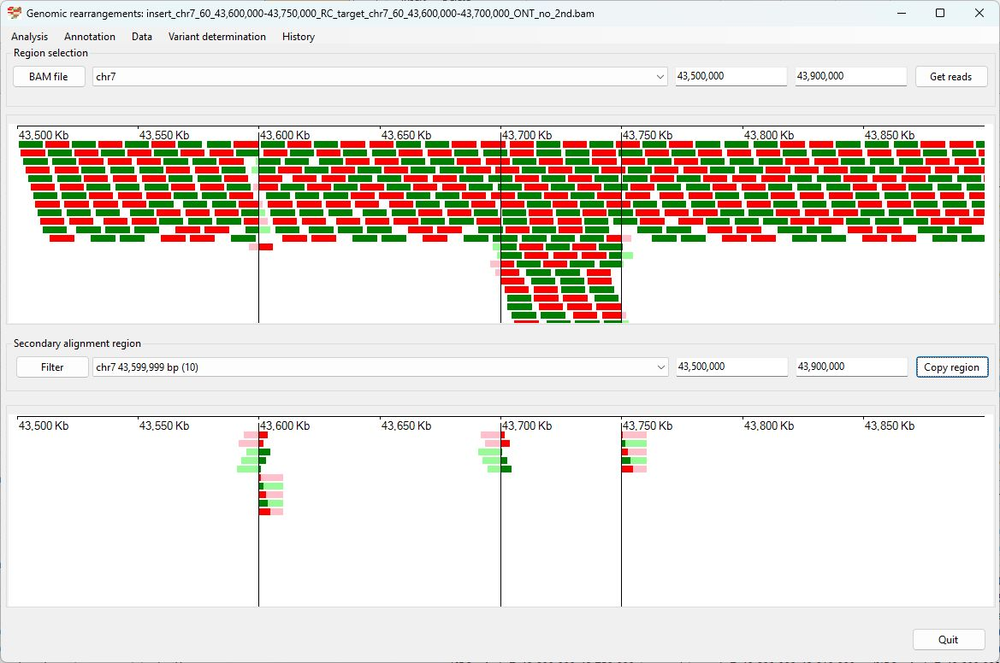

# Chr7 43,600,000 43,750,000  inserted into Chr7 43,600,000-43,700,000

Analysis of the genome in which: 

The reverse complement of **chr7 43,600,000-43,750,000** is inserted in the the region **chr7 43,600,000-43,700,000**

### Primary region spanning: chr7 43,600,000-43,750,000 

For this analysis the split reads at chr7 43,700,000-43,750,000 were selected and analysed using the ___Variant determination___ > ___Use soft clip data___ > ___Complex rearrangement___ menu option.

Figure 1

Figure 2

### Primary region spanning: chr7 43,600,000-43,700,000 

For this analysis the reads at chr7 43,600,000 and 43,700,000 were selected and analysed using the ___Variant determination___ > ___Use soft clip data___ > ___Complex rearrangement___ menu option.

Figure 3

