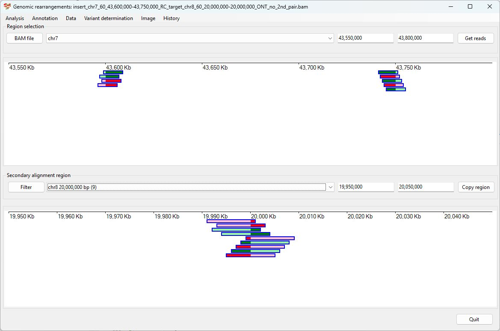
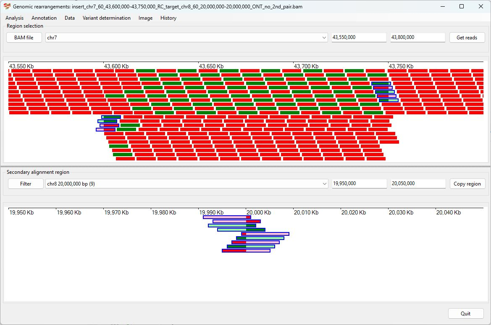
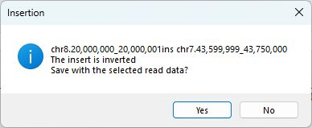
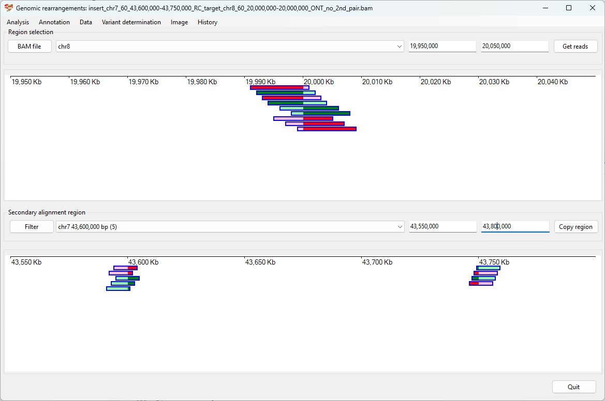
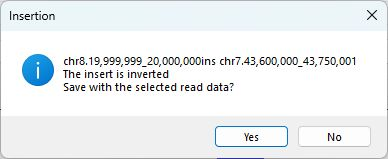
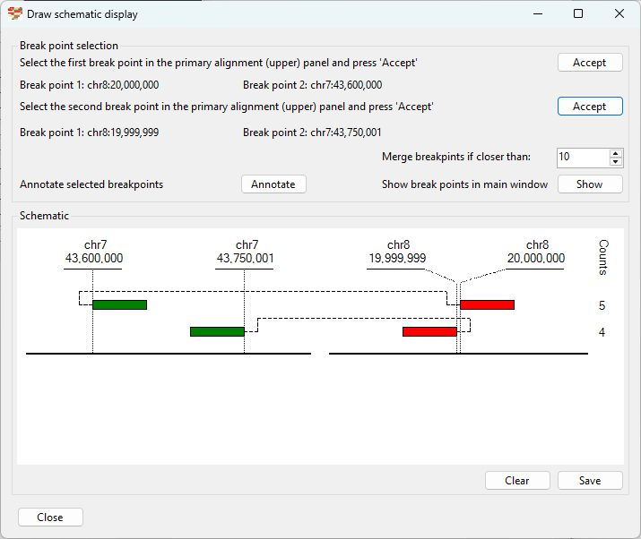

# Chr7 43,600,000 43,750,000  inserted into Chr8 20,000,000

Analysis of the genome in which: 

The reverse complement of **chr7 43,600,000-43,750,000** is inserted at **chr8 20,000,000**

### Primary region spanning: chr7 43,600,000-43,750,000 

For this analysis the split reads at chr7 43,600,000 and 43,750,000 were selected and analysed using the ___Variant determination___ > ___Use soft clip data___ > ___Insertion___ menu option.

Figure 1

Figure 2

Figure 3

### Primary region spanning: chr8 20,000,000 

For this analysis the split reads at chr8 20,000,000 were selected and analysed using the ___Variant determination___ > ___Use soft clip data___ > ___Insertion___ menu option.

Figure 4

Figure 5

Figure 6

## Schematic drawing of read alignments

The orientations of the alignments across the rearrangement is shown in Figure 7. Alignments shown in red indicate the orientation of the primary and secondary alignments differ.

Figure 7