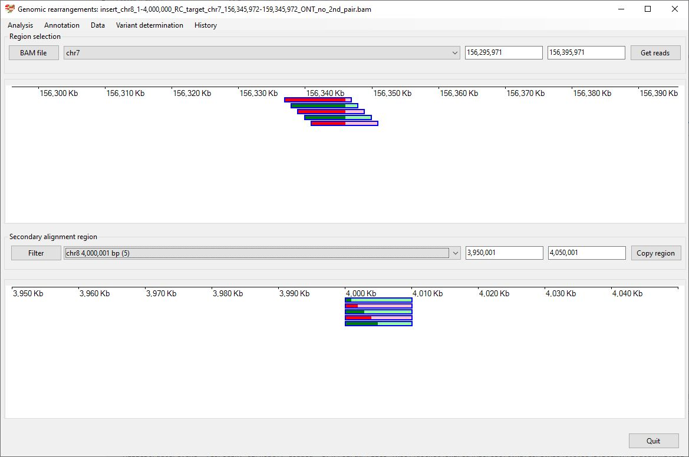
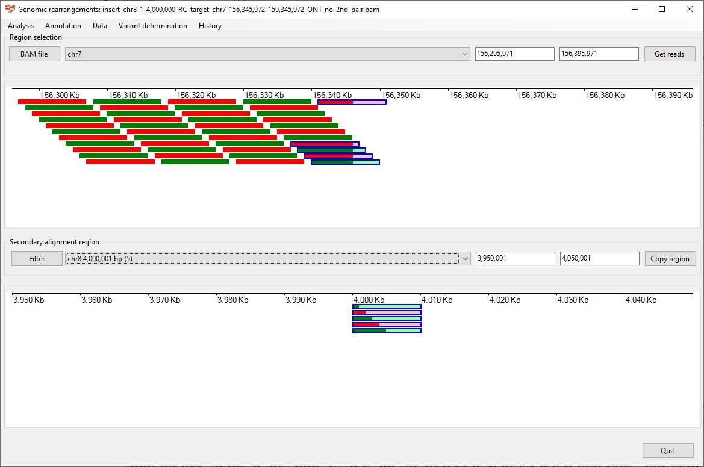
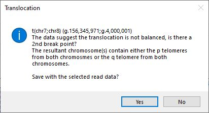
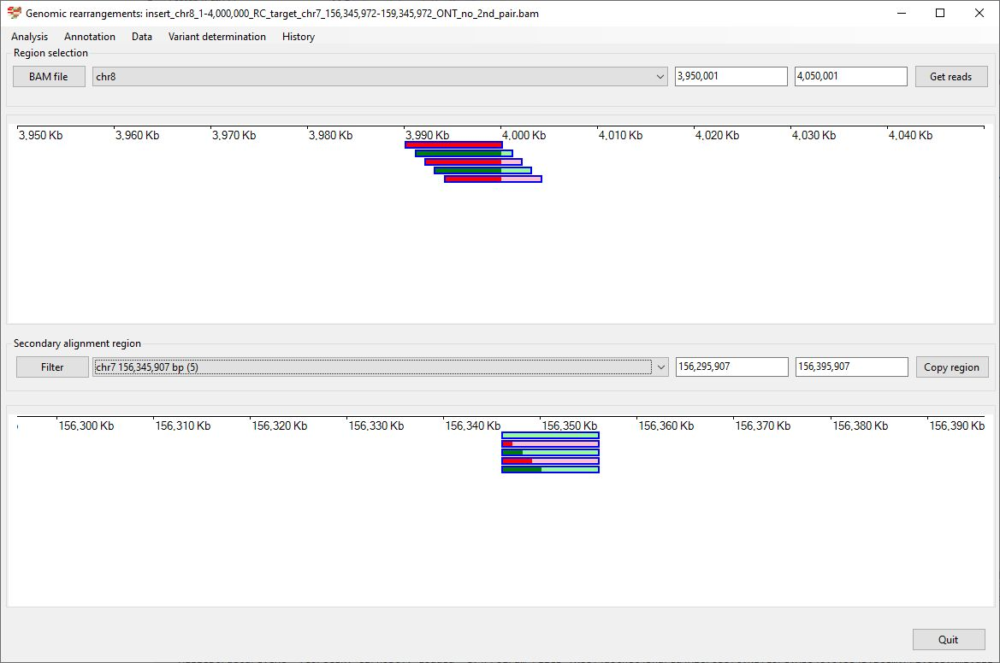
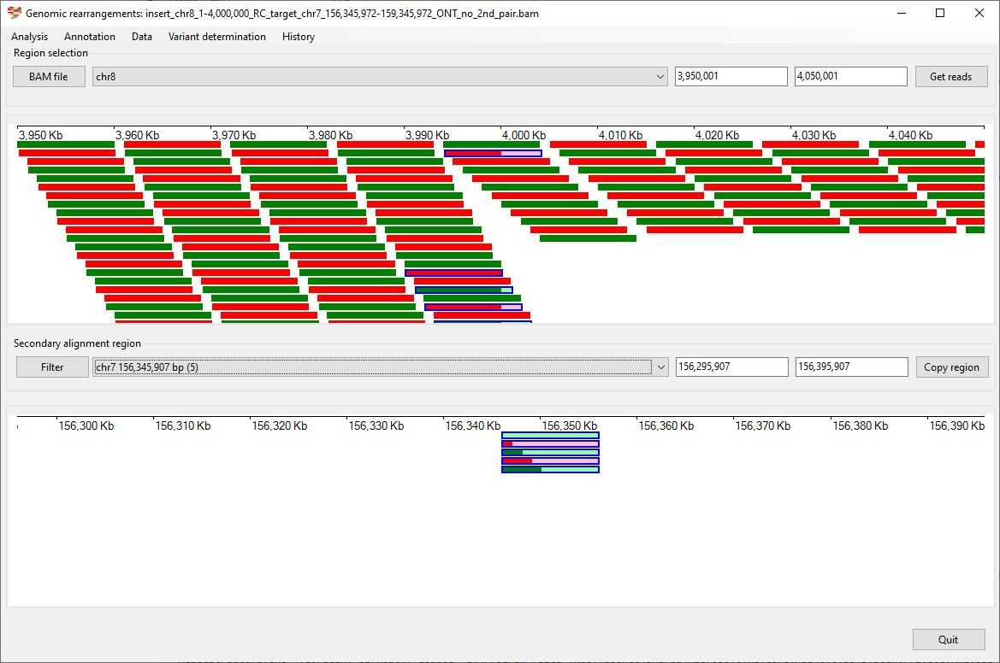
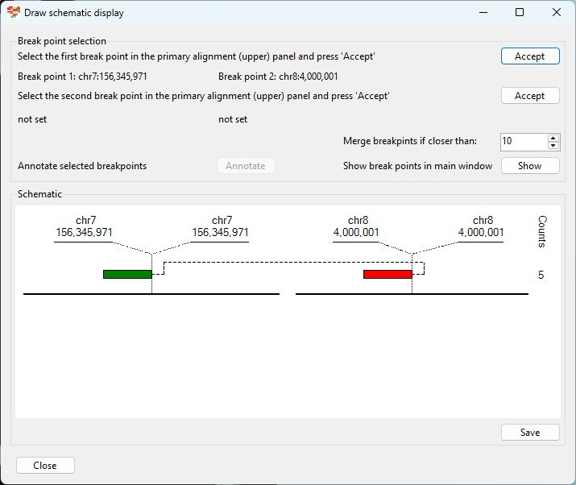

# Chr8 1 4,000,000  inserted into Chr7 156,345,972-159,345,972

### Analysis of the genome in which: 

The reverse complement of **chr8 1-4,000,000** is insert in the the region **chr7 156,345,972-159,345,972**

### Primary region spanning: chr8 1-4,000,000 

For this analysis the split reads at chr8 1-4,000,000 were selected and analysed using the ___Variant determination___ > ___Use soft clip data___ > ___Complex rearrangement___ menu option.

Figure 1

Figure 2

Figure 3

### Primary region spanning: chr7 156,345,972-159,345,972 

For this analysis the split reads at chr7 156,345,972 and 159,345,972were selected and analysed using the ___Variant determination___ > ___Use soft clip data___ > ___Complex rearrangement___ menu option.

Figure 4

Figure 5

Figure 6

## Schematic drawing of read alignments

The orientations of the alignments across the rearrangement is shown in Figure 7. Alignments shown in red indicate the orientation of the primary and secondary alignments differ.

Figure 7