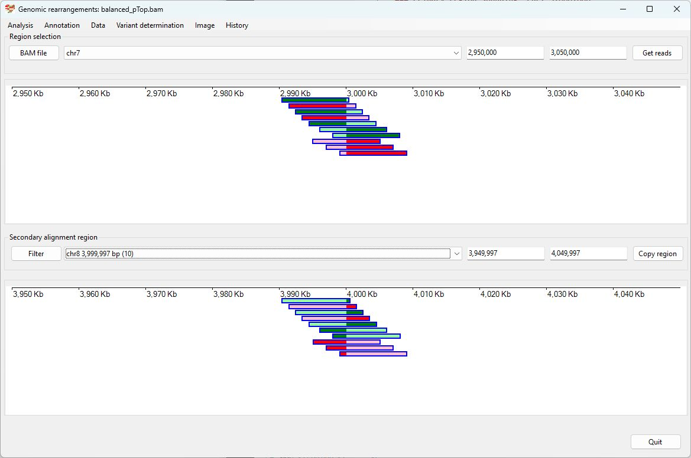

# Balanced translocation swapping chr7 1-3Mb with chr8 1-4Mb

### Analysis of the genome in which: 

The region **chr7 1 to 3,000,000** is insert in to the region **chr8 1 to 4,000,000** and **chr8 1 to 4,000,000** is insert in to the region **chr7 1 to 3,000,000** 

### Primary region spanning: chr7 3,000,000 

For this analysis the split reads at chr7 3,000,000 were selected and analysed using the ___Variant determination___ > ___Use soft clip data___ > ___Translocation___ menu option.

Figure 1

Figure 2

Figure 3

### Primary region spanning: chr8 4,000,000 

For this analysis the split reads at chr8 4,000,000 were selected and analysed using the ___Variant determination___ > ___Use soft clip data___ > ___Translocation___ menu option.

Figure 4

Figure 5

Figure 6

