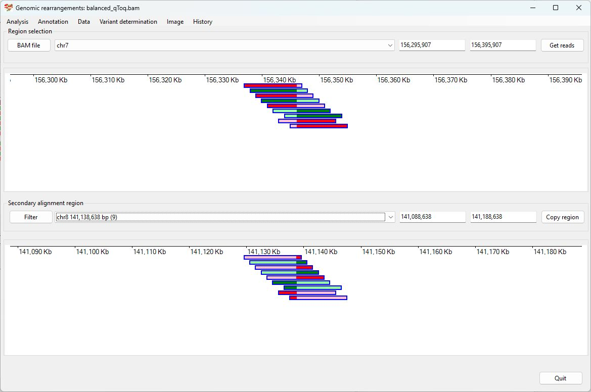
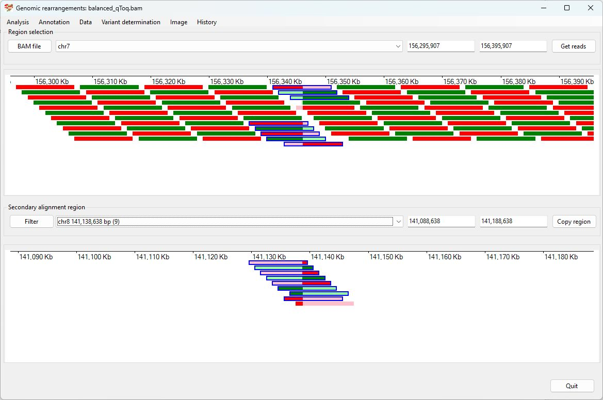

# Balanced translocation swapping q telomere of chr7 with the q telomere of  chr8

### Analysis of the genome in which: 

The region **chr7 156,345,972 to 159,345,972** is insert in to the region **chr8 141,138,635 to 145,138,635** and **chr8 141,138,635 to 145,138,635** is insert in to the region **chr7 156,345,972 to 159,345,972** 

### Primary region spanning: chr7 3,000,000 

For this analysis the split reads at chr7 3,000,000 were selected and analysed using the ___Variant determination___ > ___Use soft clip data___ > ___Translocation___ menu option.

Figure 1

Figure 2

Figure 3

### Primary region spanning: chr8 141,138,635 

For this analysis the split reads at chr8 141,138,635 were selected and analysed using the ___Variant determination___ > ___Use soft clip data___ > ___Translocation___ menu option.

Figure 4

Figure 5

Figure 6

