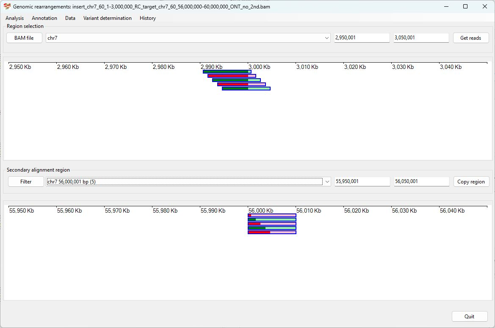
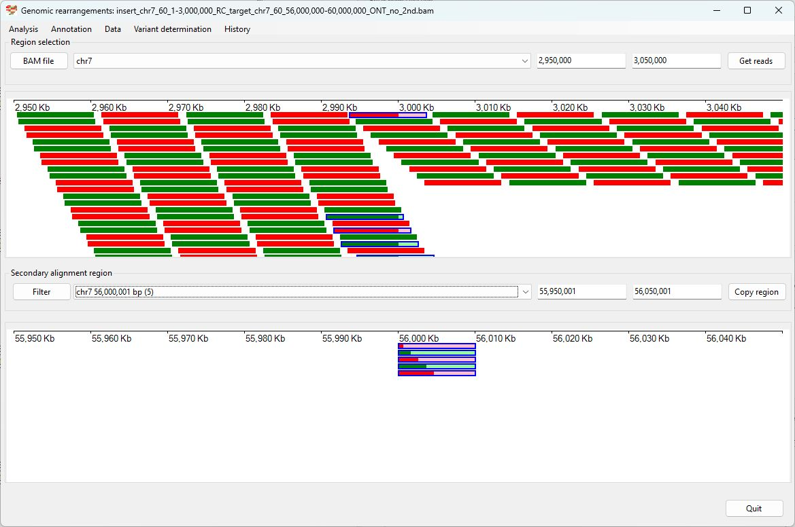
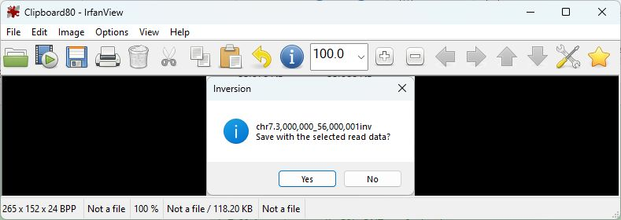

# Chr7 1-3,000,000  inserted into Chr7 56,000,000

Analysis of the genome in which: 

The reverse complement of **chr7 1-3,000,000** is insert in the the region **chr7 56,000,000-60,000,000**

### Primary region spanning: chr7 1-3,000,000 

Figure 1

Figure 2

Figure 3

### Primary region spanning: chr7 56,000,000 

Figure 4

Figure 5

Figure 6

