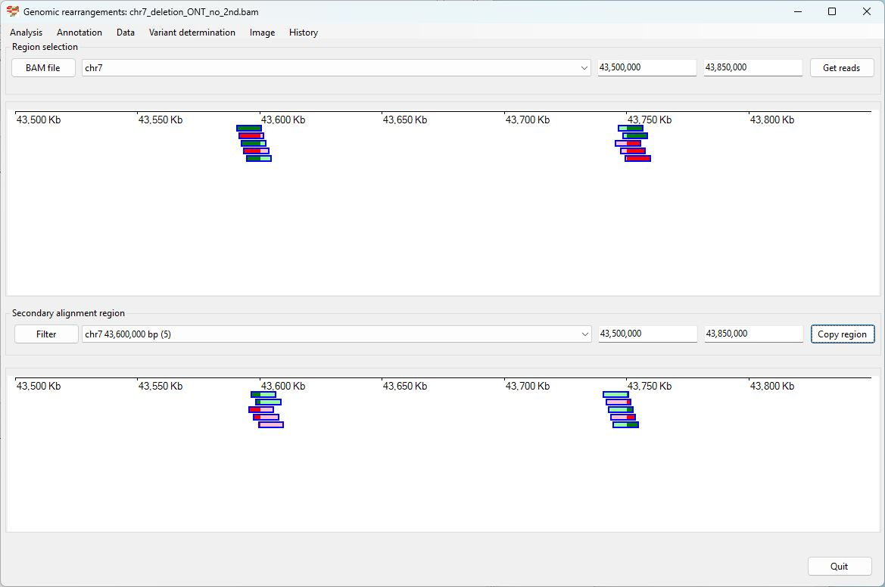

# Chr7 43,600,000-43,750,000  deleted

Analysis of the genome in which: 

The region **chr7 43,600,000-43,750,000** is deleted

### Primary region spanning: chr7 43,600,000-43,750,000 

For this analysis the reads at chr7 43,600,000 and 43,750,000 were selected and analysed using the ___Variant determination___ > ___Use soft clip data___ > ___Deletion___ menu option.

Figure 1

Figure 2

Figure 3

