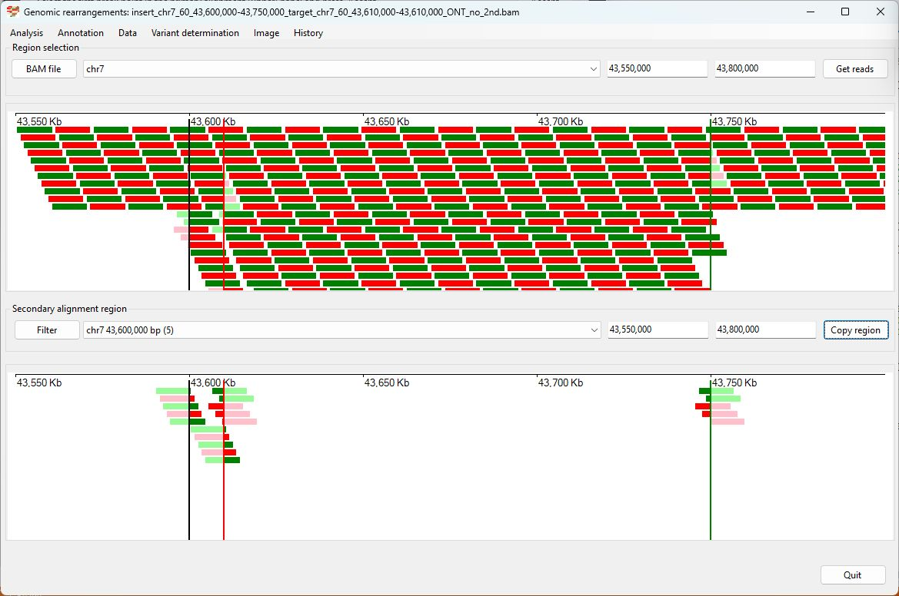
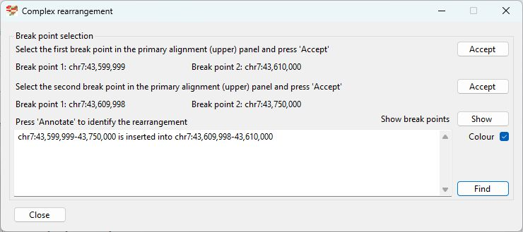

# Chr7 43,600,000-43,750,000  inserted into Chr7 43,610,000

Analysis of the genome in which: 

The region **chr7 43,600,000-43,750,000** is insert at **chr7 43,610,000**

### Primary region spanning: chr7 43,600,000-43,750,000 

Figure 1

Figure 2

Figure 3

