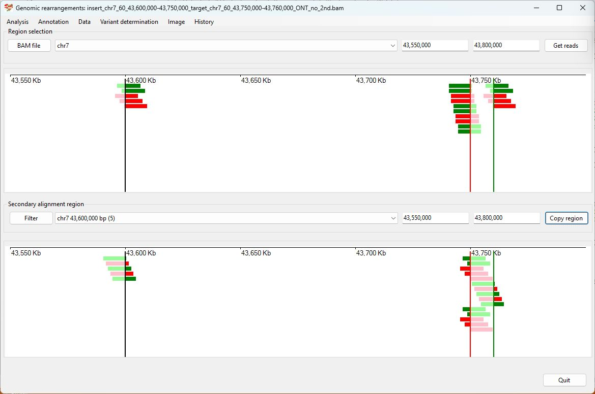
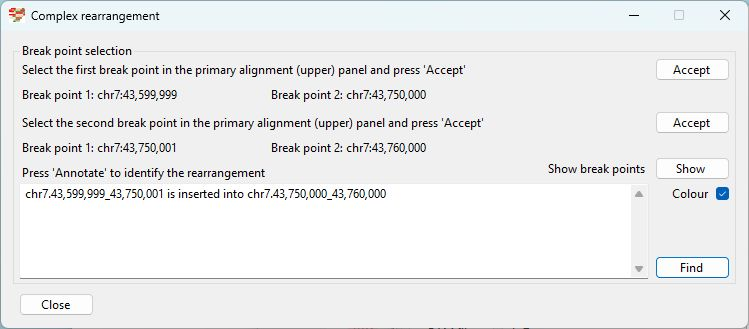
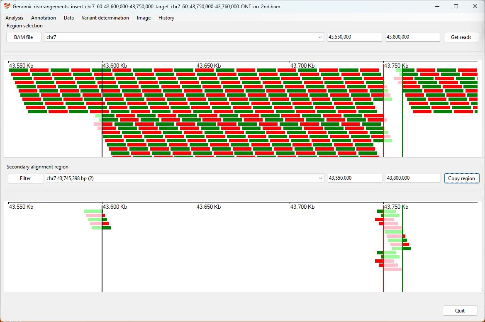
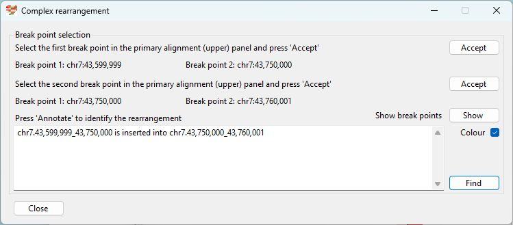

# Chr7 43,600,000-43,750,000  inserted into Chr7 43,750,000-43,760,000

### Analysis of the genome in which: 

The region **chr7 43,600,000-43,750,000** is insert in to the region **chr7 43,750,000-43,760,000**

### Primary region spanning: chr7 43,600,000-43,750,000 

For this analysis the split reads at chr7 43,600,00 (black line in Figure 1 and 2) and 43,760,000 (green line in Figure 4 and 5) were selected and analysed using the ___Variant determination___ > ___Use soft clip data___ > ___Complex rearrangement___ menu option.

Figure 1

Figure 2

Figure 3

### Primary region spanning: chr7 43,600,000-43,750,000 

For this analysis the split reads at chr7 43,7500,000 with secondary alignments at 43,760,00 (green line in Figure 4 and 5) and 43,600,000 (black line in Figure 4 and 5) were selected and analysed using the ___Variant determination___ > ___Use soft clip data___ > ___Complex rearrangement___ menu option.

Figure 4

Figure 5

Figure 6

