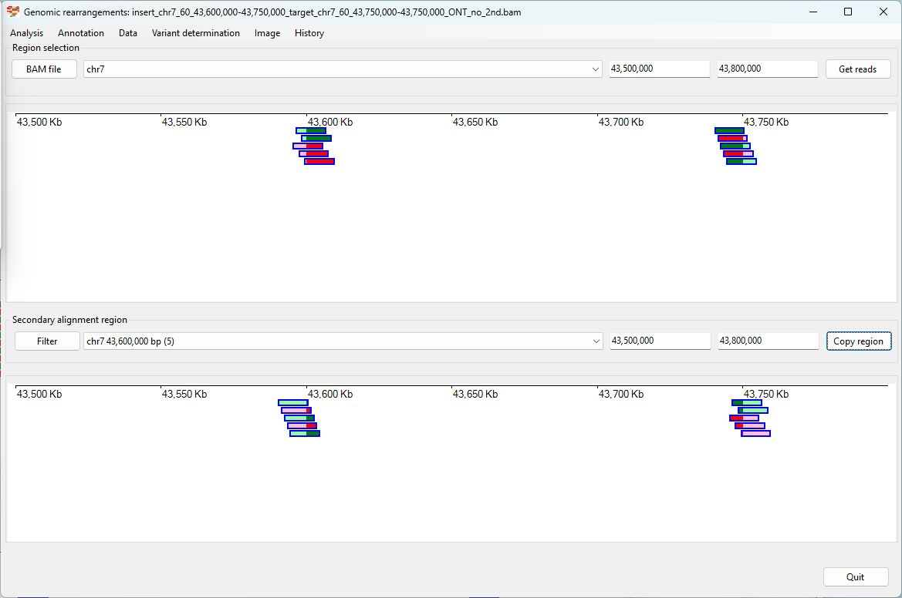
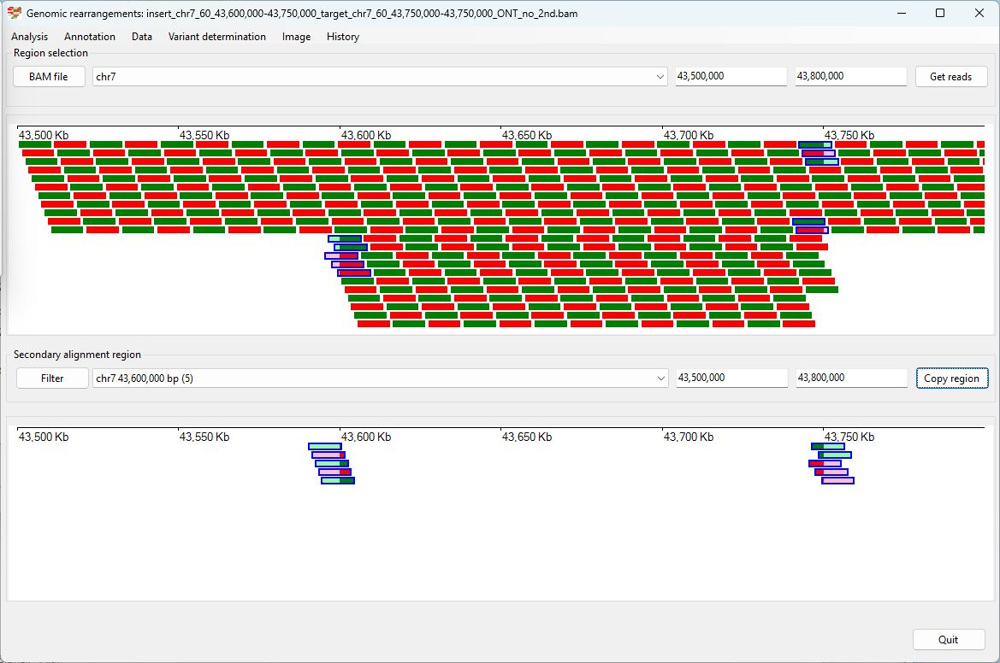
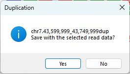

# Chr7 43,600,000-43,750,000  inserted into Chr7 43,750,000

Analysis of the genome in which: 

The region **chr7 43,600,000-43,750,000** is insert at **chr7 43,750,000**

### Primary region spanning: chr7 43,600,000-43,750,000 

For this analysis the reads at chr7 43,600,000 and 43,750,000 were selected and analysed using the ___Variant determination___ > ___Use soft clip data___ > ___Duplication___ menu option.

Figure 1

Figure 2

Figure 3

