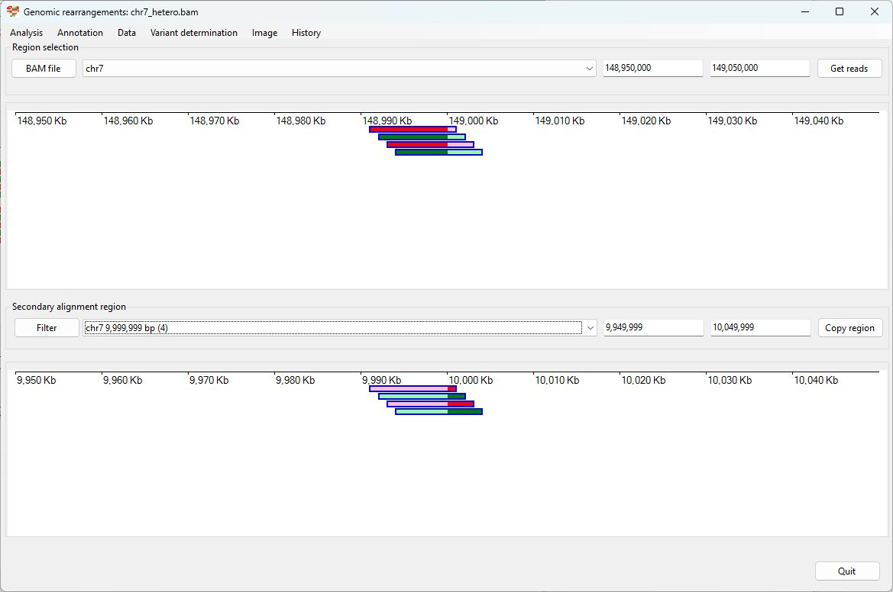
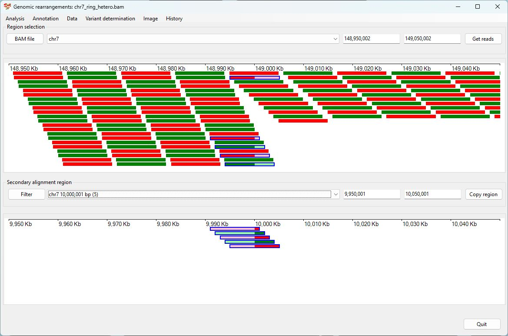

# Chr7 ring chromosme

### Analysis of the genome in which: 

The region **chr7 10,000,000 to chr7 60,000,000** is insert after **chr7 60,000,001** with sequences **chr7 1 to 10,000,000** and **chr7 149,000,000 to 159,342,972** deleted

### Primary region spanning: chr7 10,000,000 

For this analysis the split reads at chr7 10,000,000 were selected and analysed using the ___Variant determination___ > ___Use soft clip data___ > ___Ring___ menu option.

Figure 1

Figure 2

Figure 3

### Primary region spanning: chr7 149,000,000

For this analysis the split reads at chr7 149,000,000 were selected and analysed using the ___Variant determination___ > ___Use soft clip data___ > ___Ring___ menu option.

Figure 4

Figure 5

Figure 6

## Schematic drawing of read alignments

The orientations of the alignments across the rearrangement is shown in Figure 7. Alignments shown in red indicate the orientation of the primary and secondary alignments differ.

Figure 7