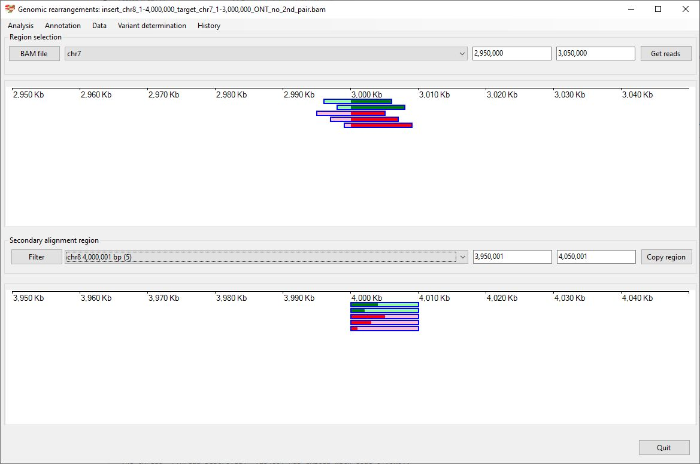
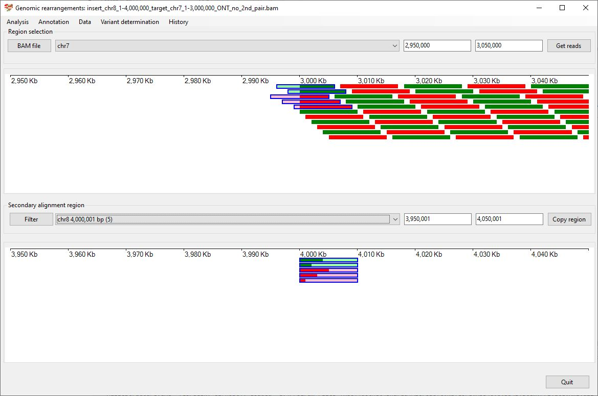
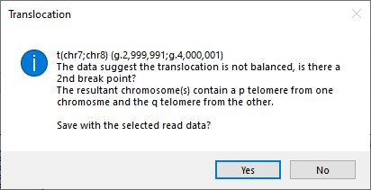
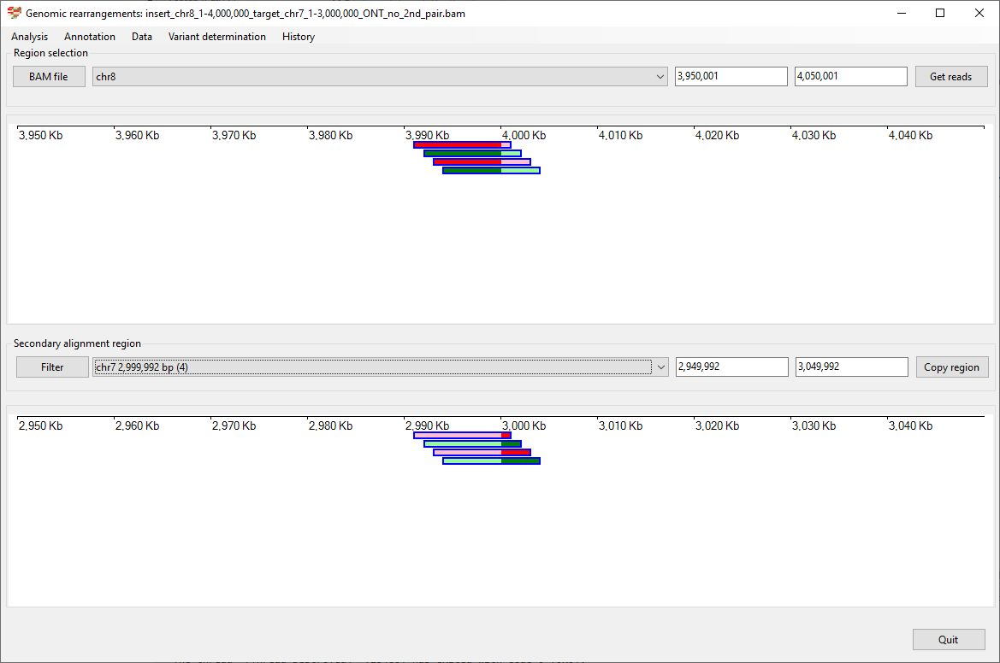
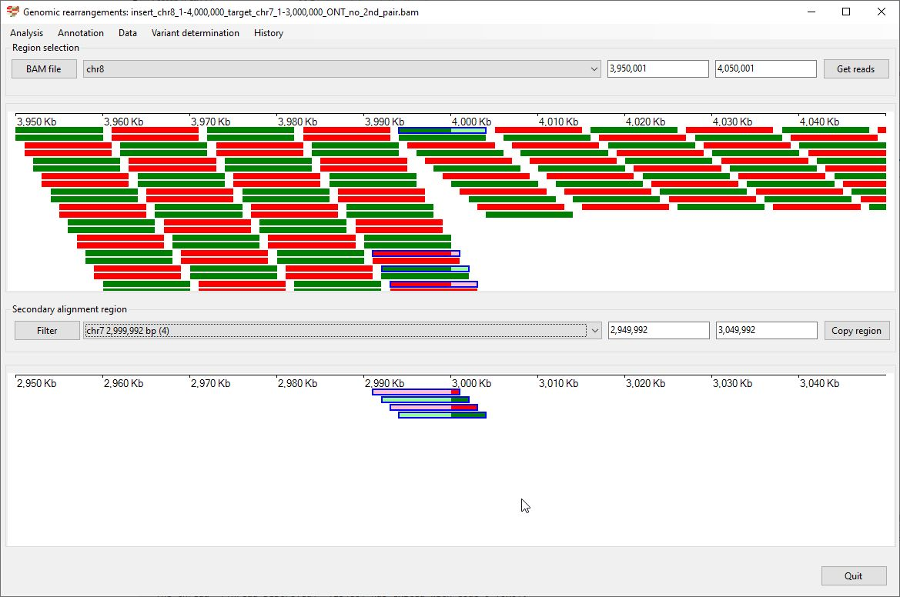
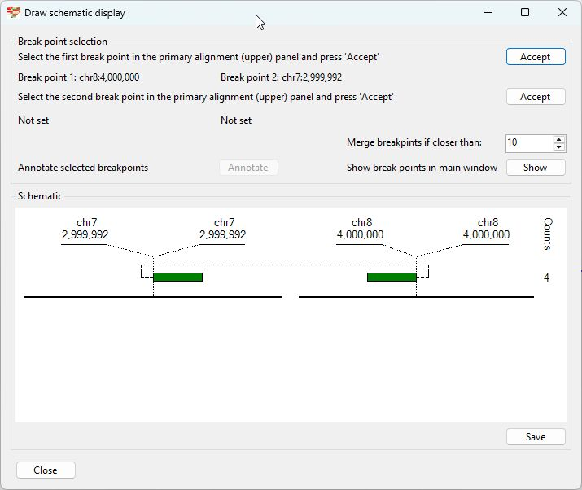

# Chr8 1 4,000,000  inserted into Chr7 1-3,000,000

### Analysis of the genome in which: 

The region **chr8 1-4,000,000** is insert in to the region **chr7 1-3,000,000**

### Primary region spanning: chr8 1-4,000,000 

For this analysis the split reads at chr8 1-4,000,000 were selected and analysed using the ___Variant determination___ > ___Use soft clip data___ > ___Translocation___ menu option.

Figure 1

Figure 2

Figure 3

### Primary region spanning: chr7 1-3,000,000 

For this analysis the split reads at chr7 1 and 3,000,000 were selected and analysed using the ___Variant determination___ > ___Use soft clip data___ > ___Translocation___ menu option.

Figure 4

Figure 5

Figure 6

## Schematic drawing of read alignments

The orientations of the alignments across the rearrangement is shown in Figure 7. Alignments shown in red indicate the orientation of the primary and secondary alignments differ.

Figure 7