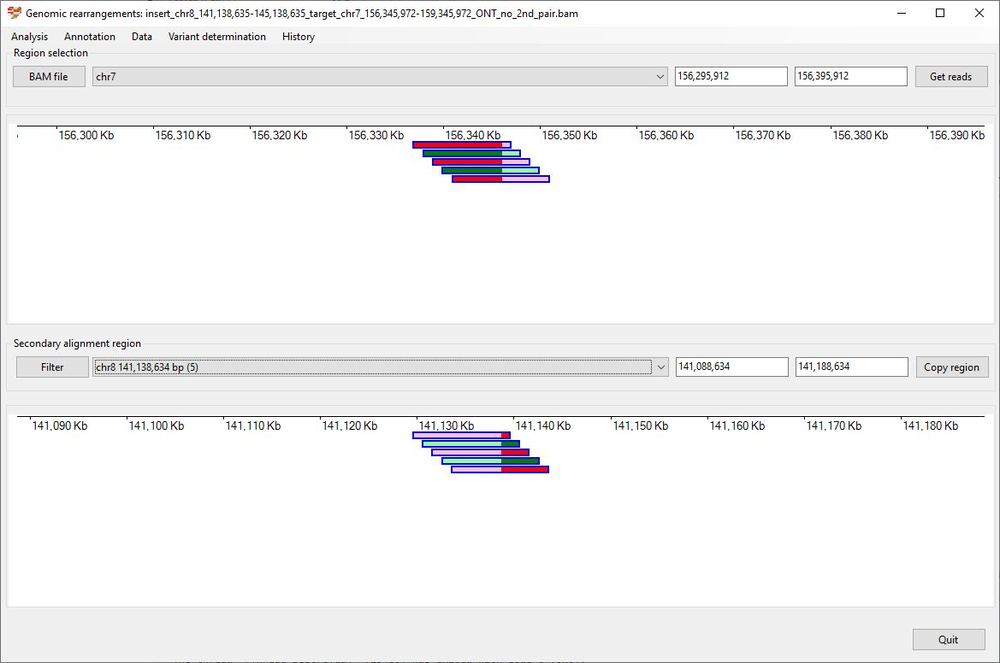
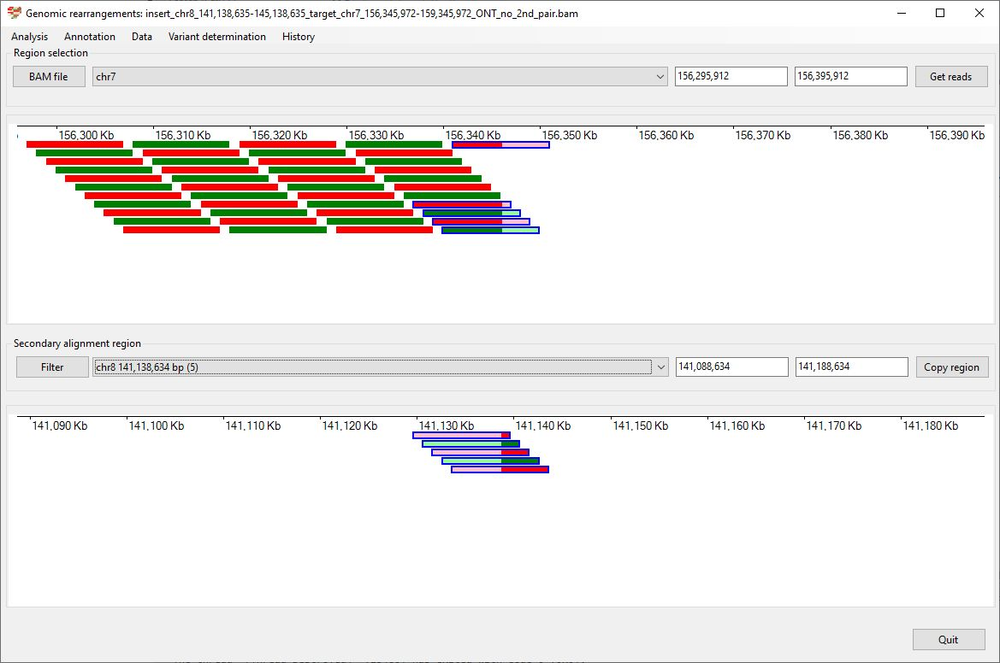
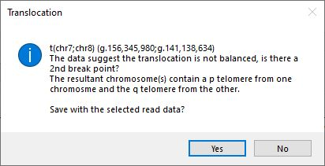
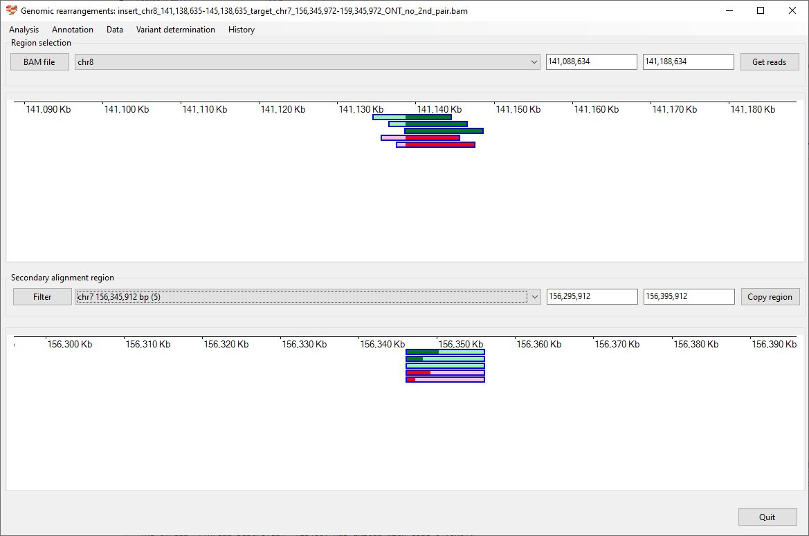
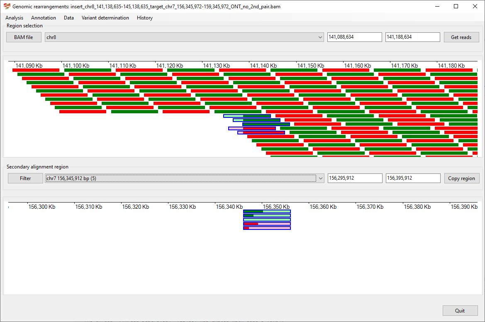
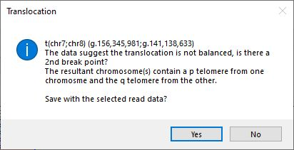

# Chr8 141,138,635 145,138,635  inserted into Chr7 156,345,972-159,345,972

### Analysis of the genome in which: 

The region **chr8 141,138,635-145,138,635** is insert in to the region **chr7 156,345,972-159,345,972**

### Primary region spanning: chr8 141,138,635-145,138,635 

For this analysis the split reads at chr8 141,138,635-145,138,635were selected and analysed using the ___Variant determination___ > ___Use soft clip data___ > ___Translocation___ menu option.

Figure 1

Figure 2

Figure 3

### Primary region spanning: chr7 156,345,972-159,345,972 

For this analysis the split reads at chr7 156,345,972 and 159,345,972were selected and analysed using the ___Variant determination___ > ___Use soft clip data___ > ___Translocation___ menu option.

Figure 4

Figure 5

Figure 6

