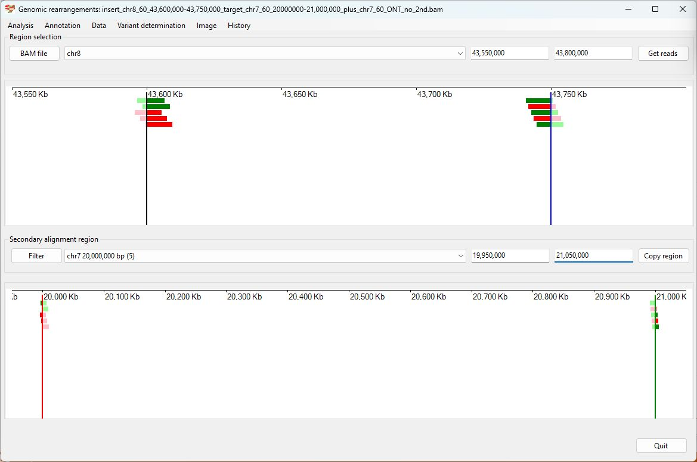
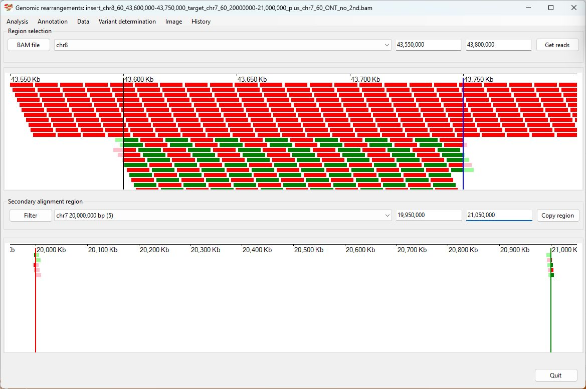
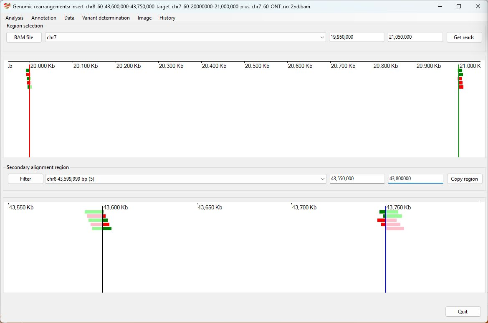
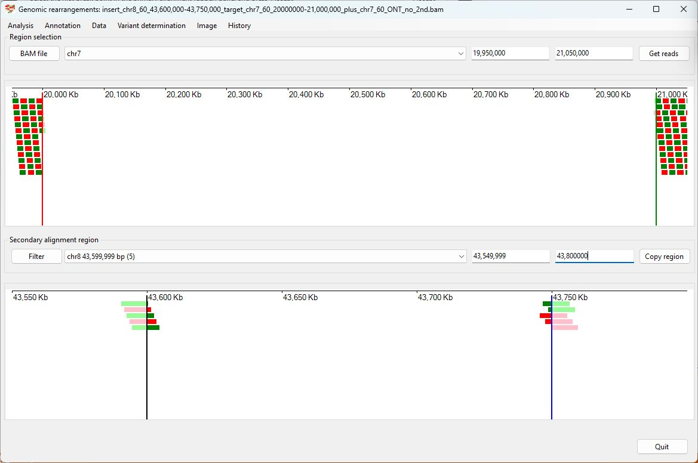
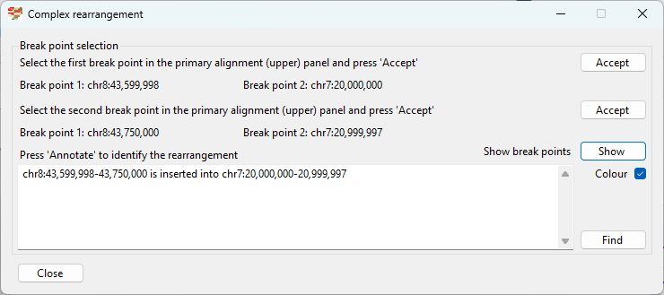

# Chr8 43,600,000-43,750,000  inserted into Chr7 20000000-21,000,000

### Analysis of the genome in which: 

The region **chr8 43,600,000-43,750,000** is insert in to the region **chr7 20000000-21,000,000**

### Primary region spanning: chr8 43,600,000-43,750,000 

For this analysis the split reads at chr8 43,600,000 (black line in Figure 1 and 2) and 43,750,000 (blue line in Fiugre 1 and 2) were selected and analysed using the ___Variant determination___ > ___Use soft clip data___ > ___Complex rearrangement___ menu option.

Figure 1

Figure 2

Figure 3

### Primary region spanning: chr7 20,000,000-21,000,000 

For this analysis the split reads at chr7 20,000,000 (red line in Figure 4 and 5) and 21,000,000 (green line in Figure 4 and 5)  were selected and analysed using the ___Variant determination___ > ___Use soft clip data___ > ___Complex rearrangement___ menu option.

Figure 4

Figure 5

Figure 6

