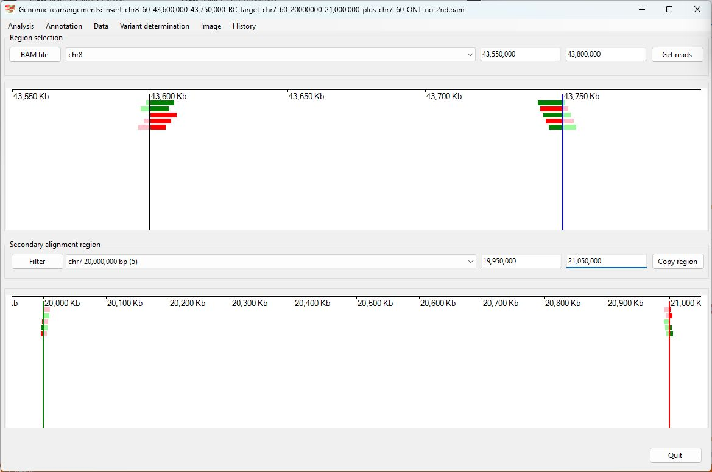
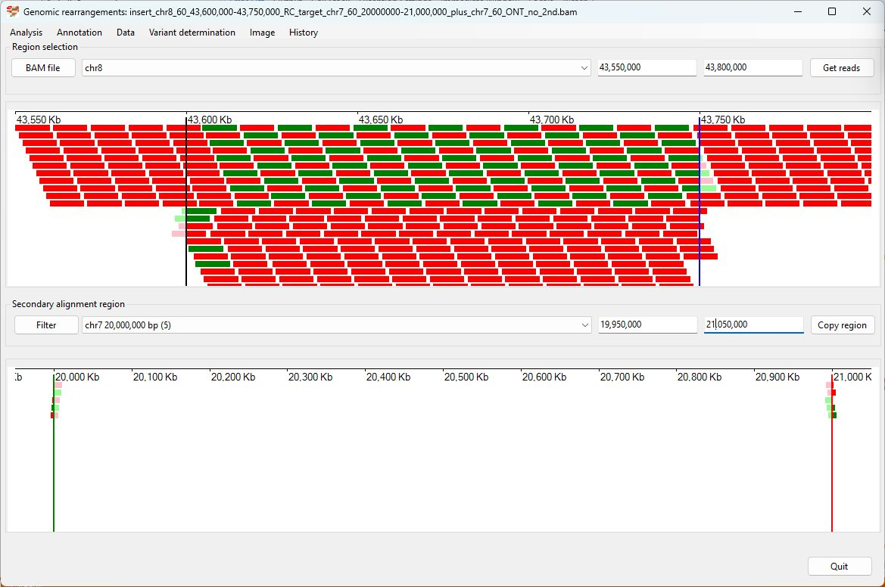
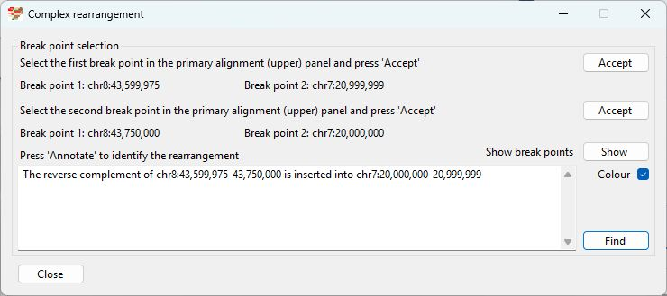

# Chr8 43,600,000-43,750,000  inserted into Chr7 20000000

Analysis of the genome in which: 

The reverse complement of **chr8 43,600,000-43,750,000** is insert in the the region **chr7 20000000-21,000,000**

### Primary region spanning: chr8 43,600,000-43,750,000 

For this analysis the reads at chr8 43,600,000 and chr8 43,750,000 where selected and analysed using the  ___Variant determination___ > ___Use soft clip data___ > ___Complex rearrangement___ menu option.

Figure 1

Figure 2

Figure 3

### Primary region spanning: chr7 20000000 

For this analysis the reads at chr7 20,000,000 and chr7 21,000,000 where selected and analysed using the  ___Variant determination___ > ___Use soft clip data___ > ___Complex rearrangement___ menu option.

Figure 4

Figure 5

Figure 6

