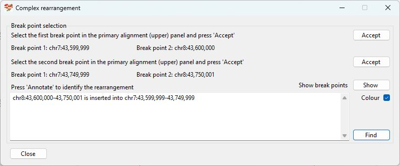
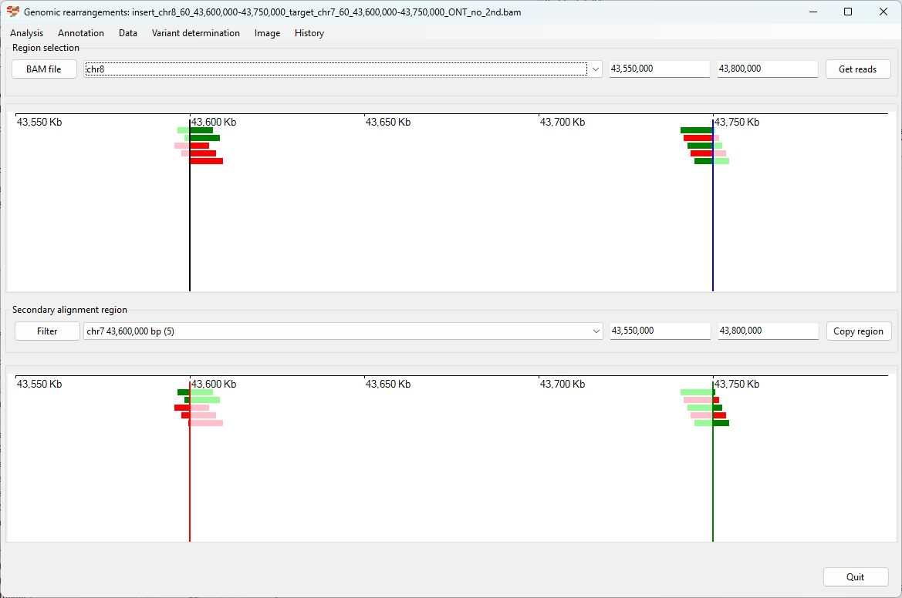
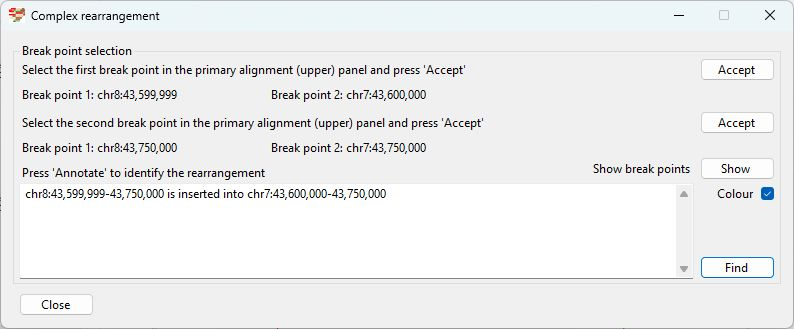

# Chr8 43,600,000-43,750,000  inserted into Chr7 43,600,000-43,750,000

### Analysis of the genome in which: 

The region **chr8 43,600,000-43,750,000** is insert in to the region **chr7 43,600,000-43,750,000**

### Primary region spanning: chr8 43,600,000-43,750,000 

For this analysis the split reads at chr8 43,600,000 (black line in Figure 1 and 2) and 43,750,000 (blue line in Figure 1 and 2) were selected and analysed using the ___Variant determination___ > ___Use soft clip data___ > ___Complex rearrangement___ menu option.

Figure 1

Figure 2

Figure 3

### Primary region spanning: chr7 43,600,000-43,750,000 

For this analysis the split reads at chr7 43,600,000 (black line in Figure 1 and 2) and 43,750,000 (blue line in Figure 1 and 2) were selected and analysed using the ___Variant determination___ > ___Use soft clip data___ > ___Complex rearrangement___ menu option.

Figure 4

Figure 5

Figure 6

## Schematic drawing of read alignments

The orientations of the alignments across the rearrangement is shown in Figure 7. Alignments shown in red indicate the orientation of the primary and secondary alignments differ.

Figure 7

